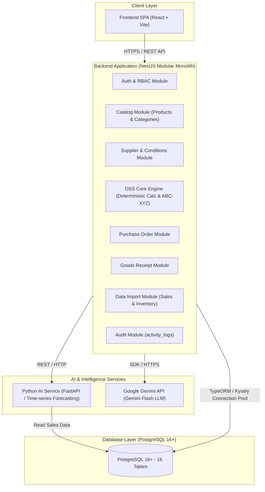
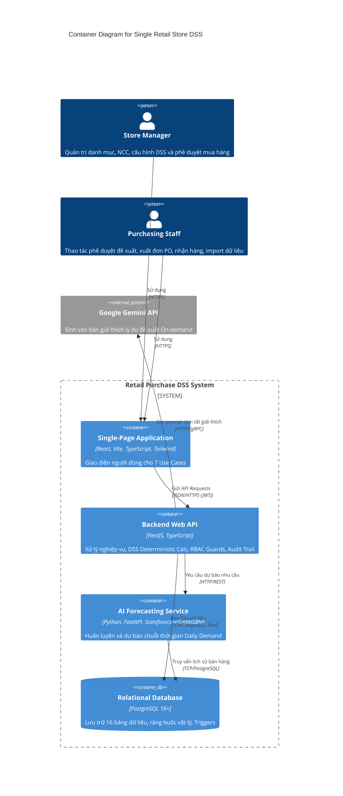
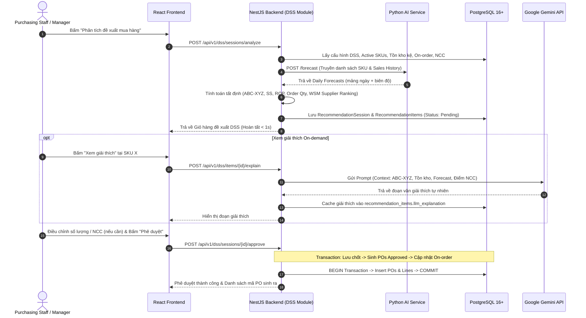

# Architecture Design Skill

## 1. Mục Đích & Vai Trò

Tài liệu này định hướng cho Agent (trong vai trò **Software Architect & System Designer**) thực hiện việc phân tích, thiết kế và đặc tả chi tiết **Kiến Trúc Hệ Thống (System Architecture)** cho hệ thống *AI-Powered Purchase Decision Support System for a Single Retail Store*.

Kiến trúc là cầu nối kỹ thuật quan trọng nhất giữa Cơ sở dữ liệu và Triển khai mã nguồn:
```text
Business Problem → Scope → Use Cases → Business Rules → Domain Model → Data Model → [Architecture] → Implementation
```

Mục tiêu chính:
* Hiện thực hóa mô hình **Polyglot Decoupled Architecture**: Backend Web API (NestJS Modular Monolith) + AI Forecasting Service (Python) + Frontend SPA (React + Vite) + CSDL (PostgreSQL 16+ với 16 bảng đã chốt).
* Cấu trúc hóa tài liệu kỹ thuật theo mô hình **Hub & Spoke** tối ưu: `docs/technical/architecture.md` (Bản thiết kế kiến trúc toàn cảnh) và `docs/technical/api-specification.md` (Hợp đồng giao tiếp chi tiết phục vụ trực tiếp bước Implementation).
* Phân lập triệt để 3 động cơ DSS: AI Forecasting chuỗi thời gian, Deterministic Business Calculations (SS, ROP, WSM Scoring, ABC-XYZ), và On-demand LLM Explainability (Gemini Flash).
* Hiện thực hóa chu trình phản hồi khép kín (Closed-Loop Supplier Performance Feedback) và cơ chế phòng thủ 3 tầng (Tier 3 Invariants tại tầng ứng dụng).
* Đặc tả cơ chế xác thực JWT, bảo mật RBAC 2 vai trò (`STORE_MANAGER` vs `PURCHASING_STAFF`), và lưu vết kiểm toán bất biến `activity_logs`.

---

## 2. Nguyên Tắc Thiết Kế Cốt Lõi

1. **Modular Monolith & Phân Tách Trách Nhiệm (Separation of Concerns):**
   * Backend Web API tổ chức theo các Module độc lập ánh xạ 1:1 với Bounded Contexts trong Domain Model.
   * Tránh bẫy Microservices phức tạp quá mức cho một cửa hàng bán lẻ đơn lẻ; giữ việc triển khai tinh gọn qua Docker Compose.
2. **"AI Recommends. Human Decides" Tại Mức Kiến Trúc:**
   * Thuật toán AI và LLM chỉ đóng vai trò phân tích, dự báo và gợi ý.
   * Đơn PO chỉ được phát hành khi con người bấm duyệt tại UC-01. Mọi sai lệch số liệu duyệt vs gợi ý (`Suggested` vs `Approved`) được âm thầm lưu vết phục vụ đánh giá mô hình.
3. **Non-blocking On-demand LLM:**
   * LLM API tuyệt đối không được nằm trong luồng tính toán đồng bộ của UC-01. Quá trình tính toán DSS phản hồi tức thì (< 1s); LLM chỉ được gọi khi người dùng click xem chi tiết giải thích cho từng mặt hàng.
4. **All-or-Nothing & Data Cleanliness First:**
   * File nạp bán hàng và kiểm kê tại UC-04 được thẩm định toàn diện trong ACID Transaction. Vi phạm bất kỳ dòng nào đều từ chối nạp cả tệp để bảo vệ chất lượng dữ liệu nuôi mô hình AI.

---

## 3. Bản Đồ Phân Rã Cấu Phần Hệ Thống (Component Decomposition)

Hệ thống bao gồm 4 khối thành phần chính:



---

## 4. Mẫu Biểu Đồ Kiến Trúc Chuẩn Bực (C4 & Sequence Diagrams)

### 4.1. Sơ Đồ C4 Container (Level 2)


### 4.2. Luồng Xử Lý Cốt Lõi UC-01 (Sequence Diagram)


---

## 5. Quy Trình Thiết Kế Kiến Trúc 6 Bước (Architecture Workflow Steps)

```text
Bước 1: Xác lập Tổng quan Tech Stack & Rationale (NestJS, Python, React+Vite, PostgreSQL)
        ↓
Bước 2: Xây dựng biểu đồ C4 Context & Container và phân rã Modules Backend
        ↓
Bước 3: Thiết kế Phân hệ AI Forecasting & DSS Deterministic Engine & LLM On-demand
        ↓
Bước 4: Thiết kế chuẩn hóa API Contracts & DTOs (Hub & Spoke: api-specification.md)
        ↓
Bước 5: Thiết kế Bảo mật JWT/RBAC, Xử lý Bất biến Tier 3 & Nhật ký kiểm toán Audit
        ↓
Bước 6: Kiểm tra tính nhất quán (Consistency Check) & Xác nhận qua Confirmation Gate
```

---

## 6. Tiêu Chí Nghiệm Thu Chất Lượng & Anti-Patterns Cần Tránh

### Tiêu Chí Nghiệm Thu (Quality Checklist)
* [ ] Kiến trúc phản ánh đầy đủ 100% 7 Use Cases và 16 bảng CSDL PostgreSQL 16+.
* [ ] 3 động cơ DSS (Forecasting, Calculation, LLM) được phân lập rõ ràng, không có sự phụ thuộc chéo làm nghẽn hệ thống.
* [ ] Có cơ chế quản lý Transaction rõ ràng cho toàn bộ các Invariants thuộc Tier 3.
* [ ] RBAC 2 roles (`STORE_MANAGER` và `PURCHASING_STAFF`) được phân định rõ ràng trên từng nhóm API.
* [ ] Tài liệu được tổ chức theo mô hình Hub & Spoke: `architecture.md` (toàn cảnh) và `api-specification.md` (chi tiết hợp đồng DTO).

### Danh Mục Anti-Patterns Tuyệt Đối Tránh
* ❌ **Microservices Overkill:** Không chia nhỏ thành hàng chục microservices riêng biệt giao tiếp qua Kafka/RabbitMQ cho quy mô 1 cửa hàng bán lẻ.
* ❌ **Blocking LLM in Main Loop:** Không gọi LLM tuần tự cho hàng trăm SKU trong API phân tích DSS ban đầu.
* ❌ **Tight User Coupling:** Không tạo Foreign Key cứng từ các bảng nghiệp vụ mua hàng sang bảng `users`.
* ❌ **Floating Point Currency:** Không dùng `number` dấu phẩy động cho tiền tệ hoặc số lượng.
