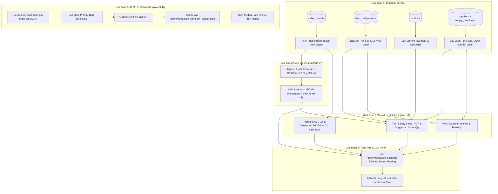
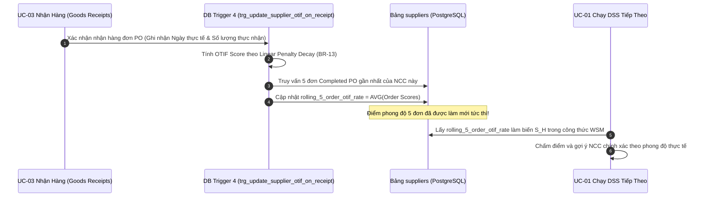

# Mô Hình & Mẫu Thiết Kế Phân Hệ DSS (DSS Subsystem Patterns)

Tài liệu này đặc tả chi tiết kiến trúc, luồng dữ liệu, thuật toán và giải pháp tích hợp cho 3 phân hệ cấu thành Động cơ Hỗ trợ Ra Quyết Định Mua Hàng (DSS Engine).

---

## 1. Bản Đồ Tổng Thể Luồng Xử Lý DSS (End-to-End DSS Pipeline)



---

## 2. Phân Hệ 1: Dự Báo Nhu Cầu Chuỗi Thời Gian (AI Forecasting Engine - Python)

### 2.1. Hợp Đồng Giao Tiếp Giữa NestJS và Python Service
* **Giao thức:** RESTful HTTP API nội bộ (`http://ai-service:8000/api/v1/forecast`).
* **Định dạng dữ liệu đầu vào (Request Payload):**
```json
{
  "horizonDays": 14,
  "series": [
    {
      "skuId": 101,
      "history": [
        { "date": "2026-08-01", "quantity": 12 },
        { "date": "2026-08-02", "quantity": 0 },
        { "date": "2026-08-14", "quantity": 15 }
      ]
    }
  ]
}
```
* **Định dạng dữ liệu đầu ra (Response Payload):**
```json
{
  "success": true,
  "forecasts": [
    {
      "skuId": 101,
      "dailyAverage": 12.5,
      "dailyDemandStd": 2.4,
      "dailyForecasts": [
        { "date": "2026-08-15", "predicted": 12.0, "lower": 10.0, "upper": 14.0 },
        { "date": "2026-08-16", "predicted": 13.0, "lower": 11.0, "upper": 15.0 }
      ]
    }
  ]
}
```

### 2.2. Chiến Lược Lựa Chọn Mô Hình & Xử Lý Dữ Liệu Thiếu (Fallback)
1. **Dữ liệu đầy đủ ($\ge 30$ ngày):** Sử dụng các mô hình chuỗi thời gian tối ưu cho bán lẻ:
   * Nhu cầu biến động đều (XYZ $\rightarrow$ X): AutoARIMA / Exponential Smoothing.
   * Nhu cầu ngắt quãng, nhiều ngày 0 (XYZ $\rightarrow$ Z): Mô hình Croston hoặc TSB (Teunter-Syntetos-Babai).
2. **Dữ liệu ngắn ($14 \le \text{ngày} < 30$):** Simple Moving Average kèm bù trừ ngày 0.
3. **Dữ liệu cực ngắn ($< 14$ ngày - Mặt hàng mới mở bán):** Kích hoạt cơ chế Fallback học thuật theo quyết định `Deterministic Inventory Formulas & Hybrid Fallback Strategy`:
   $$SS_{\text{fallback}} = \bar{d} \times \text{Safety Days} \quad (\text{với Safety Days mặc định } = 5 \text{ ngày})$$

---

## 3. Phân Hệ 2: Động Cơ Tính Toán Tất Định (Deterministic Business Calculation Engine)

Toàn bộ logic tính toán này được cài đặt trực tiếp trong NestJS Backend (`DssCalculationEngineService`), không phụ thuộc mạng:

### 3.1. Phân Loại Tồn Kho ABC-XYZ (Cố định trong mã nguồn)
* **Ma trận ABC (Giá trị Doanh số):**
  * Nhóm A: Chiếm 80% tổng doanh thu tích lũy.
  * Nhóm B: Chiếm 15% tiếp theo (từ 80% đến 95%).
  * Nhóm C: Chiếm 5% còn lại (từ 95% đến 100%).
* **Ma trận XYZ (Độ Biến Động Nhu Cầu):**
  * Tính hệ số biến thiên: $CV = \frac{\sigma_d}{\bar{d}}$.
  * Nhóm X: $CV \le 0.5$ (Dự báo rất ổn định).
  * Nhóm Y: $0.5 < CV \le 1.0$ (Biến động trung bình).
  * Nhóm Z: $CV > 1.0$ (Nhu cầu ngắt quãng, biến động mạnh).

### 3.2. Công Thức Tính Tồn Kho Chuẩn Chuỗi Cung Ứng
1. **Safety Stock (SS):**
   $$SS = Z \times \sigma_d \times \sqrt{L}$$
   * $Z$: Hệ số độ tin cậy ánh xạ từ `Target Service Level` (90% $\rightarrow 1.28$, 95% $\rightarrow 1.65$, 98% $\rightarrow 2.05$, 99% $\rightarrow 2.33$).
   * $\sigma_d$: Độ lệch chuẩn nhu cầu ngày do Python Service tính toán.
   * $L$: Committed Lead Time của NCC được gợi ý hàng đầu.
2. **Reorder Point (ROP):**
   $$ROP = (\bar{d} \times L) + SS$$
3. **Số Lượng Đề Xuất Đặt Hàng (Suggested Order Quantity - SOQ):**
   * Nếu Tồn khả dụng $I_{\text{available}} = (I_{\text{current}} + I_{\text{on\_order}}) > ROP \implies SOQ = 0$ (Hàng an toàn, không cần mua).
   * Nếu $I_{\text{available}} \le ROP$:
     $$\text{Target Stock} = \bar{d} \times (L + R) + SS$$
     $$SOQ_{\text{raw}} = \max\left(0, \text{Target Stock} - I_{\text{available}}\right)$$
     $$SOQ = \max\left(MOQ, \lceil SOQ_{\text{raw}} \rceil\right)$$
     (với $R$ là Review Period từ cấu hình, và $MOQ$ là sản lượng tối thiểu của NCC).

### 3.3. Mô Hình Chấm Điểm Nhà Cung Cấp WSM (Weighted Sum Model)
* Với mỗi NCC khả dụng của SKU, tính điểm tổng hợp:
  $$Score = (w_P \times S_P) + (w_L \times S_L) + (w_M \times S_M) + (w_H \times S_H)$$
* Chuẩn hóa Min-Max các tiêu chí chi phí (Giá, Lead Time, MOQ):
  $$S_i = 100 \times \left(1 - \frac{Value_i - Min_i}{Max_i - Min_i}\right)$$
* Tiêu chí Lịch sử Giao hàng $S_H$:
  * NCC mới ($< 3$ đơn hoàn tất): Tạm gán $S_H = 80\%$ (Điểm Khá khởi tạo).
  * NCC đã có từ 5 đơn trở lên: Lấy trung bình cộng điểm phong độ của **đúng 5 đơn hoàn tất gần nhất**.

---

## 4. Phân Hệ 3: Dịch Vụ Giải Thích On-Demand (LLM Explainability Service)

### 4.1. Cấu Trúc Ngữ Cảnh Prompt Gửi Gemini Flash
Prompt được lắp ráp từ các số liệu định lượng khách quan có sẵn:

```text
Bạn là chuyên gia cố vấn chuỗi cung ứng của cửa hàng bán lẻ. Hãy tóm tắt ngắn gọn (3-4 câu) lý do hệ thống đề xuất mua mặt hàng này để nhân viên cửa hàng duyệt nhanh:

Thông tin mặt hàng:
- Tên SKU: [sku_name] (Mã: [sku_code])
- Phân loại tồn kho: Nhóm [ABC_Badge] - [XYZ_Badge] ([Giải thích ý nghĩa ABC-XYZ])
- Tồn kho hiện tại: [current_inventory] cái | Hàng đang về: [on_order_quantity] cái
- Điểm đặt hàng lại (ROP): [reorder_point] cái | Mức tồn kho an toàn (SS): [safety_stock] cái
- Nhu cầu dự báo trung bình: [daily_average] cái/ngày trong [lead_time + review_period] ngày tới
- Số lượng đề xuất: [suggested_quantity] cái (Đã khớp MOQ: [moq])

Nhà cung cấp được chọn:
- Tên NCC: [supplier_name] (Đạt điểm cao nhất: [wsm_score]/100)
- Lý do chọn NCC: [Giá thấp nhất / Giao hàng nhanh nhất / Phong độ giao hàng xuất sắc 5 đơn gần nhất]

Yêu cầu định dạng:
Văn phong khách quan, chuyên nghiệp, đi thẳng vào nguyên nhân rủi ro thiếu hàng (Stockout) nếu không đặt, và tính tối ưu của NCC được chọn. Không dùng từ tiếp thị.
```

### 4.2. Cơ Chế Bộ Nhớ Đệm (Caching) & Xử Lý Sự Cố (Fallback)
* **Cache:** Khi nhận được văn bản từ Gemini Flash, lưu ngay vào cột `recommendation_items.llm_explanation`. Các lần bấm xem sau đó lấy thẳng từ CSDL, không gọi lại API.
* **Timeout & Fallback:** Thiết lập timeout gọi API là 3.0 giây. Nếu Gemini API lỗi hoặc timeout, tự động hiển thị đoạn văn mẫu tất định:
  > *"Hệ thống đề xuất đặt [SOQ] cái do tồn khả dụng ([I_avail]) thấp hơn mức đặt hàng lại ([ROP]). NCC [Name] được đề xuất dựa trên điểm tổng hợp WSM tốt nhất ([Score] điểm)."*

---

## 5. Chu Trình Phản Hồi Khép Kín (Closed-Loop Feedback Implementation)


