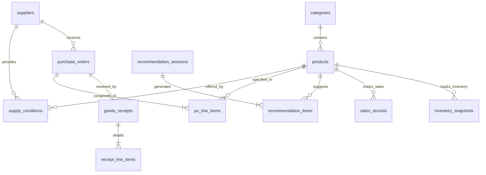

# Data Model Design Skill

## 1. Mục Đích & Vai Trò

Tài liệu này định hướng cho Agent (trong vai trò **Database Architect & System Designer**) thực hiện việc phân tích, thiết kế và đặc tả chi tiết **Mô hình Dữ liệu Kỹ thuật (Data Model)** cho hệ thống *AI-Powered Purchase Decision Support System for a Single Retail Store*.

Data Model là tầng kỹ thuật đầu tiên sau khi kết thúc giai đoạn phân tích nghiệp vụ:
```text
Business Problem → Scope → Use Cases → Business Rules → Domain Model → [Data Model] → Architecture → Implementation
```

Mục tiêu chính:
* Ánh xạ chính xác và đầy đủ **13 Domain Entities** thành các bảng CSDL quan hệ chuẩn hóa (`Tables`).
* Hiện thực hóa **44 Business Invariants** thành hệ thống ràng buộc toàn vẹn dữ liệu đa tầng (`Database Constraints`, `Triggers`, `Application Checks`).
* Thiết lập cấu trúc lưu trữ bảo lưu lịch sử bất biến (`Historical Snapshots`) cho giá mua, Lead Time và MOQ tại thời điểm phê duyệt đơn.
* Tối ưu hóa hiệu năng truy vấn cho thuật toán AI dự báo và động cơ gợi ý mua hàng thông qua chiến lược đánh chỉ mục (`Indexing Strategy`).
* Tạo lập tài liệu kỹ thuật chính thức `docs/technical/data-model.md` và mã khởi tạo Schema DDL hoàn chỉnh.

---

## 2. Nguyên Tắc Cốt Lõi

1. **Chuẩn hóa quan hệ (Relational Normalization & Controlled Denormalization):**
   * Đạt chuẩn 3NF làm nền tảng cho Master Data nhằm loại bỏ dư thừa và bất thường dữ liệu.
   * Áp dụng lưu thừa có chủ đích (Controlled Denormalization) tại các bảng giao dịch để tạo snapshot bất biến lịch sử (`historical_unit_price`, `historical_moq`).
2. **PostgreSQL Dialect & Kiểu Dữ Liệu Chuẩn Xác:**
   * Sử dụng kiểu dữ liệu tiền tệ chính xác `NUMERIC(15, 2)` (tuyệt đối không dùng `FLOAT` hay `REAL`).
   * Sử dụng `TIMESTAMPTZ` (UTC) cho toàn bộ mốc thời gian.
   * Sử dụng `BIGINT GENERATED ALWAYS AS IDENTITY` cho Surrogate Primary Key.
3. **Phòng thủ dữ liệu đa tầng (Defense-in-Depth):**
   * Càng đưa được nhiều Business Invariants xuống kiểm tra tại tầng CSDL (`CHECK`, `NOT NULL`, `UNIQUE`, `FOREIGN KEY RESTRICT`) thì tính toàn vẹn hệ thống càng vững chắc.

---

## 3. Bản Đồ 13 Tables Theo 3 Bounded Contexts

Cơ sở dữ liệu của hệ thống được tổ chức đồng bộ với 3 phân vùng nghiệp vụ trong Domain Model:

### Phân vùng 1: Dữ liệu Nền tảng (Master Data - 4 Tables)
1. `categories`: Danh mục ngành hàng quản lý và phân loại SKU.
2. `products`: Danh mục hàng hóa (SKU), lưu trữ tồn kho hiện hành trên kệ (`current_inventory`) và hàng đang về (`on_order_quantity`).
3. `suppliers`: Hồ sơ nhà cung cấp, lưu trữ Lead Time cam kết thống nhất (`committed_lead_time_days`) và phong độ OTIF 5 đơn gần nhất.
4. `supply_conditions`: Mối quan hệ thương mại giữa SKU và NCC, lưu trữ giá nhập hiện hành (`purchase_price`), MOQ và trạng thái cung ứng.

### Phân vùng 2: Dữ liệu Vận hành & Cấu hình (Operational & Configuration - 3 Tables)
5. `sales_records`: Dữ liệu bán hàng hàng ngày (Daily Demand) nạp cho AI dự báo; hỗ trợ ghi đè khi import sửa sai.
6. `inventory_snapshots`: Bản ghi kiểm kê định kỳ tại kho kệ, làm mốc thay thế tồn kho thực tế.
7. `dss_configurations`: Bảng Singleton chứa cấu hình toàn cửa hàng (bộ trọng số WSM tổng 100%, Service Level mặc định, chu kỳ rà soát mua hàng).

### Phân vùng 3: Vòng Đời Mua Hàng & Khép Kín (Procurement Lifecycle & Decision Core - 6 Tables theo 3 cặp Cha - Con)
8. `recommendation_sessions` *-- 9. `recommendation_items`: Giỏ hàng kế hoạch mua do DSS đề xuất kèm lưu vết điều chỉnh thực tế của con người và giải thích của AI.
10. `purchase_orders` *-- 11. `po_line_items`: Đơn mua hàng chính thức gửi NCC với vòng đời 1 chiều (`Approved` $\rightarrow$ `Completed` / `Cancelled`) và các dòng hàng bảo lưu giá snapshot.
12. `goods_receipts` *-- 13. `receipt_line_items`: Phiếu nhận hàng đối soát 1:1 với PO, tính toán điểm OTIF và cập nhật tồn kho kệ.

---

## 4. Kỹ Thuật Trực Quan Hóa Bằng Mermaid erDiagram

Khi trình bày cấu trúc dữ liệu, sử dụng sơ đồ Mermaid `erDiagram` với đầy đủ khóa và mối quan hệ:



---

## 5. Quy Trình Thiết Kế 5 Bước (Data Model Workflow Steps)

```text
Bước 1: Ánh xạ 13 Domain Entities sang 13 Database Tables
        ↓
Bước 2: Xác định Cột, Kiểu Dữ Liệu, Giá Trị Mặc Định & Nullability
        ↓
Bước 3: Chuyển hóa 44 Business Invariants sang Database Constraints & Triggers
        ↓
Bước 4: Thiết lập Chiến Lược Đánh Chỉ Mục (B-Tree, Composite, Partial Indexes)
        ↓
Bước 5: Kiểm tra tính nhất quán (Feedback Loop) & Confirmation Gate với Người dùng
        ↓
Bước 6: Xuất bản tài liệu chính thức docs/technical/data-model.md
```

---

## 6. Danh Mục Tài Liệu Tham Chiếu (Reference Guides)

Agent phải tham khảo các tài liệu hướng dẫn chuyên sâu sau trong thư mục `references/`:

* [domain-to-data-mapping.md](references/domain-to-data-mapping.md): Hướng dẫn chi tiết ánh xạ 13 Entities và 44 Invariants sang cấu trúc CSDL.
* [data-model-specification-template.md](references/data-model-specification-template.md): Mẫu tài liệu đặc tả Data Model chuẩn chỉnh.
* [database-conventions.md](references/database-conventions.md): Quy chuẩn kỹ thuật về kiểu dữ liệu PostgreSQL, đặt tên và đánh chỉ mục.
