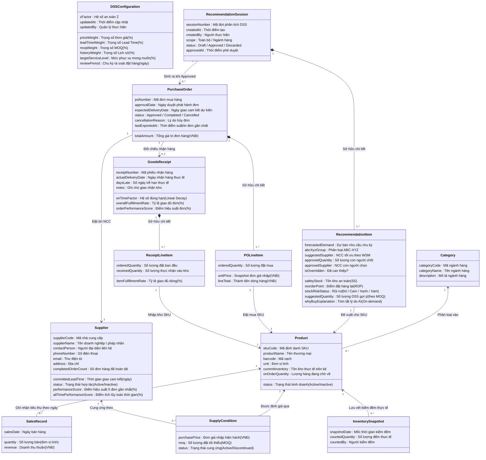

# Đặc Tả Mô Hình Miền Nghiệp Vụ (Domain Model Specification)

## AI-Powered Purchase Decision Support System for a Single Retail Store

* **Dự án:** Hệ Thống Hỗ Trợ Ra Quyết Định Mua Hàng Ứng Dụng Trí Tuệ Nhân Tạo Cho Cửa Hàng Bán Lẻ Đơn Lẻ
* **Trạng thái:** `Status: Confirmed`
* **Phiên bản:** `1.0 (Official Specification)`
* **Ngày phê duyệt:** 2026-09-12
* **Nguồn sự thật kế thừa:** [docs/project-decisions.md](../project-decisions.md), [docs/business/business-rules.md](business-rules.md) (28 BRs), và [docs/business/use-case-overview.md](use-case-overview.md) (7 UCs).

---

## 1. Nguyên Tắc Cốt Lõi Của Mô Hình Miền

1. **Triết lý vận hành: "AI recommends. Human decides":**
   * Hệ thống không vận hành theo kiểu phần mềm kế toán/ERP thụ động (nhập liệu thủ công từ đầu).
   * Hệ thống đóng vai trò **Trợ lý Tham mưu trưởng thông minh**: AI và các thuật toán tất định tự động tính toán, gom nhóm và đề xuất **Bản Kế Hoạch Mua Hàng Hoàn Chỉnh** (`RecommendationSession`). Con người giữ vai trò **Người Thẩm Định & Chỉ Huy** tối cao, tinh chỉnh kế hoạch và phê duyệt để phát hành lệnh mua (`PurchaseOrder`).
2. **Góc nhìn nghiệp vụ thuần túy (Conceptual Perspective - No Technical Bloat):**
   * Toàn bộ tài liệu mô tả các khái niệm, quy trình và chính sách kinh doanh thực tế trong một cửa hàng bán lẻ đơn lẻ.
   * Tuyệt đối không chứa chi tiết lưu trữ kỹ thuật của CSDL: Không có kiểu dữ liệu SQL (`INT`, `VARCHAR`), không có khóa chính/khóa ngoại kỹ thuật (`PK`, `FK autoincrement`), không có bảng nối thuần kỹ thuật hay ORM annotations.
3. **Ngôn ngữ nghiệp vụ thống nhất (Ubiquitous Language):**
   * Sử dụng danh từ số ít viết hoa đầu từ (PascalCase) cho tên thực thể.
   * Sử dụng tên thuộc tính nghiệp vụ kèm đơn vị đo lường thực tế (VNĐ, ngày, cái/hộp, %).
4. **Bảo vệ toàn vẹn thông qua Business Invariants:**
   * Mỗi thực thể đóng gói chặt chẽ các bất biến nghiệp vụ kế thừa từ 28 Business Rules (`BR-01` đến `BR-28`) và đã được kiểm chứng qua các tình huống phản biện thực tế (`/grill-me`).

---

## 2. Sơ Đồ Toàn Cảnh Mô Hình Miền (Domain Model Overview)

---

## 3. Đặc Tả Chi Tiết 13 Thực Thể Theo 3 Phân Vùng Nghiệp Vụ

### 3.1. Nhóm 1: Dữ Liệu Nền Tảng & Đối Tác Cung Ứng (Master Data)

#### 1. Entity: `Category` (Ngành Hàng)
* **Khái niệm:** Phân nhóm ngành hàng thương mại của cửa hàng (ví dụ: *Nước giải khát, Bánh kẹo, Hóa mỹ phẩm...*), phục vụ việc quản lý danh mục và lọc đề xuất mua hàng tập trung tại `UC-01`.
* **Thuộc tính khái niệm:**
  | Tên thuộc tính | Ý nghĩa nghiệp vụ | Đơn vị / Định dạng | Bắt buộc |
  | :--- | :--- | :--- | :---: |
  | `categoryCode` | Mã ngành hàng duy nhất toàn cục | Chuỗi ký tự không dấu (ví dụ: `BEV`, `SNK`) | Có |
  | `categoryName` | Tên hiển thị của ngành hàng | Chuỗi văn bản | Có |
  | `description` | Mô tả phạm vi mặt hàng | Chuỗi văn bản tùy chọn | Không |
* **Mối quan hệ:** Chứa $0..*$ `Product`.
* **Bất biến nghiệp vụ:**
  * `INV-CAT-01`: Mã `categoryCode` là duy nhất toàn cục và bất biến vĩnh viễn sau khi tạo (`BR-20`).
  * `INV-CAT-02`: Chặn xóa ngành hàng nếu đang chứa ít nhất 1 `Product` trong hệ thống (`BR-20`).

---

#### 2. Entity: `Product` (Sản Phẩm / SKU)
* **Khái niệm:** Mặt hàng thương mại độc lập được quản lý lưu kho và kinh doanh tại cửa hàng đơn lẻ.
* **Thuộc tính khái niệm:**
  | Tên thuộc tính | Ý nghĩa nghiệp vụ | Đơn vị / Định dạng | Bắt buộc |
  | :--- | :--- | :--- | :---: |
  | `skuCode` | Mã định danh sản phẩm duy nhất toàn cục | Chuỗi chữ, số, `-`, `_` (ví dụ: `MILK-180ML`) | Có |
  | `productName` | Tên thương mại của sản phẩm | Chuỗi văn bản | Có |
  | `barcode` | Mã vạch sản phẩm | Chuỗi số (nếu có thì duy nhất) | Không |
  | `unit` | Đơn vị tính lưu kho và giao dịch | Chuỗi văn bản (*chai, lon, hộp, gói, cái*) | Có |
  | `status` | Trạng thái kinh doanh | `Active` hoặc `Inactive` (Mặc định `Active`) | Có |
  | `currentInventory` | Tồn kho thực tế hiện hữu trên kệ | Số nguyên $\ge 0$ (theo đơn vị tính) | Có |
  | `onOrderQuantity` | Tổng lượng hàng đang về từ các PO `Approved` | Số nguyên $\ge 0$ (theo đơn vị tính) | Có |
* **Mối quan hệ:**
  * Thuộc về chính xác $1$ `Category` ($1..1$, bắt buộc).
  * Được cung cấp thông qua $0..*$ `SupplyCondition`.
  * Tích lũy $0..*$ `SalesRecord` và $0..*$ `InventorySnapshot`.
* **Bất biến nghiệp vụ:**
  * `INV-PROD-01`: Mã `skuCode` duy nhất toàn cục, không phân biệt hoa/thường, bất biến vĩnh viễn sau khi tạo (`BR-17`).
  * `INV-PROD-02 (Zero-Link Hard Delete Exception)`: Tuyệt đối cấm xóa cứng (`Hard Delete`) nếu SKU đã từng phát sinh liên kết dữ liệu (bán hàng, kiểm kê, PO, báo giá). Chỉ cho phép ngoại lệ Hard Delete khi SKU vừa tạo và hoàn toàn chưa có liên kết dữ liệu nào (`BR-18`).
  * `INV-PROD-03 (Deactivation with Pending On-Order)`: Cho phép chuyển trạng thái SKU sang `Inactive` khi đang có hàng đang về (`onOrderQuantity > 0`) kèm cảnh báo. Khi chuyển Inactive: SKU bị loại trừ 100% khỏi các đợt gợi ý mua mới tại `UC-01`, nhưng lượng hàng đang về vẫn được nhập kho bình thường tại `UC-03` để cửa hàng bán xả nốt hàng tồn (`BR-18`).
  * `INV-PROD-04`: Khi tạo mới SKU, tồn kho ban đầu mặc định: `currentInventory = 0`, `onOrderQuantity = 0`, `status = Active` (`BR-19`).
  * `INV-PROD-05 (Physical Inventory Update & Non-negative Bound)`: `currentInventory \ge 0` và `onOrderQuantity \ge 0` tại mọi thời điểm. Tệp bán hàng nạp vào ở `UC-04` chỉ lưu `SalesRecord` để nuôi AI dự báo, tuyệt đối không tự động trừ vào `currentInventory`. Tồn kho kệ chỉ thay đổi qua Nhận hàng (`UC-03`, cộng dồn) hoặc Kiểm kê thực tế (`UC-04`, ghi đè số đếm) (`BR-16`, `BR-19`).

---

#### 3. Entity: `Supplier` (Nhà Cung Cấp)
* **Khái niệm:** Đối tác thương mại cung cấp hàng hóa cho cửa hàng (`UC-06`).
* **Thuộc tính khái niệm:**
  | Tên thuộc tính | Ý nghĩa nghiệp vụ | Đơn vị / Định dạng | Bắt buộc |
  | :--- | :--- | :--- | :---: |
  | `supplierCode` | Mã định danh đối tác duy nhất toàn cục | Chuỗi ký tự không dấu (ví dụ: `VINAMILK`) | Có |
  | `supplierName` | Tên doanh nghiệp / pháp nhân của NCC | Chuỗi văn bản | Có |
  | `contactPerson` | Người đại diện liên hệ giao dịch | Chuỗi văn bản | Không |
  | `phoneNumber`, `email`, `address` | Thông tin liên lạc và kho đối tác | Chuỗi văn bản | Không |
  | `committedLeadTime` | Thời gian giao hàng cam kết tiêu chuẩn | Số nguyên $\ge 1$ (Đơn vị: ngày) | Có |
  | `status` | Trạng thái hợp tác | `Active` hoặc `Inactive` (Mặc định `Active`) | Có |
  | `performanceScore` | Điểm hiệu suất giao hàng (5 đơn gần nhất) | Tỷ lệ phần trăm ($0 - 100\%$, dùng cho WSM) | Có |
  | `allTimePerformanceScore`| Điểm hiệu suất tích lũy toàn thời gian | Tỷ lệ phần trăm ($0 - 100\%$, cho quản trị) | Có |
  | `completedOrderCount` | Tổng số đơn PO đã hoàn tất nhận hàng | Số nguyên $\ge 0$ | Có |
* **Mối quan hệ:** Cung ứng hàng hóa thông qua $0..*$ `SupplyCondition`.
* **Bất biến nghiệp vụ:**
  * `INV-SUPP-01`: Mã `supplierCode` duy nhất toàn cục và bất biến vĩnh viễn (`BR-21`).
  * `INV-SUPP-02 (Zero-Link Hard Delete Exception)`: Cấm Hard Delete nếu đã có SKU liên kết hoặc lịch sử đơn PO. Chỉ cho phép Hard Delete khi NCC vừa tạo và chưa có liên kết (`BR-24`).
  * `INV-SUPP-03 (Active PO Guard on Supplier Deactivation)`: Không cho phép chuyển Nhà cung cấp sang `Inactive` nếu đối tác này đang có ít nhất một đơn PO `Approved` chờ giao. Bắt buộc phải Hủy đơn PO (`Cancel PO` tại `UC-02`) trước để giải phóng `On-order` về 0, tránh làm sai lệch đề xuất DSS (`BR-24`).
  * `INV-SUPP-04 (Cold Start Scoring)`: Đối tác mới chưa có lịch sử ($< 3$ đơn hoàn tất từ `UC-03`) luôn có điểm `performanceScore` khởi tạo bằng $80\%$ để tham gia xếp hạng công bằng tại `UC-01` (`BR-24`).
  * `INV-SUPP-05 (Rolling 5-Order Window)`: Khi đạt từ $5$ đơn hoàn tất trở lên, điểm `performanceScore` phục vụ DSS tại `UC-01` được tính toán tự động dựa trên đúng $5$ đơn hàng hoàn tất gần nhất (`BR-24`).
  * `INV-SUPP-06 (Standard Vendor Lead Time)`: Thời gian giao hàng cam kết `committedLeadTime \ge 1` (ngày), áp dụng thống nhất cho toàn bộ các sản phẩm do đối tác này cung ứng. Đây là căn cứ xác định ngày hẹn giao của Đơn mua hàng (`BR-08`) và tính điểm tiêu chí Lead Time trong mô hình WSM (`BR-02`).

---

#### 4. Entity: `SupplyCondition` (Điều Kiện Cung Ứng / Báo Giá)
* **Khái niệm:** Thỏa thuận thương mại và chính sách báo giá cung ứng hiện hành giữa một Nhà cung cấp cụ thể và một Sản phẩm cụ thể (`UC-06`).
* **Thuộc tính khái niệm:**
  | Tên thuộc tính | Ý nghĩa nghiệp vụ | Đơn vị / Định dạng | Bắt buộc |
  | :--- | :--- | :--- | :---: |
  | `purchasePrice` | Đơn giá nhập hiện hành | Số thực dương $> 0$ (Đơn vị: VNĐ) | Có |
  | `moq` | Số lượng đặt hàng tối thiểu (MOQ) | Số nguyên $\ge 1$ (Đơn vị: đơn vị tính SKU) | Có |
  | `status` | Trạng thái cung ứng | `Active` hoặc `Discontinued` (Mặc định `Active`) | Có |
* **Mối quan hệ:** Thuộc về chính xác $1$ `Product` ($1..1$) và chính xác $1$ `Supplier` ($1..1$).
* **Bất biến nghiệp vụ:**
  * `INV-COND-01`: Cặp `(Product, Supplier)` là duy nhất toàn cục. Mỗi NCC chỉ duy trì đúng một điều kiện cung ứng hiện hành cho mỗi SKU (`BR-22`).
  * `INV-COND-02`: Đơn giá nhập `purchasePrice > 0`, `moq \ge 1` (`BR-22`).
  * `INV-COND-03 (Discontinuation Guard)`: Cấm chuyển `status = Discontinued` đối với SKU nếu đang có đơn PO `Approved` của chính NCC đó chứa SKU này (`BR-23`).
  * `INV-COND-04 (Snapshot Integrity & Current Quote Only)`: Thực thể chỉ lưu báo giá hiện hành. Toàn bộ lịch sử biến động giá trong quá khứ được bảo lưu vĩnh viễn qua thuộc tính `unitPrice` của các dòng `POLineItem` đã duyệt trong các đơn PO cũ (`BR-22`).

---

### 3.2. Nhóm 2: Dữ Liệu Vận Hành & Cấu Hình DSS (Operational Inputs & System Parameters)

#### 5. Entity: `SalesRecord` (Bản Ghi Tiêu Thụ Bán Hàng)
* **Khái niệm:** Dữ liệu tiêu thụ hàng ngày của từng SKU, nạp vào từ tệp dữ liệu bán hàng (`UC-04`). Đây là chuỗi thời gian lịch sử làm đầu vào cho mô hình AI dự báo nhu cầu (`Demand Forecast`) và phân loại tồn kho (`ABC-XYZ`) tại `UC-01`.
* **Thuộc tính khái niệm:**
  | Tên thuộc tính | Ý nghĩa nghiệp vụ | Đơn vị / Định dạng | Bắt buộc |
  | :--- | :--- | :--- | :---: |
  | `salesDate` | Ngày phát sinh lượng bán | Ngày lịch (`YYYY-MM-DD`, $\le$ Ngày hiện tại) | Có |
  | `quantity` | Tổng số lượng sản phẩm bán ra trong ngày | Số nguyên dương $> 0$ (theo đơn vị tính) | Có |
  | `revenue` | Doanh thu thuần từ sản phẩm trong ngày | Số thực $\ge 0$ (Đơn vị: VNĐ) | Có |
* **Mối quan hệ:** Thuộc về chính xác $1$ `Product` ($1..1$). Một `Product` tích lũy $0..*$ `SalesRecord`.
* **Bất biến nghiệp vụ:**
  * `INV-SALE-01`: Cặp `(salesDate, Product)` là duy nhất toàn cục. Mỗi SKU chỉ có duy nhất một bản ghi tiêu thụ trong một ngày lịch (`BR-15`).
  * `INV-SALE-02`: Ngày bán hàng `salesDate \le Today` (không nhận dữ liệu tương lai) (`BR-14`).
  * `INV-SALE-03 (Positive Demand & Zero-Demand Convention)`: Sản lượng bán `quantity > 0` và doanh thu `revenue \ge 0`. Các ngày không có giao dịch bán hàng (Zero Demand) không tạo dòng trong file nạp; tầng tính toán AI tự động điền giá trị 0 khi quét chuỗi thời gian (`BR-14`).
  * `INV-SALE-04 (De-duplication Overwrite)`: Nạp file chứa ngày đã có trong hệ thống sẽ thực hiện **ghi đè hoàn toàn (overwrite)** số liệu của ngày đó sau khi người dùng xác nhận, tuyệt đối không cộng dồn làm nhân đôi doanh số (`BR-15`).
  * `INV-SALE-05 (Sell-off Continuity)`: Bản ghi bán hàng tiếp nhận bình thường cho cả SKU `Active` và SKU `Inactive` (để theo dõi bán nốt số tồn dư) miễn là mã SKU tồn tại trong danh mục hệ thống (`BR-18`).

---

#### 6. Entity: `InventorySnapshot` (Bản Ghi Kiểm Kê Kệ Kho)
* **Khái niệm:** Bản ghi lưu vết kết quả kiểm đếm vật lý hàng hóa thực tế trên kệ tại một thời điểm kiểm kê (`UC-04`), đóng vai trò căn chỉnh tồn kho và cung cấp bằng chứng kiểm toán kho (Audit Trail).
* **Thuộc tính khái niệm:**
  | Tên thuộc tính | Ý nghĩa nghiệp vụ | Đơn vị / Định dạng | Bắt buộc |
  | :--- | :--- | :--- | :---: |
  | `snapshotDate` | Mốc thời gian thực hiện kiểm kê | Mốc thời gian (Ngày và giờ) | Có |
  | `countedQuantity` | Số lượng hàng thực tế đếm được trên kệ | Số nguyên $\ge 0$ (theo đơn vị tính của SKU) | Có |
  | `countedBy` | Người thực hiện kiểm kê hoặc tải tệp lên | Chuỗi văn bản tên người dùng | Không |
* **Mối quan hệ:** Thuộc về chính xác $1$ `Product` ($1..1$). Một `Product` tích lũy $0..*$ `InventorySnapshot`.
* **Bất biến nghiệp vụ:**
  * `INV-INV-01`: Số lượng đếm thực tế `countedQuantity \ge 0` (`BR-14`, `BR-16`).
  * `INV-INV-02 (Shelf Overwrite & State Sync)`: Mỗi lần nạp kiểm kê mới, giá trị `countedQuantity` được đồng bộ gán đè trực tiếp sang `Product.currentInventory`. Bản thân `InventorySnapshot` được bảo lưu bất biến làm bằng chứng kiểm toán quá khứ (`BR-16`).
  * `INV-INV-03 (On-Order Preservation)`: Kiểm kê kệ kho tuyệt đối **không làm thay đổi** lượng hàng đang chờ về (`onOrderQuantity`) của SKU (`BR-16`).
  * `INV-INV-04 (Partial Inventory Support)`: Hỗ trợ kiểm kê từng phần: tệp nạp chỉ cập nhật các SKU có mặt; các SKU vắng mặt được giữ nguyên vẹn tồn kho hiện tại (`BR-16`).
  * `INV-INV-05 (Multi-Snapshot Audit Trail)`: Mỗi lần nạp tệp kiểm kê thành công là một bản ghi độc lập với mốc thời gian riêng biệt, không ghi đè bản ghi snapshot cũ mà ghi đè giá trị trạng thái tồn kho mới nhất lên sản phẩm (`UC-04`).

---

#### 7. Entity: `DSSConfiguration` (Cấu Hình Tham Số DSS)
* **Khái niệm:** Thực thể cấu hình toàn cục duy nhất (Singleton) lưu trữ bộ tham số chiến lược mua hàng và chính sách kiểm soát tồn kho do Quản lý cửa hàng thiết lập tại `UC-07` để điều khiển thuật toán gợi ý tại `UC-01`.
* **Thuộc tính khái niệm:**
  | Tên thuộc tính | Ý nghĩa nghiệp vụ | Đơn vị / Định dạng | Bắt buộc |
  | :--- | :--- | :--- | :---: |
  | `priceWeight` | Trọng số tiêu chí Đơn giá ($w_{\text{Price}}$) | Tỷ lệ phần trăm ($0 - 100\%$, mặc định $40\%$) | Có |
  | `leadTimeWeight` | Trọng số tiêu chí Thời gian giao ($w_{\text{LeadTime}}$) | Tỷ lệ phần trăm ($0 - 100\%$, mặc định $20\%$) | Có |
  | `moqWeight` | Trọng số tiêu chí MOQ ($w_{\text{MOQ}}$) | Tỷ lệ phần trăm ($0 - 100\%$, mặc định $15\%$) | Có |
  | `historyWeight` | Trọng số tiêu chí Lịch sử ($w_{\text{History}}$) | Tỷ lệ phần trăm ($0 - 100\%$, mặc định $25\%$) | Có |
  | `targetServiceLevel` | Mức phục vụ mong muốn ($SL$) | 1 trong 4 mốc: $90\%, 95\%, 98\%, 99\%$ (mặc định $95\%$) | Có |
  | `zFactor` | Hệ số an toàn Z tương ứng | Số thực: $1.28, 1.65, 2.05, 2.33$ (mặc định $1.65$) | Có |
  | `reviewPeriod` | Chu kỳ rà soát đặt hàng định kỳ ($R$) | Số nguyên trong khoảng $1 \le R \le 30$ (mặc định $7$ ngày) | Có |
  | `updatedAt` | Thời điểm cập nhật cấu hình gần nhất | Mốc thời gian (Ngày và giờ) | Có |
  | `updatedBy` | Quản lý cửa hàng thực hiện điều chỉnh | Tên người dùng (Store Manager) | Có |
* **Mối quan hệ:** Thực thể cấu hình độc lập toàn cục (Singleton), tác động toàn hệ thống.
* **Bất biến nghiệp vụ:**
  * `INV-CONF-01 (Weight Sum Normalization)`: Bắt buộc tổng 4 trọng số $w_{\text{Price}} + w_{\text{LeadTime}} + w_{\text{MOQ}} + w_{\text{History}} = 100\%$ ($w_i \ge 0\%$) (`BR-25`).
  * `INV-CONF-02 (Discrete Z-Factor Mapping)`: `targetServiceLevel` chỉ nhận các giá trị rời rạc chuẩn và tự động ánh xạ tất định sang `zFactor` tương ứng (`BR-26`).
  * `INV-CONF-03 (Review Period Operational Bounds)`: Giới hạn chu kỳ rà soát $1 \le \text{reviewPeriod} \le 30$ ngày (`BR-27`).
  * `INV-CONF-04 (Forward-Looking Application)`: Cấu hình mới áp dụng tức thì cho các phiên DSS tại `UC-01` tiếp theo; tuyệt đối không áp dụng hồi tố làm thay đổi các PO cũ đã duyệt (`BR-28`).
  * `INV-CONF-05 (Default Baseline Guarantee)`: Hệ thống luôn bảo đảm khởi tạo sẵn bộ thông số an toàn mặc định ngay khi triển khai (40/20/15/25, SL 95%, R 7 ngày) và hỗ trợ nút "Khôi phục mặc định" (`Reset to Defaults`) (`BR-28`).
  * `INV-CONF-06 (Role Authorization)`: Chỉ chủ thể mang vai trò `Store Manager` mới có quyền điều chỉnh và lưu cấu hình `DSSConfiguration`; `Purchasing Staff` chỉ có quyền xem (Read-only) (`UC-07`).

---

### 3.3. Nhóm 3: Ra Quyết Định DSS & Vòng Đời Mua Hàng Khép Kín (Decision Core & Procurement Lifecycle)

#### 8. Entity: `RecommendationSession` (Phiên Đề Xuất Mua Hàng DSS)
* **Khái niệm:** Đại diện cho một đợt phân tích và ra quyết định mua hàng tập trung được kích hoạt theo nhu cầu (`On-demand`) bởi người dùng tại `UC-01`. Đây chính là **"Giỏ hàng kế hoạch thông minh"** nơi AI đề xuất và con người thẩm định.
* **Thuộc tính khái niệm:**
  | Tên thuộc tính | Ý nghĩa nghiệp vụ | Đơn vị / Định dạng | Bắt buộc |
  | :--- | :--- | :--- | :---: |
  | `sessionNumber` | Mã định danh phiên phân tích duy nhất | Chuỗi ký tự (ví dụ: `REC-20261025-01`) | Có |
  | `createdAt` | Thời điểm kích hoạt phiên | Mốc thời gian (Ngày và giờ) | Có |
  | `createdBy` | Người kích hoạt phiên | Tên/ID người dùng (`Purchasing Staff` hoặc `Store Manager`) | Có |
  | `scope` | Phạm vi phân tích | `All Categories` hoặc tên Ngành hàng cụ thể | Có |
  | `status` | Trạng thái của phiên | `Draft`, `Approved`, `Discarded` (Mặc định `Draft`) | Có |
  | `approvedAt` | Thời điểm người dùng phê duyệt phương án | Mốc thời gian (nếu `status = Approved`) | Không |
* **Mối quan hệ:**
  * Sở hữu chặt chẽ ($1 : 1..*$) các dòng `RecommendationItem` (Composition).
  * Khi `status = Approved`, sinh ra $0..*$ đơn `PurchaseOrder` (mỗi NCC có sản phẩm đặt $> 0$ sinh đúng 1 PO theo `BR-04`).
* **Bất biến nghiệp vụ:**
  * `INV-REC-01 (Single Approved Lifecycle)`: Vòng đời trạng thái chuyển dịch 1 chiều: `Draft` $\rightarrow$ `Approved` hoặc `Discarded`. Một khi đã `Approved`, toàn bộ phiên và các dòng chi tiết bị **khóa bất biến (Immutable)** để làm căn cứ đối soát (`UC-01`).
  * `INV-REC-02 (Atomic Direct PO Generation)`: Khi phiên chuyển sang `Approved`, hệ thống tự động sinh ra các đơn `PurchaseOrder` ở trạng thái `Approved` ngay lập tức (không qua bước Draft PO) cho các NCC có sản phẩm đặt $> 0$ (`BR-04`, `BR-06`).
  * `INV-REC-03 (Draft Session Re-analysis Safety)`: Nếu đang có một phiên nháp `Draft`, khi người dùng chọn tạo phiên phân tích mới, hệ thống chuyển phiên nháp cũ sang `Discarded`. Các phiên cũ đã `Approved` bảo lưu vĩnh viễn làm lịch sử (`UC-01`).

---

#### 9. Entity: `RecommendationItem` (Dòng Chi Tiết Đề Xuất Mua Hàng)
* **Khái niệm:** Kết quả tính toán nhu cầu tồn kho định lượng cho từng SKU và lưu vết quyết định thẩm định thực tế của con người tại `UC-01`.
* **Thuộc tính khái niệm:**
  | Tên thuộc tính | Ý nghĩa nghiệp vụ | Đơn vị / Định dạng | Bắt buộc |
  | :--- | :--- | :--- | :---: |
  | `forecastedDemand` | Nhu cầu dự báo tiêu thụ chu kỳ bảo vệ | Số lượng sản phẩm | Có |
  | `safetyStock` | Mức tồn kho an toàn tính toán ($SS$) | Số nguyên $\ge 0$ (`BR-01`) | Có |
  | `reorderPoint` | Điểm đặt hàng lại ($ROP$) | Số nguyên $\ge 0$ (`BR-01`) | Có |
  | `abcXyzGroup` | Nhóm phân loại ma trận tồn kho | 1 trong 9 nhóm: `AX`, `AY` ... `CZ` (`BR-05`) | Có |
  | `stockRiskStatus` | Nhãn phân loại rủi ro tồn kho trực quan | `🔴 Cần mua gấp`, `🟠 Sắp hết`, `🟢 An toàn`, `⚪ Dư thừa` | Có |
  | `suggestedQuantity`| Số lượng DSS đề xuất ban đầu (làm tròn MOQ) | Số nguyên $\ge 0$ (`BR-01`, `BR-03`) | Có |
  | `suggestedSupplier`| Nhà cung cấp tối ưu nhất theo thuật toán WSM | Tham chiếu tới `Supplier` (`BR-02`) | Có |
  | `approvedQuantity` | Số lượng con người phê duyệt thực tế | Số nguyên $\ge 0$ (Mặc định bằng `suggestedQuantity`) | Có |
  | `approvedSupplier` | Nhà cung cấp con người lựa chọn thực tế | Tham chiếu tới `Supplier` (Mặc định bằng `suggestedSupplier`) | Có |
  | `isOverridden` | Cờ nhận diện con người có can thiệp hay không | Logic: `approvedQuantity != suggestedQuantity` hoặc `approvedSupplier != suggestedSupplier` | Có |
  | `whyBuyExplanation`| Đoạn tóm tắt lý do đề xuất do LLM sinh | Chuỗi văn bản (Mặc định `null`, sinh On-demand) | Không |
* **Mối quan hệ:**
  * Thuộc về chính xác $1$ `RecommendationSession` ($1..1$, Composition).
  * Tham chiếu tới chính xác $1$ `Product` ($1..1$).
* **Bất biến nghiệp vụ:**
  * `INV-REC-04 (Implicit Override Audit Trail)`: Hệ thống luôn lưu song song cả số liệu gợi ý gốc của thuật toán (`suggested`) và số liệu thực tế con người chốt (`approved`), tự động đánh dấu `isOverridden` mà không bắt buộc gõ lý do giải thích bằng văn bản (Quyết định dự án).
  * `INV-REC-05 (On-Demand LLM Cache & Optional Nullable)`: Thuộc tính `whyBuyExplanation` mặc định là `null`. Chỉ khi người dùng chủ động click xem tại `UC-01` thì LLM mới được gọi để sinh giải thích cho riêng SKU đó. Các SKU không được click giữ nguyên là `null` vĩnh viễn; không bao giờ tự động gọi LLM chạy hàng loạt (`UC-01`).

---

#### 10. Entity: `PurchaseOrder` (Đơn Mua Hàng)
* **Khái niệm:** Chứng từ đặt hàng thương mại chính thức gửi tới một Nhà cung cấp cụ thể, được phát hành tự động sau khi con người phê duyệt phương án mua tại `UC-01` (`UC-02`).
* **Thuộc tính khái niệm:**
  | Tên thuộc tính | Ý nghĩa nghiệp vụ | Đơn vị / Định dạng | Bắt buộc |
  | :--- | :--- | :--- | :---: |
  | `poNumber` | Mã đơn mua hàng duy nhất toàn cục | Chuỗi ký tự (ví dụ: `PO-20261025-001`) | Có |
  | `approvalDate` | Ngày giờ phê duyệt phát hành đơn | Mốc thời gian (Ngày và giờ) | Có |
  | `expectedDeliveryDate` | Ngày giao hàng cam kết dự kiến | Ngày lịch ($= \text{approvalDate} + \text{Supplier.committedLeadTime}$, `BR-08`) | Có |
  | `totalAmount` | Tổng giá trị thanh toán của đơn hàng | Số thực $> 0$ (Đơn vị: VNĐ) | Có |
  | `status` | Trạng thái vòng đời của đơn mua hàng | `Approved`, `Completed`, `Cancelled` (`BR-06`) | Có |
  | `cancellationReason` | Lý do hủy đơn hàng | Chuỗi văn bản (bắt buộc khi `status = Cancelled`, `BR-10`) | Không |
  | `cancelledAt` | Thời điểm hủy đơn hàng | Mốc thời gian (nếu bị hủy) | Không |
  | `lastExportedAt` | Thời điểm xuất file PDF/Excel hoặc in gần nhất | Mốc thời gian (metadata phục vụ giám sát tiến độ) | Không |
* **Mối quan hệ:**
  * Thuộc về chính xác $1$ `Supplier` ($1..1$).
  * Sở hữu chặt chẽ $1..*$ dòng `POLineItem` (Composition).
  * Liên kết với tối đa $1$ phiếu nhận hàng `GoodsReceipt` ($1 : 0..1$).
* **Bất biến nghiệp vụ:**
  * `INV-PO-01 (Approved Initial State)`: $100\%$ Đơn mua hàng đều sinh ra ở trạng thái `Approved` từ `UC-01`. Không hỗ trợ tạo đơn thủ công hay trạng thái nháp (`Draft PO`) tại `UC-02` (`BR-04`, `BR-06`).
  * `INV-PO-02 (Whole PO Cancellation Only)`: Đơn mua hàng sau khi duyệt là **cố định tuyệt đối**: cấm sửa đổi số lượng, cấm thêm/bớt SKU. Muốn dừng đơn, chỉ cho phép **Hủy toàn bộ đơn hàng** (`Cancel PO`), không hỗ trợ hủy hay sửa lẻ từng dòng (`BR-06`).
  * `INV-PO-03 (One-Way Lifecycle Transition)`: Vòng đời trạng thái chỉ chuyển dịch 1 chiều: `Approved` $\rightarrow$ `Completed` hoặc `Cancelled`. Tuyệt đối cấm mở lại đơn đã đóng (`BR-06`).
  * `INV-PO-04 (On-Order Synchronization)`: Khi PO được tạo ở `Approved`, hệ thống tự động tăng `Product.onOrderQuantity` tương ứng. Khi PO chuyển sang `Cancelled`, hệ thống tự động hoàn trả/giảm trừ `Product.onOrderQuantity` về 0 (`BR-07`).
  * `INV-PO-05 (Immutable Expected Date)`: Ngày giao dự kiến `expectedDeliveryDate` được tính toán bằng $\text{approvalDate} + \text{Supplier.committedLeadTime}$ tại thời điểm duyệt đơn, lưu cố định vào đơn và **không bao giờ bị reset** (kể cả khi từ chối nhận hàng và giao lại) (`BR-08`).
  * `INV-PO-06 (Mandatory Cancellation Reason)`: Hủy đơn bắt buộc phải chọn hoặc nhập lý do hủy (`cancellationReason`) (`BR-10`).

---

#### 11. Entity: `POLineItem` (Dòng Chi Tiết Đơn Mua Hàng)
* **Khái niệm:** Từng mặt hàng cụ thể được đặt mua trong Đơn mua hàng (`UC-02`).
* **Thuộc tính khái niệm:**
  | Tên thuộc tính | Ý nghĩa nghiệp vụ | Đơn vị / Định dạng | Bắt buộc |
  | :--- | :--- | :--- | :---: |
  | `orderedQuantity` | Số lượng đặt mua | Số nguyên dương $> 0$ (theo đơn vị tính của SKU) | Có |
  | `unitPrice` | Đơn giá nhập snapshot tại thời điểm duyệt | Số thực $> 0$ (Đơn vị: VNĐ, `BR-22`) | Có |
  | `lineTotal` | Tổng giá trị thành tiền của dòng mặt hàng | Số thực $> 0$ ($= \text{orderedQuantity} \times \text{unitPrice}$, VNĐ) | Có |
* **Mối quan hệ:**
  * Thuộc về chính xác $1$ `PurchaseOrder` ($1..1$, Composition).
  * Tham chiếu tới chính xác $1$ `Product` ($1..1$).
* **Bất biến nghiệp vụ:**
  * `INV-POLINE-01 (Price Snapshot Integrity)`: Đơn giá `unitPrice` là snapshot bất biến lấy từ `SupplyCondition` tại thời điểm duyệt đơn. Mọi thay đổi giá tương lai của NCC không làm thay đổi `unitPrice` của dòng này (`BR-22`).
  * `INV-POLINE-02`: Số lượng đặt `orderedQuantity > 0` và thành tiền `lineTotal = orderedQuantity * unitPrice`.

---

#### 12. Entity: `GoodsReceipt` (Phiếu Nhận Hàng Kho)
* **Khái niệm:** Chứng từ ghi nhận sự kiện thực tế giao nhận hàng hóa tại kho giữa Nhà cung cấp và cửa hàng, khép kín vòng lặp phản hồi để đo lường hiệu suất đối tác (`UC-03`, `BR-11`).
* **Thuộc tính khái niệm:**
  | Tên thuộc tính | Ý nghĩa nghiệp vụ | Đơn vị / Định dạng | Bắt buộc |
  | :--- | :--- | :--- | :---: |
  | `receiptNumber` | Mã phiếu nhận hàng duy nhất | Chuỗi ký tự (ví dụ: `GR-20261028-001`) | Có |
  | `actualDeliveryDate` | Ngày giao nhận hàng thực tế tại kho | Ngày lịch ($\le$ Ngày hiện tại) | Có |
  | `daysLate` | Số ngày giao trễ hạn thực tế | Số nguyên $\ge 0$ ($= \max(0, \text{actualDeliveryDate} - \text{expectedDeliveryDate})$) | Có |
  | `onTimeFactor` | Hệ số thời gian theo mô hình suy giảm tuyến tính | Số thực trong khoảng $[0.0, 1.0]$ (`BR-13`) | Có |
  | `overallFulfillmentRate`| Tỷ lệ giao đủ hàng toàn đơn (Cap 100%) | Tỷ lệ phần trăm ($0 - 100\%$, `BR-13`) | Có |
  | `orderPerformanceScore` | Điểm hiệu suất giao hàng của đơn | Tỷ lệ phần trăm ($0 - 100\%$, `BR-13`) | Có |
  | `notes` | Ghi chú tình trạng hàng hóa lúc giao nhận | Chuỗi văn bản tùy chọn | Không |
  | `receivedBy` | Nhân viên kho/mua hàng tiếp nhận | Tên/ID người dùng (`Purchasing Staff`) | Có |
* **Mối quan hệ:**
  * Đối chiếu với chính xác $1$ `PurchaseOrder` ($1 : 1$, quan hệ đơn nhất theo `BR-11`).
  * Sở hữu chặt chẽ $1..*$ dòng `ReceiptLineItem` (Composition).
* **Bất biến nghiệp vụ:**
  * `INV-GR-01 (Strict 1:1 & Approved Only)`: Chỉ đơn PO đang ở trạng thái `Approved` mới được phép nhận hàng. Mỗi PO chỉ được ghi nhận nhận hàng duy nhất $1$ lần trong toàn bộ vòng đời (No Partial Delivery) (`BR-11`).
  * `INV-GR-02 (Non-Zero Receipt Guard)`: Hệ thống từ chối hoàn tất phiếu nhận hàng nếu toàn bộ các dòng mặt hàng đều có số lượng thực nhận bằng 0. (Trường hợp từ chối 100% hàng lỗi, nhân viên giữ nguyên PO ở trạng thái `Approved` để NCC giao lại ngoài thực tế) (`BR-11`).
  * `INV-GR-03 (PO Completion & Inventory Sync Trigger)`: Hoàn tất nhận hàng tự động:
    1. Chuyển PO sang trạng thái `Completed` (`BR-06`).
    2. Cộng số lượng thực nhận vào tồn kho kệ: `Product.currentInventory += receivedQuantity` (`BR-12`).
    3. Tất toán toàn bộ lượng hàng đang về theo số lượng đặt ban đầu: `Product.onOrderQuantity -= orderedQuantity` (`BR-12`).
    4. Cập nhật điểm phong độ 5 đơn gần nhất của NCC (`BR-13`, `BR-24`).

---

#### 13. Entity: `ReceiptLineItem` (Dòng Chi Tiết Nhận Hàng Kho)
* **Khái niệm:** Chi tiết số lượng hàng hóa thực nhận nguyên vẹn của từng mặt hàng trong đợt giao (`UC-03`, `BR-13`).
* **Thuộc tính khái niệm:**
  | Tên thuộc tính | Ý nghĩa nghiệp vụ | Đơn vị / Định dạng | Bắt buộc |
  | :--- | :--- | :--- | :---: |
  | `orderedQuantity` | Số lượng đã đặt ban đầu trên PO | Số nguyên $> 0$ (kế thừa từ `POLineItem`) | Có |
  | `receivedQuantity` | Số lượng thực nhận nguyên vẹn vào kho | Số nguyên $\ge 0$ (cho phép $> \text{orderedQuantity}$ kèm cảnh báo) | Có |
  | `itemFulfillmentRate` | Tỷ lệ giao đủ của dòng sản phẩm (Cap 100%)| Tỷ lệ phần trăm ($= \min(100\%, \frac{\text{receivedQuantity}}{\text{orderedQuantity}} \times 100\%)$) | Có |
* **Mối quan hệ:**
  * Thuộc về chính xác $1$ `GoodsReceipt` ($1..1$, Composition).
  * Tham chiếu tới chính xác $1$ `Product` ($1..1$).
* **Bất biến nghiệp vụ:**
  * `INV-RECLINE-01 (Over-delivery & Fulfillment Cap)`: Cho phép `receivedQuantity > orderedQuantity` để tồn kho thực tế phản ánh đúng hàng trên kệ, nhưng tỷ lệ giao đủ `itemFulfillmentRate` bị khóa trần tối đa ở $100\%$ (không cộng điểm thưởng cho giao thừa) (`BR-12`, `BR-13`).
  * `INV-RECLINE-02 (Shortfall Handling)`: Hàng giao thiếu ($receivedQuantity < orderedQuantity$) không được treo nợ lại. Đơn vẫn đóng sang `Completed`, phần thiếu hụt làm giảm điểm hiệu suất của NCC và được DSS tính bù vào đợt phân tích tiếp theo (`BR-12`).

---

## 4. Ma Trận Mối Quan Hệ & Bản Số Toàn Hệ Thống (Relationship Matrix)

| Thực thể nguồn (Source) | Quan hệ (Relationship) | Thực thể đích (Target) | Bản số (Multiplicity) | Ý nghĩa nghiệp vụ |
| :--- | :---: | :--- | :---: | :--- |
| `Product` | Thuộc về | `Category` | $N : 1$ (Bắt buộc) | Mỗi SKU bắt buộc thuộc đúng 1 ngành hàng để lọc DSS |
| `Product` | Được định giá qua | `SupplyCondition` | $1 : 0..*$ | Một SKU có thể chưa có hoặc có nhiều đối tác cung cấp cạnh tranh |
| `Supplier` | Cung ứng theo | `SupplyCondition` | $1 : 0..*$ | Một NCC có thể báo giá cho nhiều SKU khác nhau |
| `SupplyCondition` | Ràng buộc tới | `Product` | $N : 1$ (Bắt buộc) | Mỗi điều kiện cung ứng gắn với đúng 1 sản phẩm |
| `SupplyCondition` | Ràng buộc tới | `Supplier` | $N : 1$ (Bắt buộc) | Mỗi điều kiện cung ứng gắn với đúng 1 nhà cung cấp |
| `SalesRecord` | Ghi nhận cho | `Product` | $N : 1$ (Bắt buộc) | Mỗi bản ghi bán hàng phản ánh lượng tiêu thụ của đúng 1 SKU |
| `InventorySnapshot` | Kiểm đếm cho | `Product` | $N : 1$ (Bắt buộc) | Mỗi snapshot ghi nhận số lượng đếm thực tế của đúng 1 SKU |
| `DSSConfiguration` | Điều khiển toàn cục | Toàn hệ thống | Singleton ($1$) | Duy nhất 1 bộ cấu hình tham số áp dụng chung cho toàn cửa hàng |
| `RecommendationSession`| Sở hữu chi tiết | `RecommendationItem` | $1 : 1..*$ (Composition) | Phiên phân tích DSS chứa danh sách các mặt hàng được rà soát |
| `RecommendationSession`| Sinh ra khi duyệt | `PurchaseOrder` | $1 : 0..*$ | Khi duyệt phiên, tự động sinh các đơn PO theo từng NCC |
| `RecommendationItem` | Tham chiếu tới | `Product` | $N : 1$ (Bắt buộc) | Mỗi dòng đề xuất phân tích cho đúng 1 SKU |
| `PurchaseOrder` | Sở hữu chi tiết | `POLineItem` | $1 : 1..*$ (Composition) | Một đơn mua hàng chứa 1 hoặc nhiều mặt hàng đặt mua |
| `PurchaseOrder` | Đặt hàng tới | `Supplier` | $N : 1$ (Bắt buộc) | Mỗi PO chỉ gửi tới duy nhất 1 Nhà cung cấp |
| `PurchaseOrder` | Đối chiếu nhận hàng | `GoodsReceipt` | $1 : 0..1$ (Đơn nhất) | Mỗi PO chỉ được nhận hàng 1 lần duy nhất trong toàn bộ vòng đời |
| `POLineItem` | Đặt mua mặt hàng | `Product` | $N : 1$ (Bắt buộc) | Mỗi dòng đơn hàng tham chiếu tới đúng 1 sản phẩm |
| `GoodsReceipt` | Sở hữu chi tiết | `ReceiptLineItem` | $1 : 1..*$ (Composition) | Phiếu nhận hàng chứa chi tiết thực nhận của từng mặt hàng |
| `ReceiptLineItem` | Nhận hàng cho | `Product` | $N : 1$ (Bắt buộc) | Mỗi dòng nhận hàng tương ứng với đúng 1 SKU vào kho |

---

## 5. Bảng Truy Vết Toàn Diện Bất Biến Nghiệp Vụ (Invariants Traceability Matrix)

Hệ thống bao gồm **44 Bất biến nghiệp vụ chuẩn hóa** bảo đảm tính toàn vẹn tuyệt đối xuyên suốt chu trình DSS:

| Thực thể (Entity) | Mã Invariant | Nội dung quy tắc bảo vệ | Nguồn Rule | Trạng thái |
| :--- | :--- | :--- | :---: | :---: |
| `Category` | `INV-CAT-01` | Mã ngành hàng duy nhất toàn cục và bất biến vĩnh viễn | `BR-20` | `Confirmed` |
| `Category` | `INV-CAT-02` | Chặn xóa ngành hàng nếu đang có SKU trực thuộc | `BR-20` | `Confirmed` |
| `Product` | `INV-PROD-01` | Mã SKU duy nhất toàn cục và bất biến vĩnh viễn | `BR-17` | `Confirmed` |
| `Product` | `INV-PROD-02` | Cấm Hard Delete (ngoại lệ khi bản ghi vừa tạo chưa có liên kết) | `BR-18` | `Confirmed` |
| `Product` | `INV-PROD-03` | Cho phép Inactive khi còn On-order (chặn gợi ý mới, vẫn nhận nốt hàng) | `BR-18` | `Confirmed` |
| `Product` | `INV-PROD-04` | Khởi tạo mặc định: Active, tồn kho = 0, on-order = 0 | `BR-19` | `Confirmed` |
| `Product` | `INV-PROD-05` | Tồn kho $\ge 0$; bán hàng không trừ tồn; tồn kho chỉ đổi qua nhận hàng và kiểm kê | `BR-16`, `BR-19` | `Confirmed` |
| `Supplier` | `INV-SUPP-01` | Mã NCC duy nhất toàn cục và bất biến vĩnh viễn | `BR-21` | `Confirmed` |
| `Supplier` | `INV-SUPP-02` | Cấm Hard Delete nếu đã có liên kết SKU hoặc PO | `BR-24` | `Confirmed` |
| `Supplier` | `INV-SUPP-03` | Chặn Inactive NCC nếu đang còn đơn PO Approved chờ giao (bắt buộc hủy PO trước) | `BR-24` | `Confirmed` |
| `Supplier` | `INV-SUPP-04` | Cold Start: NCC mới (< 3 đơn) khởi tạo 80% điểm hiệu suất WSM | `BR-24` | `Confirmed` |
| `Supplier` | `INV-SUPP-05` | Phong độ tính theo cửa sổ trượt 5 đơn hoàn tất gần nhất | `BR-24` | `Confirmed` |
| `SupplyCondition` | `INV-COND-01` | Cặp (Product, Supplier) là duy nhất toàn cục | `BR-22` | `Confirmed` |
| `SupplyCondition` | `INV-COND-02` | Đơn giá $> 0$, Lead Time $\ge 1$ ngày, MOQ $\ge 1$ | `BR-22` | `Confirmed` |
| `SupplyCondition` | `INV-COND-03` | Chặn chuyển Discontinued nếu đang có đơn PO Approved chứa SKU này | `BR-23` | `Confirmed` |
| `SupplyCondition` | `INV-COND-04` | Chỉ lưu báo giá hiện hành; bảo lưu lịch sử qua POLineItem cũ | `BR-22` | `Confirmed` |
| `SalesRecord` | `INV-SALE-01` | Cặp (salesDate, Product) là duy nhất toàn cục | `BR-15` | `Confirmed` |
| `SalesRecord` | `INV-SALE-02` | Ngày bán hàng $\le$ Ngày hiện tại | `BR-14` | `Confirmed` |
| `SalesRecord` | `INV-SALE-03` | Sản lượng bán $> 0$, doanh thu $\ge 0$; ngày không bán quy ước Zero-Demand | `BR-14` | `Confirmed` |
| `SalesRecord` | `INV-SALE-04` | Ghi đè (Overwrite) toàn bộ dữ liệu ngày trùng lặp, không cộng dồn | `BR-15` | `Confirmed` |
| `SalesRecord` | `INV-SALE-05` | Tiếp nhận bình thường cho cả SKU Active và Inactive để xả hàng | `BR-18` | `Confirmed` |
| `InventorySnapshot`| `INV-INV-01` | Số lượng đếm thực tế $\ge 0$ | `BR-14`, `BR-16` | `Confirmed` |
| `InventorySnapshot`| `INV-INV-02` | Đồng bộ gán đè `countedQuantity` sang `Product.currentInventory`, bảo lưu snapshot | `BR-16` | `Confirmed` |
| `InventorySnapshot`| `INV-INV-03` | Kiểm kê kệ kho bảo lưu nguyên vẹn lượng hàng đang về `onOrderQuantity` | `BR-16` | `Confirmed` |
| `InventorySnapshot`| `INV-INV-04` | Hỗ trợ kiểm kê luân phiên (giữ nguyên tồn kho các SKU vắng mặt) | `BR-16` | `Confirmed` |
| `InventorySnapshot`| `INV-INV-05` | Mỗi lần nạp là một snapshot độc lập lưu vết kiểm toán (Audit Trail) | `UC-04` | `Confirmed` |
| `DSSConfiguration` | `INV-CONF-01` | Tổng 4 trọng số $w_{\text{Price}} + w_{\text{LeadTime}} + w_{\text{MOQ}} + w_{\text{History}} = 100\%$ | `BR-25` | `Confirmed` |
| `DSSConfiguration` | `INV-CONF-02` | Mức phục vụ rời rạc {90%, 95%, 98%, 99%} ánh xạ tất định sang $Z$ | `BR-26` | `Confirmed` |
| `DSSConfiguration` | `INV-CONF-03` | Chu kỳ rà soát bị chặn trong khoảng $1 \le R \le 30$ ngày | `BR-27` | `Confirmed` |
| `DSSConfiguration` | `INV-CONF-04` | Tham số áp dụng tiến về trước, không hồi tố đơn PO cũ | `BR-28` | `Confirmed` |
| `DSSConfiguration` | `INV-CONF-05` | Khởi tạo mặc định an toàn (40/20/15/25, SL 95%, R 7) & nút Reset | `BR-28` | `Confirmed` |
| `DSSConfiguration` | `INV-CONF-06` | Phân quyền: Chỉ Store Manager mới có quyền điều chỉnh cấu hình | `UC-07` | `Confirmed` |
| `RecommendationSession`| `INV-REC-01` | Vòng đời 1 chiều Draft $\rightarrow$ Approved/Discarded. Khóa bất biến khi Approved | `UC-01` | `Confirmed` |
| `RecommendationSession`| `INV-REC-02` | Phê duyệt phiên tự động sinh các đơn PO Approved (Direct PO Creation) | `BR-04`, `BR-06` | `Confirmed` |
| `RecommendationSession`| `INV-REC-03` | An toàn tạo phiên mới: Phiên nháp cũ chuyển Discarded, phiên Approved bảo lưu | `UC-01` | `Confirmed` |
| `RecommendationItem` | `INV-REC-04` | Lưu vết song song Suggested vs Approved, tự động gắn cờ `isOverridden` | `UC-01` | `Confirmed` |
| `RecommendationItem` | `INV-REC-05` | LLM Explanation là tùy chọn (Nullable); chỉ sinh On-demand khi click | `UC-01` | `Confirmed` |
| `PurchaseOrder` | `INV-PO-01` | 100% PO sinh ra ở trạng thái Approved từ DSS; cấm tạo đơn thủ công ngoài hệ thống | `BR-04`, `BR-06` | `Confirmed` |
| `PurchaseOrder` | `INV-PO-02` | PO cố định tuyệt đối; chỉ cho phép Hủy cả đơn (Cancel PO), cấm sửa lẻ dòng | `BR-06` | `Confirmed` |
| `PurchaseOrder` | `INV-PO-03` | Vòng đời 1 chiều: Approved $\rightarrow$ Completed / Cancelled. Cấm mở lại | `BR-06` | `Confirmed` |
| `PurchaseOrder` | `INV-PO-04` | Duyệt PO tăng On-order; Hủy PO hoàn trả On-order về 0 ngay lập tức | `BR-07` | `Confirmed` |
| `PurchaseOrder` | `INV-PO-05` | Ngày giao dự kiến bất biến cố định, không bao giờ bị reset | `BR-08` | `Confirmed` |
| `PurchaseOrder` | `INV-PO-06` | Hủy đơn bắt buộc phải chọn hoặc nhập lý do hủy (`cancellationReason`) | `BR-10` | `Confirmed` |
| `POLineItem` | `INV-POLINE-01` | Snapshot đơn giá nhập tại thời điểm duyệt, bảo lưu vĩnh viễn | `BR-22` | `Confirmed` |
| `POLineItem` | `INV-POLINE-02` | Số lượng đặt $> 0$, thành tiền $= \text{orderedQuantity} \times \text{unitPrice}$ | `BR-06` | `Confirmed` |
| `GoodsReceipt` | `INV-GR-01` | Chỉ nhận PO Approved; nhận 1 lần duy nhất trong vòng đời ($1 : 1$, No Partial) | `BR-11` | `Confirmed` |
| `GoodsReceipt` | `INV-GR-02` | Chặn hoàn tất nếu toàn bộ nhận $= 0$ (Từ chối 100% giữ PO Approved để giao lại) | `BR-11` | `Confirmed` |
| `GoodsReceipt` | `INV-GR-03` | Nhận hàng tự động: PO sang Completed, tăng tồn kệ, tất toán On-order, tính OTIF | `BR-06`, `BR-12` | `Confirmed` |
| `ReceiptLineItem` | `INV-RECLINE-01` | Cho phép giao thừa (nhận cảnh báo), nhưng Fulfillment Rate bị cap ở 100% | `BR-12`, `BR-13` | `Confirmed` |
| `ReceiptLineItem` | `INV-RECLINE-02` | Giao thiếu đóng PO sang Completed, không treo nợ; DSS tự tính bù ở kỳ sau | `BR-12` | `Confirmed` |

---

## 6. Ranh Giới Chuyển Tiếp Sang Thiết Kế Kỹ Thuật (Handoff to Data Model)

Khi chuyển giao sang giai đoạn thiết kế cơ sở dữ liệu kỹ thuật (**Data Model / Schema Design**), các kỹ sư phần mềm cần chú ý hiện thực hóa các điểm then chốt sau:

1. **Hiện thực hóa quan hệ nhiều - nhiều giữa `Product` và `Supplier`:**
   * Không dùng bảng nối trung gian vô nghĩa, mà sử dụng thực thể nghiệp vụ **`SupplyCondition`** làm thực thể liên kết mang thuộc tính (Báo giá, Lead Time cam kết, MOQ, Trạng thái cung ứng).
2. **Cơ chế Snapshot bảo vệ lịch sử giao dịch:**
   * Bảng `POLineItem` bắt buộc phải lưu snapshot trường `unit_price` cố định tại thời điểm tạo đơn, tách biệt hoàn toàn với bảng báo giá hiện hành `SupplyCondition`.
   * Bảng `PurchaseOrder` bắt buộc lưu trường `expected_delivery_date` cố định để phục vụ tính toán phạt trễ hạn `daysLate`.
3. **Phân định ranh giới giữa Trạng Thái Hiện Hành và Bằng Chứng Kiểm Toán:**
   * Bảng `Product` lưu trực tiếp 2 trường số lượng: `current_inventory` và `on_order_quantity` để phục vụ truy vấn DSS tức thì ($< 1$ giây).
   * Bảng `InventorySnapshot` đóng vai trò bản ghi sự kiện thời điểm (Point-in-Time Audit Log), phục vụ đối soát và báo cáo thất thoát.
4. **Vòng đời 1 chiều và Ràng buộc toàn vẹn:**
   * Áp dụng Check Constraint hoặc State Machine để đảm bảo trạng thái của `PurchaseOrder` và `RecommendationSession` chỉ dịch chuyển 1 chiều.
   * Áp dụng ràng buộc `cancellation_reason NOT NULL` khi trạng thái PO là `Cancelled`.
