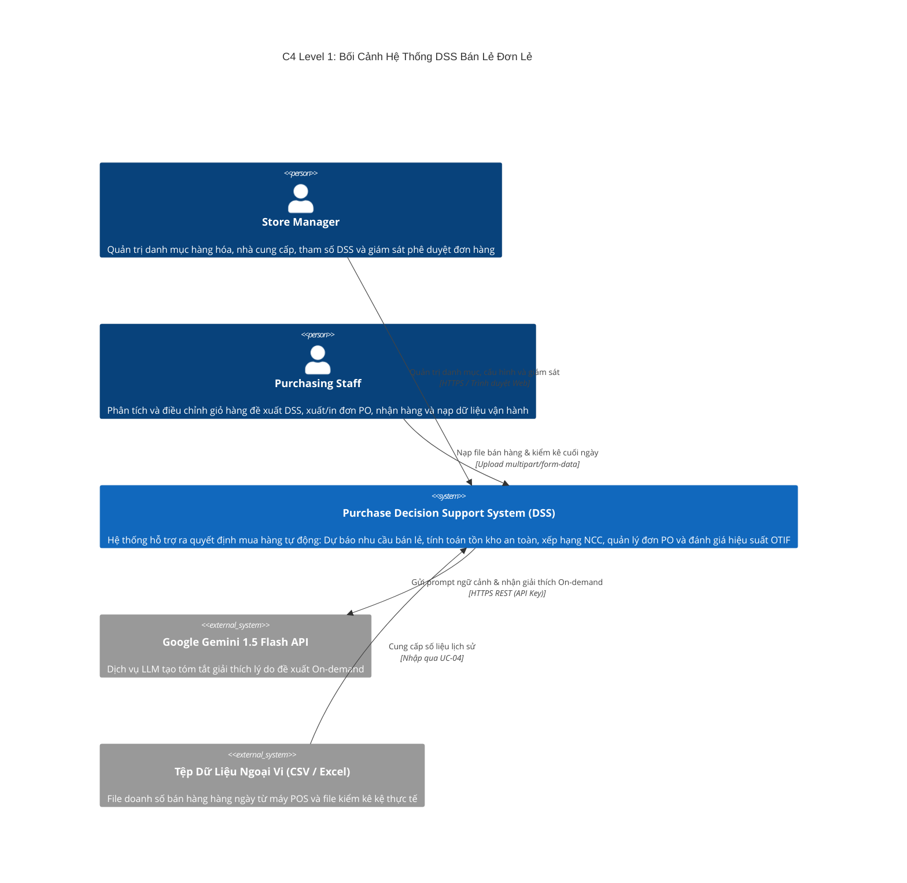
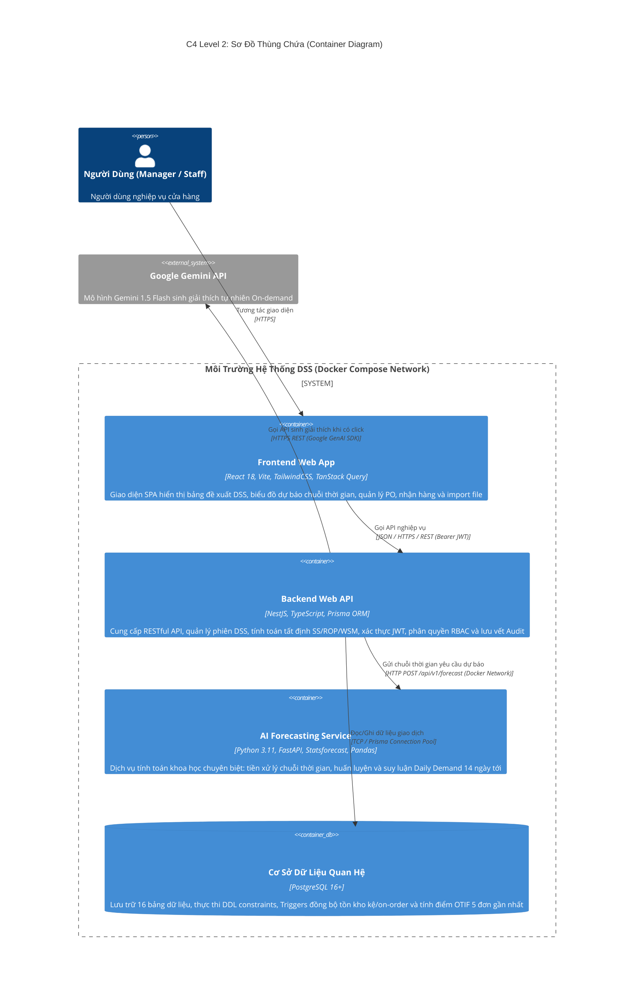
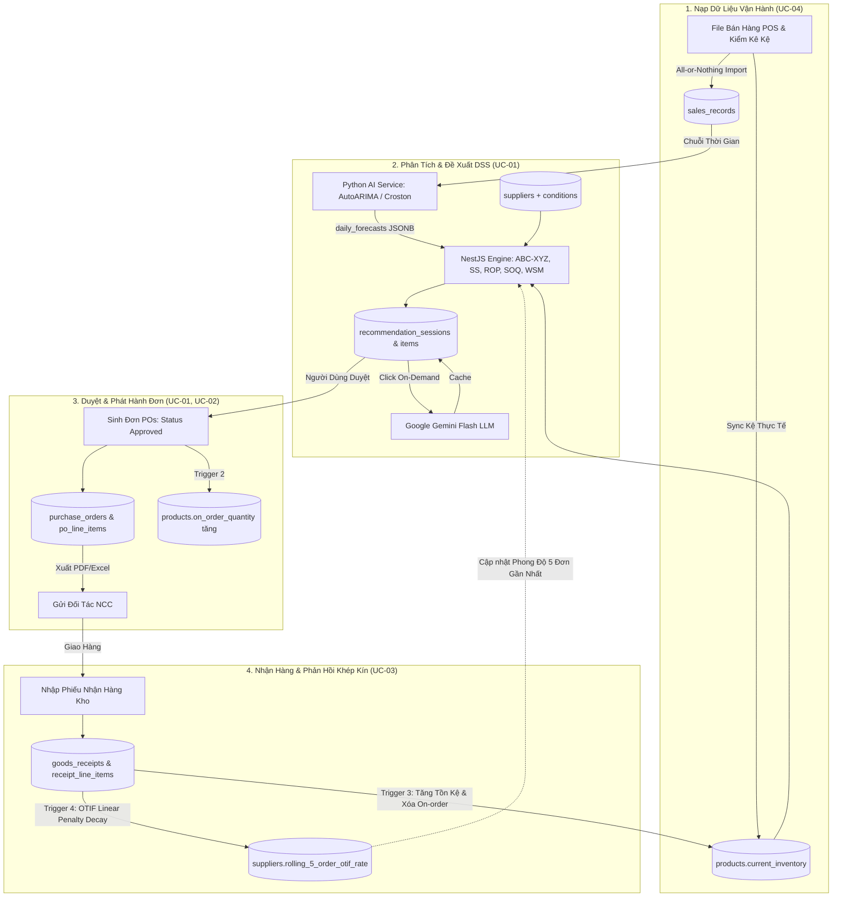

# Kiến Trúc Kỹ Thuật Hệ Thống (Technical System Architecture)

* **Tên hệ thống:** AI-Powered Purchase Decision Support System for a Single Retail Store
* **Phiên bản:** 1.0
* **Trạng thái:** Status: Confirmed
* **Tài liệu tham chiếu:** 
  * Mô hình Dữ liệu Kỹ thuật: [docs/technical/data-model.md](data-model.md)
  * Đặc tả Hợp đồng API Chi Tiết: [docs/technical/api-specification.md](api-specification.md)
  * Quy tắc Nghiệp vụ Chuẩn hóa: [docs/business/business-rules.md](../business/business-rules.md)
  * Mô hình Miền Nghiệp vụ: [docs/business/domain-model.md](../business/domain-model.md)
  * Quyết định Dự án: [docs/project-decisions.md](../project-decisions.md)

---

## 1. Tổng Quan Kiến Trúc & Mục Tiêu Thiết Kế

### 1.1. Bối Cảnh & Triết Lý Vận Hành
Hệ thống là giải pháp Hỗ trợ Ra Quyết Định Mua Hàng (Decision Support System - DSS) dành cho một cửa hàng bán lẻ đơn lẻ, tập trung giải quyết bài toán cân bằng tối ưu giữa việc ngăn chặn đứt hàng (**Stockout Prevention**) và giảm thiểu tồn kho ứ đọng vốn (**Overstock Mitigation**).

Hệ thống hoạt động theo triết lý nền tảng:
> **AI recommends. Human decides.**

AI đóng vai trò dự báo nhu cầu chuỗi thời gian, phân tích dữ liệu và đưa ra khuyến nghị; con người (Store Manager và Purchasing Staff) luôn giữ quyền thẩm định, điều chỉnh và đưa ra quyết định mua hàng cuối cùng.

### 1.2. Các Động Lực Kiến Trúc Cốt Lõi (Architectural Drivers)
1. **Tính Đúng Đắn & Bất Biến Lịch Sử (Correctness & Historical Immutability):** Hiện thực hóa trọn vẹn 44 Business Invariants qua mô hình phòng thủ 3 tầng (3-Tier Defense: Database Constraints, Triggers và Application Transactions). Toàn bộ đơn hàng đã duyệt bảo lưu vĩnh viễn mức giá, MOQ và Lead Time snapshot tại thời điểm phê duyệt.
2. **Tốc Độ Phản Hồi Tức Thì (Sub-second Responsiveness):** Chuỗi tính toán DSS ban đầu tại UC-01 hoàn tất trong thời gian < 1 giây thông qua việc phân lập rạch ròi 3 động cơ tính toán và tách mô hình ngôn ngữ lớn (LLM) ra khỏi đường dẫn tới hạn (Critical Path).
3. **Tính Minh Bạch & Giải Thích Được (Explainability):** Kết hợp hài hòa giữa số liệu định lượng khách quan (phân loại ABC-XYZ, Reorder Point, khoảng dự báo tin cậy 95%, bảng so sánh WSM) và tóm tắt diễn giải ngôn ngữ tự nhiên On-demand từ Google Gemini Flash.
4. **Chu Trình Phản Hồi Khép Kín (Closed-Loop Feedback):** Dữ liệu giao nhận hàng thực tế tại UC-03 tự động kích hoạt tính toán điểm OTIF theo mô hình phạt trễ hạn suy giảm tuyến tính, làm mới phong độ 5 đơn gần nhất của NCC để nuôi lại thuật toán chấm điểm cho các đợt DSS tiếp theo.
5. **Kiến Trúc Tinh Gọn (KISS & High Maintainability):** Áp dụng mô hình Polyglot Decoupled Architecture gồm Modular Monolith NestJS kết hợp Python AI Service chuyên biệt, đóng gói trọn gói qua Docker Compose, loại bỏ sự phức tạp vận hành của các hệ thống phân tán microservices/message broker.

---

## 2. Lựa Chọn Công Nghệ (Tech Stack Selection & Rationale)

| Phân tầng / Thành phần | Công nghệ lựa chọn | Vai trò & Căn cứ kỹ thuật |
| :--- | :--- | :--- |
| **Cơ Sở Dữ Liệu (Database)** | **PostgreSQL 16+** | Hỗ trợ kiểu dữ liệu chính xác `NUMERIC(15,2)`, trường bán cấu trúc `JSONB` cho dự báo/ranking, Stored Generated Columns, Database Triggers đồng bộ tồn kho và hệ thống chỉ mục B-Tree/Partial Indexes tối ưu. |
| **Data Access Layer** | **Prisma ORM** | Type-safe tuyệt đối từ Database Schema đến TypeScript DTOs, hỗ trợ Prisma Client Transaction (`$transaction`) cho các nghiệp vụ nguyên tử Tier 3, quản lý Schema Migrations tự động và an toàn. |
| **Backend Web API** | **NestJS (TypeScript)** | Kiến trúc **Modular Monolith** chuẩn Enterprise, Dependency Injection (DI), tích hợp sẵn Guards (RBAC), Interceptors (Audit Trail), Pipes validation tự động (`class-validator`) và tự sinh Swagger UI. |
| **Dịch Vụ AI (AI Service)** | **Python 3.11+ (FastAPI)** | Hệ sinh thái khoa học dữ liệu mạnh mẽ (`statsforecast`, `pandas`, `numpy`, `scipy`), chuyên trách tiền xử lý chuỗi thời gian, xử lý ngày không bán (Zero-Demand) và chạy các thuật toán dự báo nhu cầu bán lẻ. |
| **Mô Hình Ngôn Ngữ (LLM)** | **Google Gemini 1.5 Flash** | Tích hợp qua SDK chính thức `@google/genai`, tối ưu độ trễ thấp (~500ms), chi phí token rẻ, tóm tắt ngữ cảnh quản trị chuỗi cung ứng theo nhu cầu (On-demand). |
| **Frontend Web App** | **React 18+ + Vite** | Single Page Application (SPA), hiệu năng tải cực nhanh, TailwindCSS cho giao diện hiện đại, TanStack Query (React Query) quản lý cache dữ liệu và Recharts cho biểu đồ chuỗi thời gian. |
| **Đóng Gói & Triển Khai** | **Docker & Docker Compose**| Đóng gói 4 containers biệt lập (`frontend`, `backend`, `ai-service`, `postgres`), giao tiếp qua Docker Network nội bộ, dễ dàng triển khai cục bộ hoặc trên máy chủ bán lẻ. |

---

## 3. Kiến Trúc Mức Cao (High-Level Architecture - C4 Model)

### 3.1. C4 Level 1: Sơ Đồ Ngữ Cảnh Hệ Thống (System Context Diagram)



### 3.2. C4 Level 2: Sơ Đồ Thùng Chứa (Container Diagram & Network Topology)



### 3.3. Luồng Dữ Liệu Khép Kín Toàn Hệ Thống (Closed-Loop Data Flow)



---

## 4. Phân Rã Cấu Phần Backend (Backend Component Architecture)

### 4.1. Cấu Trúc Phân Tầng Nội Bộ (Layered Architecture Pattern)
Mỗi module bên trong Backend NestJS được tổ chức nhất quán theo 4 tầng phân tách trách nhiệm:
1. **Presentation Layer (Controllers, DTOs, Guards):**
   * Tiếp nhận HTTP requests, kiểm tra định dạng DTO qua `ValidationPipe` (`class-validator`).
   * Kiểm soát quyền truy cập qua `JwtAuthGuard` và `RolesGuard`.
   * Đóng gói response theo chuẩn `Standard API Envelope`.
2. **Application Layer (Services & Use Case Orchestrators):**
   * Điều phối quy trình nghiệp vụ theo từng Use Case.
   * Thiết lập ranh giới giao dịch CSDL (`Prisma.$transaction`) đảm bảo tính nguyên tử ACID.
   * Xử lý các quy tắc nghiệp vụ phức hợp thuộc Tier 3 Invariants.
3. **Domain Layer (Engines, Mathematical Formulas, Invariants):**
   * Chứa các thuật toán tính toán tất định thuần túy (Pure Functions): công thức SS, ROP, SOQ, phân loại ABC-XYZ, mô hình chấm điểm WSM.
   * Hoàn toàn độc lập với database và framework, thuận tiện cho việc viết Unit Test.
4. **Infrastructure Layer (PrismaService, External Clients):**
   * Tương tác với PostgreSQL thông qua Prisma Client.
   * Gọi HTTP client sang Python AI Service và Google Gemini API SDK.

### 4.2. Danh Mục 9 Modules Chuẩn Hóa
Kiến trúc Backend được chia thành chính xác 9 Modules độc lập:

| Module Name | Trách nhiệm nghiệp vụ | Use Cases liên quan | Bảng CSDL phụ trách |
| :--- | :--- | :--- | :--- |
| **`AuthModule`** | Đăng nhập, đăng xuất, Refresh Token Rotation, kiểm tra JWT, RBAC Guards. | Chung toàn hệ thống | `users`, `refresh_tokens` |
| **`CatalogModule`** | Quản trị danh mục ngành hàng, thông tin SKU, theo dõi tồn kho kệ và hàng đang về. | UC-05 | `categories`, `products` |
| **`SupplierModule`**| Quản trị hồ sơ NCC, Lead Time cam kết, điều kiện báo giá (giá nhập, MOQ), theo dõi điểm OTIF. | UC-06 | `suppliers`, `supply_conditions` |
| **`DssModule`** | Khởi tạo phiên phân tích, điều phối dự báo AI, tính toán tất định, gọi LLM giải thích On-demand. | UC-01, UC-07 | `recommendation_sessions`, `recommendation_items`, `dss_configurations` |
| **`PurchaseOrderModule`**| Quản lý vòng đời đơn PO, xuất file PDF/Excel (`last_exported_at`), hủy đơn và hoàn trả On-order. | UC-02 | `purchase_orders`, `po_line_items` |
| **`GoodsReceiptModule`** | Nhận hàng kho đơn giản, đối soát 1:1 với PO, kích hoạt trigger cập nhật tồn kho và tính OTIF. | UC-03 | `goods_receipts`, `receipt_line_items` |
| **`DataImportModule`** | Nạp dữ liệu doanh số POS và kiểm kê kệ với cơ chế All-or-Nothing, ghi đè ngày trùng lặp. | UC-04 | `sales_records`, `inventory_snapshots` |
| **`ConfigurationModule`**| Quản trị bản ghi Singleton cấu hình tham số toàn cửa hàng (bộ trọng số WSM, Service Level). | UC-07 | `dss_configurations` |
| **`AuditModule`** | Cung cấp `AuditLogInterceptor` tự động ghi nhận nhật ký hoạt động Append-Only. | Giám sát hệ thống | `activity_logs` |

---

## 5. Thiết Kế Phân Hệ AI & DSS Engine (DSS Subsystem Design)

### 5.1. Phân Hệ Dự Báo Nhu Cầu Chuỗi Thời Gian (Python AI Service)
* **Mô hình triển khai:** Dịch vụ tính toán phi trạng thái (Stateless Compute Service) phát triển bằng FastAPI, lắng nghe tại cổng nội bộ 8000.
* **Giao thức giao tiếp:** RESTful HTTP đồng bộ (`POST /api/v1/forecast`).
* **Hợp đồng dữ liệu:**
  * *Request:* NestJS gửi danh sách Active SKUs kèm chuỗi lịch sử bán hàng gần nhất (ngày và số lượng bán).
  * *Tiền xử lý:* Tự động điền giá trị 0 cho các ngày không phát sinh đơn hàng (Zero-Demand Handling).
  * *Lựa chọn thuật toán:*
    * Nhu cầu ngắt quãng, nhiều ngày 0: Sử dụng mô hình **Croston** hoặc **TSB** (Teunter-Syntetos-Babai) qua thư viện `statsforecast`.
    * Nhu cầu đều, biến động thấp ($CV \le 0.5$): Sử dụng **AutoARIMA** hoặc **Holt-Winters ETS**.
    * Chuỗi dữ liệu ngắn ($14 \le N < 30$ ngày): Sử dụng **Simple Moving Average (7 ngày)**.
  * *Response:* Trả về nhu cầu trung bình ngày ($\bar{d}$), độ lệch chuẩn nhu cầu ngày ($\sigma_d$), và mảng dự báo từng ngày cho **14 ngày tiếp theo** kèm khoảng tin cậy 95% (Lower/Upper bounds).
* **Cơ chế phòng thủ (Graceful Fallback):** Nếu container Python AI Service gặp sự cố hoặc timeout (> 3 giây), NestJS tự động chuyển sang tính $\bar{d}$ từ trung bình lịch sử thô qua SQL, hiển thị cảnh báo mềm `[Dự báo Dự Phòng]` trên giao diện và không bao giờ làm nghẽn chu trình mua hàng.

### 5.2. Động Cơ Tính Toán Tất Định (NestJS DssCalculationEngineService)
Toàn bộ logic tính toán được thực thi 100% tất định trong bộ nhớ Backend:
1. **Phân loại tồn kho ABC-XYZ:**
   * Ngưỡng ABC cố định theo doanh thu 90 ngày: A (Top 80%), B (15% tiếp theo), C (5% còn lại).
   * Ngưỡng XYZ theo hệ số biến thiên $CV = \frac{\sigma_d}{\bar{d}}$: X ($CV \le 0.5$), Y ($0.5 < CV \le 1.0$), Z ($CV > 1.0$).
2. **Tính Tồn Kho An Toàn (Safety Stock):**
   $$SS = Z \times \sigma_d \times \sqrt{L}$$
   * $Z$: Ánh xạ từ Service Level (90% $\rightarrow 1.28$, 95% $\rightarrow 1.65$, 98% $\rightarrow 2.05$, 99% $\rightarrow 2.33$).
   * $L$: Committed Lead Time của NCC được xếp hạng cao nhất.
   * Fallback SKU mới bán $< 14$ ngày: $SS_{\text{fallback}} = \bar{d} \times 5 \text{ ngày}$.
3. **Tính Điểm Đặt Hàng Lại (Reorder Point) & Số Lượng Gợi Ý (SOQ):**
   $$ROP = (\bar{d} \times L) + SS$$
   * Tồn khả dụng: $I_{\text{avail}} = \text{currentInventory} + \text{onOrderQuantity}$.
   * Nếu $I_{\text{avail}} > ROP \implies SOQ = 0$.
   * Nếu $I_{\text{avail}} \le ROP$:
     $$\text{Target Stock} = \bar{d} \times (L + R) + SS$$
     $$SOQ = \max\left(MOQ, \left\lceil \max(0, \text{Target Stock} - I_{\text{avail}}) \right\rceil\right)$$
4. **Mô Hình Chấm Điểm Nhà Cung Cấp WSM (Weighted Sum Model):**
   * Chuẩn hóa Min-Max các tiêu chí chi phí: Điểm Giá ($S_P$), Điểm Lead Time ($S_L$), Điểm MOQ ($S_M$).
   * Tiêu chí Lịch sử Giao hàng ($S_H$): Lấy từ `suppliers.rolling_5_order_otif_rate`; đối tác mới $< 3$ đơn tạm tính mức chuẩn $80\%$.
   * Điểm tổng hợp: $Score = (w_P \cdot S_P) + (w_L \cdot S_L) + (w_M \cdot S_M) + (w_H \cdot S_H)$ với $\sum w_i = 100\%$.
   * Lưu toàn bộ kết quả so sánh các NCC vào `supplier_rankings (JSONB)`.

### 5.3. Dịch Vụ Giải Thích Tự Nhiên On-Demand (Google Gemini Flash)
* **SDK:** `@google/genai` với model `gemini-1.5-flash`.
* **Cơ chế kích hoạt:** Chỉ chạy khi người dùng bấm xem chi tiết giải thích cho một SKU cụ thể tại UC-01 (`POST /api/v1/dss/items/{id}/explain`). Hoàn toàn không nằm trên blocking critical path khi tải bảng đề xuất ban đầu.
* **Ngữ cảnh Prompt:** Ghép nối số liệu định lượng (Tên SKU, Nhóm ABC-XYZ, Tồn kệ, Hàng đang về, ROP, SS, SOQ, Tên NCC được chọn, Điểm WSM).
* **Bộ nhớ đệm (Caching):** Kết quả phản hồi được lưu trực tiếp vào cột CSDL `recommendation_items.why_buy_explanation` (tương ứng trường DTO `llmExplanation`). Các lần mở sau đọc trực tiếp từ CSDL (0ms độ trễ, 0 token phát sinh).
* **Cơ chế Timeout:** Timeout 3.0 giây; nếu lỗi mạng trả về đoạn văn mẫu tất định an toàn.

---

## 6. Kiến Trúc Phân Hệ Frontend (Frontend Web Architecture)

### 6.1. Cấu Trúc Mã Nguồn Theo Tính Năng (Feature-Driven Structure)
Giao diện React được tổ chức theo từng phân hệ tính năng độc lập tương ứng 7 Use Cases:
```text
frontend/src/
├── features/
│   ├── auth/           # Màn hình Login, AuthContext, ProtectedRoute
│   ├── dss-review/     # Màn hình UC-01: Bảng đề xuất, Badge ABC-XYZ, Modal Explain, Recharts LineChart
│   ├── orders/         # Màn hình UC-02: Danh sách đơn PO, Modal Hủy đơn, In/Xuất PDF
│   ├── receipts/       # Màn hình UC-03: Nhận hàng kho đơn giản, Soft warning Over-delivery
│   ├── data-import/    # Màn hình UC-04: Nạp file kéo thả, Data Preview, Danh sách lỗi chi tiết
│   ├── catalog/        # Màn hình UC-05: Danh mục SKU, Form thêm/sửa, Bộ lọc ngành hàng
│   ├── suppliers/      # Màn hình UC-06: Hồ sơ NCC, Cấu hình báo giá SKU, Bảng điểm OTIF 5 đơn
│   └── configuration/  # Màn hình UC-07: Cấu hình trọng số WSM (tổng 100%), Service Level slider
├── components/         # UI components dùng chung (Button, Table, Modal, Toast, Input, Badge)
├── services/api/       # Axios client cấu hình Base URL, Interceptor tự động Refresh Token
└── hooks/              # Custom hooks (useAuth, useDssSession, useProducts)
```

### 6.2. Quản Lý Trạng Thái & Đồng Bộ Dữ Liệu
* **Server State:** Quản lý bằng **TanStack Query (React Query)**: Caching dữ liệu bảng, tự động refetch sau khi mutation (tạo PO, nhận hàng, đổi trạng thái SKU).
* **Client State:** React Context API cho phiên đăng nhập (`AuthContext`) và giỏ hàng điều chỉnh DSS trong phiên làm việc.
* **Biểu đồ chuỗi thời gian:** Sử dụng thư viện **Recharts** vẽ biểu đồ diện tích/đường kết hợp (Lịch sử bán hàng thực tế + 14 ngày dự báo + dải tin cậy 95%).

---

## 7. Bảo Mật, Phân Quyền (RBAC) & Nhật Ký Kiểm Toán (Audit Trail)

### 7.1. Chu Trình Xác Thực JWT & Token Rotation
* **Access Token:** JWT ngắn hạn (15 phút), chứa `sub` (userId), `username`, `role`. Truyền qua Header `Authorization: Bearer <token>`.
* **Refresh Token:** Chuỗi ngẫu nhiên bảo mật cao (7 ngày). Chuỗi băm SHA-256 được lưu trong bảng `refresh_tokens`.
* **Lưu trữ Client an toàn tuyệt đối:** Refresh Token được Backend gửi về qua Cookie `Set-Cookie: refreshToken=...; HttpOnly; Secure; SameSite=Strict`. JavaScript trên Frontend hoàn toàn không thể đọc cookie này, **miễn nhiễm 100% với tấn công XSS**.
* **Cơ chế Token Rotation:** Mỗi lần gọi `POST /api/v1/auth/refresh`, Backend đánh dấu thu hồi token cũ (`revoked_at = now()`) và phát hành token mới. Nếu phát hiện token đã bị thu hồi được sử dụng lại, hệ thống lập tức hủy toàn bộ session của tài khoản đó (phát hiện xâm nhập).

### 7.2. Phân Quyền RBAC (Role-Based Access Control)
Hệ thống phân quyền cứng thông qua `@UseGuards(JwtAuthGuard, RolesGuard)`:
* **`STORE_MANAGER`:** Toàn quyền trên 100% hệ thống (Quản trị tài khoản, danh mục SKU, NCC, giá, cấu hình DSS, duyệt mua, nhận hàng, xem audit logs).
* **`PURCHASING_STAFF`:**
  * Toàn quyền tác nghiệp mua hàng: UC-01 (Phân tích & Phê duyệt đề xuất), UC-02 (Quản lý đơn PO), UC-03 (Nhận hàng kho), UC-04 (Nạp dữ liệu vận hành).
  * Chế độ **Chỉ xem (Read-only)**: UC-05 (Xem danh mục SKU), UC-06 (Xem NCC & Báo giá), UC-07 (Xem cấu hình DSS). Bị chặn toàn bộ các thao tác tạo/sửa/xóa Master Data và bị chặn truy cập `/audit-logs`.

### 7.3. Nhật Ký Kiểm Toán (Audit Trail)
* Sử dụng `AuditLogInterceptor` gắn trên các Controller nghiệp vụ.
* Ghi nhận bất biến (Append-Only) vào bảng `activity_logs`: `user_id`, `username`, `action`, `entity_type`, `entity_id`, `metadata (JSONB)`, `ip_address`.
* Chỉ kích hoạt sau khi request xử lý thành công (Status 2xx), thực thi bất đồng bộ trong background promise để không gây trễ cho người dùng.

---

## 8. Quản Lý Giao Dịch & Xử Lý Bất Biến Tier 3 (Transaction Management)

Hệ thống bảo vệ toàn vẹn dữ liệu thông qua các ranh giới giao dịch ACID (`prisma.$transaction`):

### 8.1. Giao Dịch Phê Duyệt Đề Xuất DSS & Tạo Đơn PO (UC-01)
* **Bất biến liên quan:** `INV-24`, `INV-25`, `INV-26`, `INV-27`.
* **Ranh giới giao dịch:**
  1. Cập nhật trạng thái `recommendation_sessions` sang `Approved`.
  2. Cập nhật `approved_quantity` và `approved_supplier_id` trên từng dòng `recommendation_items`.
  3. Gom nhóm các mặt hàng theo Nhà cung cấp được chọn. Với mỗi NCC:
     * Tạo 1 bản ghi `purchase_orders` ở trạng thái `Approved`.
     * Xác định `expected_delivery_date = Approval_Date + supplier.committed_lead_time_days`.
     * Tạo các dòng `po_line_items`, bảo lưu vĩnh viễn snapshot `historical_unit_price`, `historical_moq`, `historical_lead_time_days`.
  4. Trigger 2 trong CSDL tự động tăng `products.on_order_quantity`.

### 8.2. Giao Dịch Xác Nhận Nhận Hàng Kho Đơn Giản (UC-03)
* **Bất biến liên quan:** `INV-31`, `INV-32`, `INV-33`, `INV-35`, `INV-36`, `INV-37`, `INV-38`.
* **Ranh giới giao dịch:**
  1. Thẩm định điều kiện: Đơn PO phải đang ở trạng thái `Approved`; tập SKU thực nhận phải thuộc về đơn PO gốc; chặn nếu 100% số lượng thực nhận bằng 0.
  2. Tạo bản ghi `goods_receipts` và các dòng `receipt_line_items`.
  3. Trigger 3 trong CSDL tự động: Tăng `products.current_inventory` theo số lượng thực nhận; giảm `products.on_order_quantity` theo số lượng đặt ban đầu; chuyển đơn PO sang trạng thái `Completed`.
  4. Trigger 4 tự động tính điểm OTIF theo mô hình suy giảm tuyến tính (BR-13) và làm mới `suppliers.rolling_5_order_otif_rate`.

### 8.3. Giao Dịch Nạp Dữ Liệu Vận Hành All-or-Nothing (UC-04)
* **Bất biến liên quan:** `INV-14`, `INV-22`, `INV-23`.
* **Ranh giới giao dịch:**
  1. Thẩm định toàn bộ file trong bộ nhớ đệm (In-memory validation). Nếu có bất kỳ dòng nào lỗi $\rightarrow$ Ném ngoại lệ `ALL_OR_NOTHING_IMPORT_FAILED` trả về danh sách chi tiết toàn bộ các dòng vi phạm và Rollback ngay lập tức.
  2. Đối với Doanh số bán hàng (`sales_records`): Kiểm tra các mốc ngày đã tồn tại trong CSDL. Thực hiện xóa dữ liệu cũ của các ngày đó (`deleteMany`) rồi chèn hàng loạt dữ liệu mới (`createMany`) để bảo đảm không cộng dồn doanh số.
  3. Đối với Kiểm kê kho (`inventory_snapshots`): Cập nhật `products.current_inventory` theo số lượng đếm được cho các SKU trong tệp; bảo lưu nguyên vẹn tồn kho của các SKU vắng mặt và bảo lưu nguyên vẹn `on_order_quantity`.

---

## 9. Kiến Trúc Triển Khai & Vận Hành (Deployment Architecture)

### 9.1. Cấu Hình Docker Compose
Toàn bộ hệ thống được đóng gói và vận hành qua một file `docker-compose.yml` duy nhất:

```yaml
version: '3.8'

services:
  postgres:
    image: postgres:16-alpine
    container_name: dss_postgres
    restart: always
    environment:
      POSTGRES_USER: ${POSTGRES_USER:-dss_admin}
      POSTGRES_PASSWORD: ${POSTGRES_PASSWORD:-dss_secret_pass}
      POSTGRES_DB: ${POSTGRES_DB:-dss_retail_db}
    ports:
      - "5432:5432"
    volumes:
      - pgdata:/var/lib/postgresql/data
    networks:
      - dss_network

  ai-service:
    build:
      context: ./ai-service
      dockerfile: Dockerfile
    container_name: dss_ai_service
    restart: always
    environment:
      PORT: 8000
    ports:
      - "8000:8000"
    networks:
      - dss_network

  backend:
    build:
      context: ./backend
      dockerfile: Dockerfile
    container_name: dss_backend
    restart: always
    depends_on:
      - postgres
      - ai-service
    environment:
      PORT: 3000
      DATABASE_URL: postgresql://${POSTGRES_USER:-dss_admin}:${POSTGRES_PASSWORD:-dss_secret_pass}@postgres:5432/${POSTGRES_DB:-dss_retail_db}?schema=public
      AI_SERVICE_URL: http://ai-service:8000
      GEMINI_API_KEY: ${GEMINI_API_KEY}
      JWT_SECRET: ${JWT_SECRET:-super_jwt_secret_key_change_in_production}
    ports:
      - "3000:3000"
    networks:
      - dss_network

  frontend:
    build:
      context: ./frontend
      dockerfile: Dockerfile
    container_name: dss_frontend
    restart: always
    depends_on:
      - backend
    ports:
      - "80:80"
    networks:
      - dss_network

volumes:
  pgdata:
    driver: local

networks:
  dss_network:
    driver: bridge
```

---

## 10. Liên Kết Hợp Đồng Giao Tiếp API Chi Tiết

Tài liệu này giữ vai trò là **Bản thiết kế kiến trúc toàn cảnh (Hub)**. Toàn bộ chi tiết kỹ thuật phục vụ lập trình bao gồm danh mục 30+ endpoints, cấu trúc DTOs, các trường dữ liệu, validation decorators và taxonomy mã lỗi được quy định chính thức tại:

👉 [docs/technical/api-specification.md](api-specification.md)
