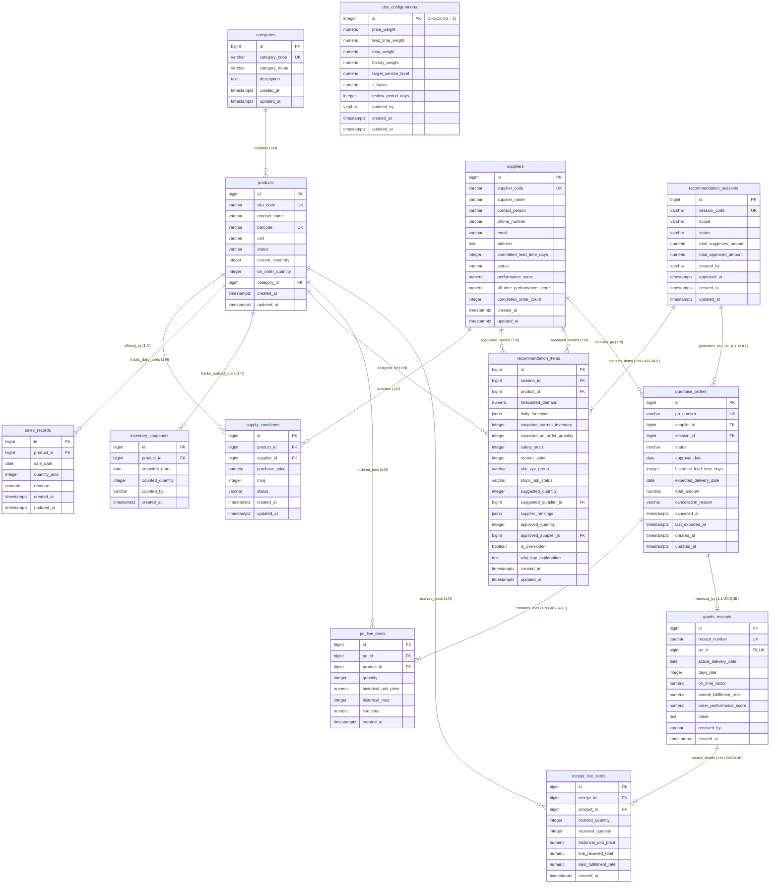

# Đặc Tả Mô Hình Dữ Liệu Kỹ Thuật (Data Model Specification)

## AI-Powered Purchase Decision Support System for a Single Retail Store

* **Dự án:** Hệ Thống Hỗ Trợ Ra Quyết Định Mua Hàng Ứng Dụng Trí Tuệ Nhân Tạo Cho Cửa Hàng Bán Lẻ Đơn Lẻ
* **Hệ quản trị CSDL mục tiêu:** PostgreSQL 16+
* **Trạng thái:** `Status: Confirmed`
* **Phiên bản:** `1.0 (Official Technical Specification)`
* **Ngày phê duyệt:** 2026-09-13
* **Nguồn sự thật kế thừa:** [docs/project-decisions.md](../project-decisions.md), [docs/business/domain-model.md](../business/domain-model.md) (13 Entities, 44 Invariants), và [docs/business/business-rules.md](../business/business-rules.md) (28 BRs).

---

## 1. Nguyên Tắc Thiết Kế Cơ Sở Dữ Liệu Cốt Lõi

1. **Hiện thực hóa trực tiếp Mô hình Miền (Direct Domain-to-Data Mapping):**
   * Ánh xạ chính xác và toàn vẹn 13 Domain Entities thành 13 bảng quan hệ vật lý chuẩn hóa (3NF trên Master Data).
   * Không sử dụng bảng nối trung gian vô nghĩa: Mối quan hệ nhiều - nhiều giữa Sản phẩm và Nhà cung cấp được hiện thực hóa qua thực thể nghiệp vụ mang thuộc tính `supply_conditions`.
2. **Khóa Kỹ Thuật & Khóa Tự Nhiên (Key Management):**
   * Mọi bảng đều sử dụng khóa chính kỹ thuật vô nghĩa `id BIGINT GENERATED ALWAYS AS IDENTITY` để tối ưu hóa hiệu năng B-Tree Index, bộ nhớ đệm và các phép nối JOIN.
   * Toàn bộ mã nghiệp vụ tự nhiên (`sku_code`, `supplier_code`, `po_number`, `receipt_number`, `session_code`) được bảo vệ bằng ràng buộc `UNIQUE NOT NULL` kết hợp chỉ mục không phân biệt hoa thường (`Functional Unique Index UPPER(...)`).
3. **Toàn vẹn dữ liệu đa tầng (Defense-in-Depth):**
   * Chuyển hóa tối đa 44 Business Invariants xuống kiểm tra cứng tại tầng CSDL (`NOT NULL`, `CHECK`, `UNIQUE`, `EXCLUDE`, Generated Columns).
   * Áp dụng Database Triggers cho các nghiệp vụ đồng bộ trạng thái liên bảng tự động (Tồn kho kệ, Hàng đang về, Phong độ OTIF).
4. **Bảo tồn Bất biến Lịch sử (Historical Immutability & Auditability):**
   * Áp dụng kỹ thuật lưu thừa có kiểm soát (`Controlled Denormalization`) tại các bảng giao dịch: Sao chép snapshot đơn giá nhập (`historical_unit_price`), MOQ (`historical_moq`) và thời gian giao cam kết (`historical_lead_time_days`) tại thời điểm duyệt đơn. Tuyệt đối không JOIN ngược về bảng báo giá hiện hành khi truy vấn đơn hàng quá khứ.
   * Lưu snapshot tồn kho thực tế (`snapshot_current_inventory`) và hàng đang về (`snapshot_on_order_quantity`) tại thời điểm phân tích DSS để bảo tồn 100% tính giải trình của thuật toán.
5. **Độ chính xác số học & Chuẩn hóa thời gian:**
   * Sử dụng kiểu dữ liệu tiền tệ chính xác `NUMERIC(15, 2)` và tỷ lệ % / điểm số `NUMERIC(5, 4)` (tuyệt đối không sử dụng `FLOAT` hoặc `REAL`).
   * Sử dụng `TIMESTAMPTZ` (UTC) cho toàn bộ mốc thời gian hệ thống và `DATE` cho các mốc ngày lịch kinh doanh.
6. **Chính sách khóa ngoại an toàn (Referential Integrity Policy):**
   * Mặc định sử dụng `ON DELETE RESTRICT` trên toàn bộ các thực thể độc lập và dữ liệu giao dịch để ngăn chặn việc xóa nhầm làm gãy liên kết kiểm toán (Bảo vệ quy tắc Zero-Link Hard Delete).
   * Chỉ sử dụng `ON DELETE CASCADE` cho các bảng chi tiết phụ thuộc 100% vào vòng đời bảng cha (`recommendation_items`, `po_line_items`, `receipt_line_items`).

---

## 2. Sơ Đồ Thực Thể Liên Kết Toàn Cảnh (Database ERD - 13 Tables)



---

## 3. Đặc Tả Chi Tiết 13 Bảng CSDL (Data Dictionary)

### 3.1. Phân Vùng 1: Dữ Liệu Nền Tảng (Master Data - 4 Bảng)

#### 3.1.1. Bảng `categories` (Danh mục Ngành hàng)
* **Mô tả nghiệp vụ:** Lưu trữ các nhóm ngành hàng thương mại của cửa hàng, làm bộ lọc phạm vi tính toán cho DSS tại `UC-01`.
* **Kế thừa:** Entity `Category`, quy tắc `BR-20`, bất biến `INV-01`, `INV-02`, `INV-CAT-01`, `INV-CAT-02`.

| Tên Cột | Kiểu Dữ Liệu | Nullable | Mặc Định | Ràng Buộc / Khóa | Ý Nghĩa Nghiệp Vụ |
| :--- | :--- | :---: | :--- | :--- | :--- |
| `id` | `BIGINT` | **NO** | `GENERATED ALWAYS AS IDENTITY` | `pk_categories` (PK) | Khóa chính kỹ thuật 64-bit tự tăng |
| `category_code` | `VARCHAR(50)` | **NO** | | `uq_categories_category_code` (UK) | Mã ngành hàng tự nhiên (`BEV`, `SNK`), bất biến |
| `category_name` | `VARCHAR(100)` | **NO** | | `chk_categories_name_not_empty` | Tên hiển thị ngành hàng, cấm chuỗi rỗng |
| `description` | `TEXT` | YES | `NULL` | | Mô tả phạm vi mặt hàng |
| `created_at` | `TIMESTAMPTZ` | **NO** | `NOW()` | | Thời điểm tạo bản ghi (UTC) |
| `updated_at` | `TIMESTAMPTZ` | **NO** | `NOW()` | | Thời điểm cập nhật cuối (UTC) |

* **Danh sách Ràng buộc (Constraints):**
  * `pk_categories`: `PRIMARY KEY (id)`
  * `uq_categories_category_code`: `UNIQUE (category_code)`
  * `chk_categories_code_format`: `CHECK (category_code ~ '^[A-Za-z0-9_-]+$')`
  * `chk_categories_name_not_empty`: `CHECK (trim(category_name) <> '')`
* **Chỉ mục (Indexes):**
  * `uq_categories_code_upper`: Functional Unique Index `CREATE UNIQUE INDEX uq_categories_code_upper ON categories (UPPER(category_code));`

---

#### 3.1.2. Bảng `products` (Danh mục Sản phẩm / SKU)
* **Mô tả nghiệp vụ:** Lưu trữ danh mục mặt hàng kinh doanh, quản lý tồn kho hiện hữu trên kệ và lượng hàng đang về từ các PO đã duyệt.
* **Kế thừa:** Entity `Product`, quy tắc `BR-17`, `BR-18`, `BR-19`, `BR-20`, bất biến `INV-03` đến `INV-08`, `INV-PROD-01..05`.

| Tên Cột | Kiểu Dữ Liệu | Nullable | Mặc Định | Ràng Buộc / Khóa | Ý Nghĩa Nghiệp Vụ |
| :--- | :--- | :---: | :--- | :--- | :--- |
| `id` | `BIGINT` | **NO** | `GENERATED ALWAYS AS IDENTITY` | `pk_products` (PK) | Khóa chính kỹ thuật |
| `sku_code` | `VARCHAR(50)` | **NO** | | `uq_products_sku_code` (UK) | Mã định danh SKU tự nhiên (`MILK-180ML`), bất biến |
| `product_name` | `VARCHAR(255)` | **NO** | | `chk_products_name_not_empty` | Tên thương mại sản phẩm |
| `barcode` | `VARCHAR(50)` | YES | `NULL` | `uq_products_barcode` (UK) | Mã vạch sản phẩm (nếu có thì duy nhất) |
| `unit` | `VARCHAR(30)` | **NO** | | `chk_products_unit_not_empty` | Đơn vị tính (`Chai`, `Hộp`, `Gói`, `Lon`) |
| `status` | `VARCHAR(20)` | **NO** | `'Active'` | `chk_products_status` | Trạng thái kinh doanh (`Active`, `Inactive`) |
| `current_inventory` | `INTEGER` | **NO** | `0` | `chk_products_inventory_non_negative` | Tồn kho thực tế trên kệ ($\ge 0$, khởi tạo = 0) |
| `on_order_quantity`| `INTEGER` | **NO** | `0` | `chk_products_on_order_non_negative` | Lượng hàng đang về từ PO Approved ($\ge 0$, khởi tạo = 0) |
| `category_id` | `BIGINT` | **NO** | | `fk_products_categories` (FK) | Tham chiếu ngành hàng bắt buộc (`ON DELETE RESTRICT`) |
| `created_at` | `TIMESTAMPTZ` | **NO** | `NOW()` | | Thời điểm tạo bản ghi (UTC) |
| `updated_at` | `TIMESTAMPTZ` | **NO** | `NOW()` | | Thời điểm cập nhật cuối (UTC) |

* **Danh sách Ràng buộc (Constraints):**
  * `pk_products`: `PRIMARY KEY (id)`
  * `uq_products_sku_code`: `UNIQUE (sku_code)`
  * `uq_products_barcode`: `UNIQUE (barcode)`
  * `fk_products_categories`: `FOREIGN KEY (category_id) REFERENCES categories(id) ON DELETE RESTRICT`
  * `chk_products_sku_code_format`: `CHECK (sku_code ~ '^[A-Za-z0-9_-]+$')`
  * `chk_products_name_not_empty`: `CHECK (trim(product_name) <> '')`
  * `chk_products_unit_not_empty`: `CHECK (trim(unit) <> '')`
  * `chk_products_status`: `CHECK (status IN ('Active', 'Inactive'))`
  * `chk_products_inventory_non_negative`: `CHECK (current_inventory >= 0)`
  * `chk_products_on_order_non_negative`: `CHECK (on_order_quantity >= 0)`
* **Chỉ mục (Indexes):**
  * `uq_products_sku_code_upper`: Functional Unique Index `CREATE UNIQUE INDEX uq_products_sku_code_upper ON products (UPPER(sku_code));`
  * `idx_products_category_id`: B-Tree trên `(category_id)`
  * `idx_products_status`: B-Tree trên `(status)`

---

#### 3.1.3. Bảng `suppliers` (Danh mục Nhà Cung Cấp)
* **Mô tả nghiệp vụ:** Hồ sơ đối tác thương mại, quản lý thời gian giao hàng cam kết tiêu chuẩn thống nhất (`committed_lead_time_days`) và phong độ giao hàng lịch sử phục vụ thuật toán WSM.
* **Kế thừa:** Entity `Supplier`, quy tắc `BR-21`, `BR-24`, bất biến `INV-09` đến `INV-11`, `INV-SUPP-01..06`.

| Tên Cột | Kiểu Dữ Liệu | Nullable | Mặc Định | Ràng Buộc / Khóa | Ý Nghĩa Nghiệp Vụ |
| :--- | :--- | :---: | :--- | :--- | :--- |
| `id` | `BIGINT` | **NO** | `GENERATED ALWAYS AS IDENTITY` | `pk_suppliers` (PK) | Khóa chính kỹ thuật |
| `supplier_code` | `VARCHAR(50)` | **NO** | | `uq_suppliers_supplier_code` (UK) | Mã định danh NCC tự nhiên (`VINAMILK`), bất biến |
| `supplier_name` | `VARCHAR(255)` | **NO** | | `chk_suppliers_name_not_empty` | Tên doanh nghiệp đối tác |
| `contact_person` | `VARCHAR(100)` | YES | `NULL` | | Người đại diện liên hệ |
| `phone_number` | `VARCHAR(50)` | YES | `NULL` | | Số điện thoại liên hệ |
| `email` | `VARCHAR(100)` | YES | `NULL` | | Email giao dịch |
| `address` | `TEXT` | YES | `NULL` | | Địa chỉ văn phòng / kho xuất hàng |
| `committed_lead_time_days` | `INTEGER` | **NO** | | `chk_suppliers_lead_time_positive` | Lead Time giao hàng cam kết chuẩn ($\ge 1$ ngày) |
| `status` | `VARCHAR(20)` | **NO** | `'Active'` | `chk_suppliers_status` | Trạng thái hợp tác (`Active`, `Inactive`) |
| `performance_score` | `NUMERIC(5, 4)` | **NO** | `0.8000` | `chk_suppliers_performance_score` | Phong độ 5 đơn gần nhất ($0.0 - 1.0$), Cold start = $0.8000$ |
| `all_time_performance_score` | `NUMERIC(5, 4)` | **NO** | `0.8000` | `chk_suppliers_all_time_score` | Điểm tích lũy toàn thời gian ($0.0 - 1.0$), mặc định $0.8000$ |
| `completed_order_count` | `INTEGER` | **NO** | `0` | `chk_suppliers_order_count_non_negative` | Tổng số đơn PO đã hoàn tất nhận hàng ($\ge 0$) |
| `created_at` | `TIMESTAMPTZ` | **NO** | `NOW()` | | Thời điểm tạo hồ sơ (UTC) |
| `updated_at` | `TIMESTAMPTZ` | **NO** | `NOW()` | | Thời điểm cập nhật cuối (UTC) |

* **Danh sách Ràng buộc (Constraints):**
  * `pk_suppliers`: `PRIMARY KEY (id)`
  * `uq_suppliers_supplier_code`: `UNIQUE (supplier_code)`
  * `chk_suppliers_code_format`: `CHECK (supplier_code ~ '^[A-Za-z0-9_-]+$')`
  * `chk_suppliers_name_not_empty`: `CHECK (trim(supplier_name) <> '')`
  * `chk_suppliers_lead_time_positive`: `CHECK (committed_lead_time_days >= 1)`
  * `chk_suppliers_status`: `CHECK (status IN ('Active', 'Inactive'))`
  * `chk_suppliers_performance_score`: `CHECK (performance_score >= 0.0000 AND performance_score <= 1.0000)`
  * `chk_suppliers_all_time_score`: `CHECK (all_time_performance_score >= 0.0000 AND all_time_performance_score <= 1.0000)`
  * `chk_suppliers_order_count_non_negative`: `CHECK (completed_order_count >= 0)`
* **Chỉ mục (Indexes):**
  * `uq_suppliers_code_upper`: Functional Unique Index `CREATE UNIQUE INDEX uq_suppliers_code_upper ON suppliers (UPPER(supplier_code));`
  * `idx_suppliers_status`: B-Tree trên `(status)`

---

#### 3.1.4. Bảng `supply_conditions` (Điều Kiện Cung Ứng / Báo Giá)
* **Mô tả nghiệp vụ:** Thỏa thuận thương mại và chính sách báo giá hiện hành giữa một NCC và một SKU, quản lý đơn giá nhập, MOQ và trạng thái cung ứng.
* **Kế thừa:** Entity `SupplyCondition`, quy tắc `BR-22`, `BR-23`, bất biến `INV-12`, `INV-13`, `INV-COND-01..04`.

| Tên Cột | Kiểu Dữ Liệu | Nullable | Mặc Định | Ràng Buộc / Khóa | Ý Nghĩa Nghiệp Vụ |
| :--- | :--- | :---: | :--- | :--- | :--- |
| `id` | `BIGINT` | **NO** | `GENERATED ALWAYS AS IDENTITY` | `pk_supply_conditions` (PK) | Khóa chính kỹ thuật |
| `product_id` | `BIGINT` | **NO** | | `fk_supply_conditions_products` (FK) | Tham chiếu SKU (`ON DELETE RESTRICT`) |
| `supplier_id` | `BIGINT` | **NO** | | `fk_supply_conditions_suppliers` (FK) | Tham chiếu NCC (`ON DELETE RESTRICT`) |
| `purchase_price` | `NUMERIC(15, 2)` | **NO** | | `chk_supply_conditions_price_positive` | Đơn giá nhập hiện hành ($> 0$ VNĐ) |
| `moq` | `INTEGER` | **NO** | `1` | `chk_supply_conditions_moq_positive` | Số lượng đặt hàng tối thiểu ($\ge 1$) |
| `status` | `VARCHAR(20)` | **NO** | `'Active'` | `chk_supply_conditions_status` | Trạng thái cung ứng (`Active`, `Discontinued`) |
| `created_at` | `TIMESTAMPTZ` | **NO** | `NOW()` | | Thời điểm tạo báo giá (UTC) |
| `updated_at` | `TIMESTAMPTZ` | **NO** | `NOW()` | | Thời điểm cập nhật cuối (UTC) |

* **Danh sách Ràng buộc (Constraints):**
  * `pk_supply_conditions`: `PRIMARY KEY (id)`
  * `uq_supply_conditions_product_supplier`: `UNIQUE (product_id, supplier_id)`
  * `fk_supply_conditions_products`: `FOREIGN KEY (product_id) REFERENCES products(id) ON DELETE RESTRICT`
  * `fk_supply_conditions_suppliers`: `FOREIGN KEY (supplier_id) REFERENCES suppliers(id) ON DELETE RESTRICT`
  * `chk_supply_conditions_price_positive`: `CHECK (purchase_price > 0)`
  * `chk_supply_conditions_moq_positive`: `CHECK (moq >= 1)`
  * `chk_supply_conditions_status`: `CHECK (status IN ('Active', 'Discontinued'))`
* **Chỉ mục (Indexes):**
  * `idx_supply_conditions_product_id`: B-Tree trên `(product_id)`
  * `idx_supply_conditions_supplier_id`: B-Tree trên `(supplier_id)`
  * `idx_supply_conditions_active`: Partial Index `CREATE INDEX idx_supply_conditions_active ON supply_conditions(product_id) WHERE status = 'Active';`

---

### 3.2. Phân Vùng 2: Dữ Liệu Vận Hành & Cấu Hình (Operational & Configuration - 3 Bảng)

#### 3.2.1. Bảng `sales_records` (Dữ Liệu Bán Hàng Theo Ngày)
* **Mô tả nghiệp vụ:** Chuỗi thời gian tiêu thụ hàng ngày của từng SKU, làm đầu vào nuôi mô hình AI dự báo nhu cầu và phân loại ma trận ABC-XYZ tại `UC-01`.
* **Kế thừa:** Entity `SalesRecord`, quy tắc `BR-14`, `BR-15`, `BR-18`, bất biến `INV-14` đến `INV-16`, `INV-SALE-01..05`.

| Tên Cột | Kiểu Dữ Liệu | Nullable | Mặc Định | Ràng Buộc / Khóa | Ý Nghĩa Nghiệp Vụ |
| :--- | :--- | :---: | :--- | :--- | :--- |
| `id` | `BIGINT` | **NO** | `GENERATED ALWAYS AS IDENTITY` | `pk_sales_records` (PK) | Khóa chính kỹ thuật |
| `product_id` | `BIGINT` | **NO** | | `fk_sales_records_products` (FK) | Tham chiếu SKU (`ON DELETE RESTRICT`) |
| `sale_date` | `DATE` | **NO** | | `chk_sales_records_date_not_future` | Ngày bán hàng lịch ($\le$ Ngày hiện tại) |
| `quantity_sold` | `INTEGER` | **NO** | | `chk_sales_records_quantity_positive` | Số lượng bán trong ngày ($> 0$) |
| `revenue` | `NUMERIC(15, 2)` | **NO** | `0.00` | `chk_sales_records_revenue_non_negative` | Doanh thu thuần thu được ($\ge 0$ VNĐ) |
| `created_at` | `TIMESTAMPTZ` | **NO** | `NOW()` | | Thời điểm nạp bản ghi lần đầu (UTC) |
| `updated_at` | `TIMESTAMPTZ` | **NO** | `NOW()` | | Thời điểm cập nhật / ghi đè (UTC) |

* **Danh sách Ràng buộc (Constraints):**
  * `pk_sales_records`: `PRIMARY KEY (id)`
  * `uq_sales_records_product_date`: `UNIQUE (product_id, sale_date)`
  * `fk_sales_records_products`: `FOREIGN KEY (product_id) REFERENCES products(id) ON DELETE RESTRICT`
  * `chk_sales_records_date_not_future`: `CHECK (sale_date <= CURRENT_DATE)`
  * `chk_sales_records_quantity_positive`: `CHECK (quantity_sold > 0)`
  * `chk_sales_records_revenue_non_negative`: `CHECK (revenue >= 0.00)`
* **Chỉ mục (Indexes):**
  * `idx_sales_records_product_date`: Composite Index `CREATE INDEX idx_sales_records_product_date ON sales_records (product_id, sale_date DESC);`
  * `idx_sales_records_sale_date`: B-Tree trên `(sale_date)`

---

#### 3.2.2. Bảng `inventory_snapshots` (Bản Ghi Kiểm Kê Kho Kệ)
* **Mô tả nghiệp vụ:** Lưu vết kết quả kiểm đếm vật lý thực tế tại kho kệ, làm căn cứ kiểm toán kho và đồng bộ gán đè tồn kho hiện tại lên bảng `products`.
* **Kế thừa:** Entity `InventorySnapshot`, quy tắc `BR-14`, `BR-16`, bất biến `INV-17` đến `INV-19`, `INV-INV-01..05`.

| Tên Cột | Kiểu Dữ Liệu | Nullable | Mặc Định | Ràng Buộc / Khóa | Ý Nghĩa Nghiệp Vụ |
| :--- | :--- | :---: | :--- | :--- | :--- |
| `id` | `BIGINT` | **NO** | `GENERATED ALWAYS AS IDENTITY` | `pk_inventory_snapshots` (PK) | Khóa chính kỹ thuật |
| `product_id` | `BIGINT` | **NO** | | `fk_inventory_snapshots_products` (FK) | Tham chiếu SKU (`ON DELETE RESTRICT`) |
| `snapshot_date` | `DATE` | **NO** | | `chk_inventory_snapshots_date_not_future` | Ngày thực hiện kiểm kê kho ($\le$ Ngày hiện tại) |
| `counted_quantity` | `INTEGER` | **NO** | | `chk_inventory_snapshots_counted_non_negative` | Số lượng hàng thực tế đếm được ($\ge 0$) |
| `counted_by` | `VARCHAR(100)` | YES | `NULL` | | Người thực hiện kiểm kê kho |
| `created_at` | `TIMESTAMPTZ` | **NO** | `NOW()` | | Thời điểm nạp bản ghi kiểm kê (UTC) |

* **Danh sách Ràng buộc (Constraints):**
  * `pk_inventory_snapshots`: `PRIMARY KEY (id)`
  * `uq_inventory_snapshots_product_date`: `UNIQUE (product_id, snapshot_date)`
  * `fk_inventory_snapshots_products`: `FOREIGN KEY (product_id) REFERENCES products(id) ON DELETE RESTRICT`
  * `chk_inventory_snapshots_date_not_future`: `CHECK (snapshot_date <= CURRENT_DATE)`
  * `chk_inventory_snapshots_counted_non_negative`: `CHECK (counted_quantity >= 0)`
* **Chỉ mục (Indexes):**
  * `idx_inventory_snapshots_product_date`: Composite Index `CREATE INDEX idx_inventory_snapshots_product_date ON inventory_snapshots (product_id, snapshot_date DESC);`

---

#### 3.2.3. Bảng `dss_configurations` (Cấu Hình Tham Số DSS Toàn Hệ Thống)
* **Mô tả nghiệp vụ:** Bảng Singleton 1 dòng duy nhất lưu bộ tham số chiến lược mua hàng toàn cửa hàng (trọng số WSM, Service Level mục tiêu, chu kỳ rà soát).
* **Kế thừa:** Entity `DSSConfiguration`, quy tắc `BR-25`, `BR-26`, `BR-27`, `BR-28`, bất biến `INV-20` đến `INV-22`, `INV-CONF-01..06`.

| Tên Cột | Kiểu Dữ Liệu | Nullable | Mặc Định | Ràng Buộc / Khóa | Ý Nghĩa Nghiệp Vụ |
| :--- | :--- | :---: | :--- | :--- | :--- |
| `id` | `INTEGER` | **NO** | `1` | `pk_dss_configurations` (PK) | Khóa chính khóa cứng = 1 (Singleton) |
| `price_weight` | `NUMERIC(5, 4)` | **NO** | `0.4000` | `chk_weights_non_negative` | Trọng số Đơn giá ($w_{\text{Price}}$, mặc định $40\%$) |
| `lead_time_weight` | `NUMERIC(5, 4)` | **NO** | `0.2000` | `chk_weights_non_negative` | Trọng số Lead Time ($w_{\text{LeadTime}}$, mặc định $20\%$) |
| `moq_weight` | `NUMERIC(5, 4)` | **NO** | `0.1500` | `chk_weights_non_negative` | Trọng số MOQ ($w_{\text{MOQ}}$, mặc định $15\%$) |
| `history_weight` | `NUMERIC(5, 4)` | **NO** | `0.2500` | `chk_weights_non_negative` | Trọng số Lịch sử ($w_{\text{History}}$, mặc định $25\%$) |
| `target_service_level`| `NUMERIC(5, 4)` | **NO** | `0.9500` | `chk_target_service_level_values` | Mức phục vụ mong muốn ($90\%, 95\%, 98\%, 99\%$) |
| `z_factor` | `NUMERIC(4, 2)` | **NO** | `1.65` | `chk_z_factor_service_level_mapping` | Hệ số an toàn Z tương ứng ($1.28, 1.65, 2.05, 2.33$) |
| `review_period_days` | `INTEGER` | **NO** | `7` | `chk_review_period_bounds` | Chu kỳ rà soát mua hàng định kỳ ($1 \le R \le 30$ ngày) |
| `updated_by` | `VARCHAR(100)` | **NO** | `'Store Manager'` | | Quản lý cửa hàng cập nhật cấu hình |
| `created_at` | `TIMESTAMPTZ` | **NO** | `NOW()` | | Thời điểm khởi tạo cấu hình (UTC) |
| `updated_at` | `TIMESTAMPTZ` | **NO** | `NOW()` | | Thời điểm cập nhật cuối (UTC) |

* **Danh sách Ràng buộc (Constraints):**
  * `pk_dss_configurations`: `PRIMARY KEY (id)`
  * `chk_dss_configurations_singleton_id`: `CHECK (id = 1)`
  * `chk_dss_configurations_weights_sum`: `CHECK (price_weight + lead_time_weight + moq_weight + history_weight = 1.0000)`
  * `chk_dss_configurations_weights_non_negative`: `CHECK (price_weight >= 0 AND lead_time_weight >= 0 AND moq_weight >= 0 AND history_weight >= 0)`
  * `chk_dss_configurations_service_level_values`: `CHECK (target_service_level IN (0.9000, 0.9500, 0.9800, 0.9900))`
  * `chk_dss_configurations_z_factor_mapping`:
    ```sql
    CHECK (
        (target_service_level = 0.9000 AND z_factor = 1.28) OR
        (target_service_level = 0.9500 AND z_factor = 1.65) OR
        (target_service_level = 0.9800 AND z_factor = 2.05) OR
        (target_service_level = 0.9900 AND z_factor = 2.33)
    )
    ```
  * `chk_dss_configurations_review_period_bounds`: `CHECK (review_period_days >= 1 AND review_period_days <= 30)`

---

### 3.3. Phân Vùng 3: Vòng Đời Mua Hàng & Khép Kín (Procurement Lifecycle & Decision Core - 6 Bảng)

#### 3.3.1. Bảng `recommendation_sessions` (Phiên Đề Xuất DSS)
* **Mô tả nghiệp vụ:** Đại diện cho một đợt phân tích mua hàng on-demand tại `UC-01`. Khi được duyệt (`Approved`), phiên tự động sinh các đơn PO tương ứng theo từng NCC.
* **Kế thừa:** Entity `RecommendationSession`, quy tắc `BR-04`, `BR-06`, bất biến `INV-23`, `INV-24`, `INV-REC-01..03`.

| Tên Cột | Kiểu Dữ Liệu | Nullable | Mặc Định | Ràng Buộc / Khóa | Ý Nghĩa Nghiệp Vụ |
| :--- | :--- | :---: | :--- | :--- | :--- |
| `id` | `BIGINT` | **NO** | `GENERATED ALWAYS AS IDENTITY` | `pk_recommendation_sessions` (PK) | Khóa chính kỹ thuật |
| `session_code` | `VARCHAR(50)` | **NO** | | `uq_recommendation_sessions_code` (UK) | Mã phiên tự nhiên (`REC-20261025-01`), bất biến |
| `scope` | `VARCHAR(100)` | **NO** | `'All Categories'` | | Phạm vi phân tích (`All Categories` hoặc Tên ngành hàng) |
| `status` | `VARCHAR(20)` | **NO** | `'Draft'` | `chk_recommendation_sessions_status` | Trạng thái (`Draft`, `Approved`, `Discarded`) |
| `total_suggested_amount` | `NUMERIC(15, 2)` | **NO** | `0.00` | `chk_sessions_suggested_amt_non_negative` | Tổng ngân sách dự kiến theo gợi ý ban đầu |
| `total_approved_amount` | `NUMERIC(15, 2)` | **NO** | `0.00` | `chk_sessions_approved_amt_non_negative` | Tổng ngân sách thực tế sau khi con người thẩm định |
| `created_by` | `VARCHAR(100)` | **NO** | | | Người kích hoạt phiên phân tích |
| `approved_at` | `TIMESTAMPTZ` | YES | `NULL` | `chk_sessions_approved_at_consistency` | Thời điểm phê duyệt chốt phương án |
| `created_at` | `TIMESTAMPTZ` | **NO** | `NOW()` | | Thời điểm tạo phiên (UTC) |
| `updated_at` | `TIMESTAMPTZ` | **NO** | `NOW()` | | Thời điểm cập nhật cuối (UTC) |

* **Danh sách Ràng buộc (Constraints):**
  * `pk_recommendation_sessions`: `PRIMARY KEY (id)`
  * `uq_recommendation_sessions_code`: `UNIQUE (session_code)`
  * `chk_recommendation_sessions_status`: `CHECK (status IN ('Draft', 'Approved', 'Discarded'))`
  * `chk_sessions_approved_at_consistency`: `CHECK ((status = 'Approved' AND approved_at IS NOT NULL) OR (status <> 'Approved'))`
  * `chk_sessions_suggested_amt_non_negative`: `CHECK (total_suggested_amount >= 0.00)`
  * `chk_sessions_approved_amt_non_negative`: `CHECK (total_approved_amount >= 0.00)`
* **Chỉ mục (Indexes):**
  * `idx_recommendation_sessions_status`: B-Tree trên `(status)`

---

#### 3.3.2. Bảng `recommendation_items` (Chi Tiết Đề Xuất & Lưu Vết Thẩm Định)
* **Mô tả nghiệp vụ:** Dòng tính toán chi tiết cho từng SKU. Lưu vết song song số liệu gợi ý gốc vs số liệu thực tế con người duyệt, lưu mảng dự báo ngày `daily_forecasts` phục vụ vẽ biểu đồ và bảng xếp hạng điểm WSM của các NCC.
* **Kế thừa:** Entity `RecommendationItem`, quy tắc `BR-01`, `BR-02`, `BR-03`, `BR-05`, bất biến `INV-25`, `INV-26`, `INV-REC-04..05`.

| Tên Cột | Kiểu Dữ Liệu | Nullable | Mặc Định | Ràng Buộc / Khóa | Ý Nghĩa Nghiệp Vụ |
| :--- | :--- | :---: | :--- | :--- | :--- |
| `id` | `BIGINT` | **NO** | `GENERATED ALWAYS AS IDENTITY` | `pk_recommendation_items` (PK) | Khóa chính kỹ thuật |
| `session_id` | `BIGINT` | **NO** | | `fk_rec_items_sessions` (FK) | Thuộc về phiên nào (`ON DELETE CASCADE`) |
| `product_id` | `BIGINT` | **NO** | | `fk_rec_items_products` (FK) | Đề xuất cho SKU nào (`ON DELETE RESTRICT`) |
| `forecasted_demand` | `NUMERIC(10, 2)` | **NO** | `0.00` | `chk_rec_items_forecast_non_negative` | Tổng nhu cầu dự báo chu kỳ bảo vệ ($L+R$) từ AI |
| `daily_forecasts` | `JSONB` | YES | `NULL` | | Mảng chuỗi ngày dự báo tương lai kèm min/max phục vụ vẽ biểu đồ |
| `snapshot_current_inventory`| `INTEGER` | **NO** | `0` | `chk_rec_items_snap_inv_non_negative` | Snapshot tồn kho kệ thực tế tại thời điểm chạy DSS |
| `snapshot_on_order_quantity`| `INTEGER` | **NO** | `0` | `chk_rec_items_snap_order_non_negative` | Snapshot lượng hàng đang về tại thời điểm chạy DSS |
| `safety_stock` | `INTEGER` | **NO** | `0` | `chk_rec_items_ss_non_negative` | Mức tồn kho an toàn tính toán ($SS \ge 0$) |
| `reorder_point` | `INTEGER` | **NO** | `0` | `chk_rec_items_rop_non_negative` | Điểm đặt hàng lại ($ROP \ge 0$) |
| `abc_xyz_group` | `VARCHAR(2)` | **NO** | | `chk_rec_items_abc_xyz` | Phân loại ma trận tồn kho (`AX`...`CZ`) |
| `stock_risk_status` | `VARCHAR(30)` | **NO** | | `chk_rec_items_risk_status` | Phân loại rủi ro (`Critical`, `Warning`, `Safe`, `Overstock`) |
| `suggested_quantity` | `INTEGER` | **NO** | `0` | `chk_rec_items_suggested_qty` | Số lượng DSS tính toán gợi ý (làm tròn MOQ) |
| `suggested_supplier_id`| `BIGINT` | **NO** | | `fk_rec_items_sugg_supplier` (FK) | NCC tối ưu nhất do thuật toán WSM lựa chọn |
| `supplier_rankings` | `JSONB` | YES | `NULL` | | Bảng điểm so sánh chi tiết toàn bộ NCC khả dụng cho SKU |
| `approved_quantity` | `INTEGER` | **NO** | `0` | `chk_rec_items_approved_qty` | Số lượng con người phê duyệt thực tế ($\ge 0$) |
| `approved_supplier_id` | `BIGINT` | **NO** | | `fk_rec_items_appr_supplier` (FK) | NCC con người lựa chọn thực tế |
| `is_overridden` | `BOOLEAN` | **NO** | `FALSE` | | Cờ tự động: `TRUE` nếu con người can thiệp số lượng/NCC |
| `why_buy_explanation` | `TEXT` | YES | `NULL` | | Đoạn tóm tắt lý do do LLM sinh On-demand khi click |
| `created_at` | `TIMESTAMPTZ` | **NO** | `NOW()` | | Thời điểm tạo bản ghi (UTC) |
| `updated_at` | `TIMESTAMPTZ` | **NO** | `NOW()` | | Thời điểm cập nhật cuối (UTC) |

* **Danh sách Ràng buộc (Constraints):**
  * `pk_recommendation_items`: `PRIMARY KEY (id)`
  * `uq_recommendation_items_session_product`: `UNIQUE (session_id, product_id)`
  * `fk_rec_items_sessions`: `FOREIGN KEY (session_id) REFERENCES recommendation_sessions(id) ON DELETE CASCADE`
  * `fk_rec_items_products`: `FOREIGN KEY (product_id) REFERENCES products(id) ON DELETE RESTRICT`
  * `fk_rec_items_sugg_supplier`: `FOREIGN KEY (suggested_supplier_id) REFERENCES suppliers(id) ON DELETE RESTRICT`
  * `fk_rec_items_appr_supplier`: `FOREIGN KEY (approved_supplier_id) REFERENCES suppliers(id) ON DELETE RESTRICT`
  * `chk_rec_items_forecast_non_negative`: `CHECK (forecasted_demand >= 0.00)`
  * `chk_rec_items_snap_inv_non_negative`: `CHECK (snapshot_current_inventory >= 0)`
  * `chk_rec_items_snap_order_non_negative`: `CHECK (snapshot_on_order_quantity >= 0)`
  * `chk_rec_items_ss_non_negative`: `CHECK (safety_stock >= 0)`
  * `chk_rec_items_rop_non_negative`: `CHECK (reorder_point >= 0)`
  * `chk_rec_items_abc_xyz`: `CHECK (abc_xyz_group IN ('AX','AY','AZ','BX','BY','BZ','CX','CY','CZ'))`
  * `chk_rec_items_risk_status`: `CHECK (stock_risk_status IN ('Critical', 'Warning', 'Safe', 'Overstock'))`
  * `chk_rec_items_suggested_qty`: `CHECK (suggested_quantity >= 0)`
  * `chk_rec_items_approved_qty`: `CHECK (approved_quantity >= 0)`
* **Chỉ mục (Indexes):**
  * `idx_rec_items_session_id`: B-Tree trên `(session_id)`
  * `idx_rec_items_product_id`: B-Tree trên `(product_id)`

---

#### 3.3.3. Bảng `purchase_orders` (Đơn Mua Hàng)
* **Mô tả nghiệp vụ:** Chứng từ đặt hàng thương mại phát hành cho đối tác. $100\%$ đơn hàng sinh ra ở trạng thái `Approved` từ `UC-01`. Vòng đời trạng thái chuyển dịch 1 chiều: `Approved` $\rightarrow$ `Completed` hoặc `Cancelled`.
* **Kế thừa:** Entity `PurchaseOrder`, quy tắc `BR-04`, `BR-06`, `BR-07`, `BR-08`, `BR-09`, `BR-10`, bất biến `INV-27` đến `INV-31`, `INV-PO-01..06`.

| Tên Cột | Kiểu Dữ Liệu | Nullable | Mặc Định | Ràng Buộc / Khóa | Ý Nghĩa Nghiệp Vụ |
| :--- | :--- | :---: | :--- | :--- | :--- |
| `id` | `BIGINT` | **NO** | `GENERATED ALWAYS AS IDENTITY` | `pk_purchase_orders` (PK) | Khóa chính kỹ thuật |
| `po_number` | `VARCHAR(50)` | **NO** | | `uq_purchase_orders_po_number` (UK) | Mã đơn mua hàng tự nhiên (`PO-20261025-001`), bất biến |
| `supplier_id` | `BIGINT` | **NO** | | `fk_po_suppliers` (FK) | Gửi tới NCC nào (`ON DELETE RESTRICT`) |
| `session_id` | `BIGINT` | YES | `NULL` | `fk_po_sessions` (FK) | Sinh từ phiên DSS nào (`ON DELETE SET NULL`) |
| `status` | `VARCHAR(20)` | **NO** | `'Approved'` | `chk_purchase_orders_status` | Trạng thái 1 chiều (`Approved`, `Completed`, `Cancelled`) |
| `approval_date` | `DATE` | **NO** | `CURRENT_DATE` | | Ngày phê duyệt phát hành đơn |
| `historical_lead_time_days`| `INTEGER`| **NO** | | `chk_po_lead_time_positive` | Snapshot Lead Time cam kết của NCC tại thời điểm duyệt |
| `expected_delivery_date` | `DATE` | **NO** | | `chk_po_delivery_date_valid` | Ngày giao dự kiến bất biến ($= \text{approval} + \text{lead\_time}$) |
| `total_amount` | `NUMERIC(15, 2)` | **NO** | `0.00` | `chk_po_total_amount_non_negative` | Tổng giá trị thanh toán của đơn hàng (VNĐ) |
| `cancellation_reason` | `VARCHAR(255)` | YES | `NULL` | `chk_po_cancellation_reason_required` | Bắt buộc nhập lý do khi trạng thái là `Cancelled` |
| `cancelled_at` | `TIMESTAMPTZ` | YES | `NULL` | | Thời điểm hủy đơn thực tế |
| `last_exported_at` | `TIMESTAMPTZ` | YES | `NULL` | | Thời điểm xuất file PDF/Excel hoặc in đơn gần nhất |
| `created_at` | `TIMESTAMPTZ` | **NO** | `NOW()` | | Thời điểm tạo bản ghi (UTC) |
| `updated_at` | `TIMESTAMPTZ` | **NO** | `NOW()` | | Thời điểm cập nhật cuối (UTC) |

* **Danh sách Ràng buộc (Constraints):**
  * `pk_purchase_orders`: `PRIMARY KEY (id)`
  * `uq_purchase_orders_po_number`: `UNIQUE (po_number)`
  * `fk_po_suppliers`: `FOREIGN KEY (supplier_id) REFERENCES suppliers(id) ON DELETE RESTRICT`
  * `fk_po_sessions`: `FOREIGN KEY (session_id) REFERENCES recommendation_sessions(id) ON DELETE SET NULL`
  * `chk_purchase_orders_status`: `CHECK (status IN ('Approved', 'Completed', 'Cancelled'))`
  * `chk_po_lead_time_positive`: `CHECK (historical_lead_time_days >= 1)`
  * `chk_po_delivery_date_valid`: `CHECK (expected_delivery_date >= approval_date)`
  * `chk_po_total_amount_non_negative`: `CHECK (total_amount >= 0.00)`
  * `chk_po_cancellation_reason_required`:
    ```sql
    CHECK (
        (status = 'Cancelled' AND cancellation_reason IS NOT NULL AND trim(cancellation_reason) <> '' AND cancelled_at IS NOT NULL) OR
        (status <> 'Cancelled' AND cancellation_reason IS NULL AND cancelled_at IS NULL)
    )
    ```
* **Chỉ mục (Indexes):**
  * `idx_purchase_orders_supplier_id`: B-Tree trên `(supplier_id)`
  * `idx_purchase_orders_approved`: Partial Index:
    ```sql
    CREATE INDEX idx_po_approved_orders ON purchase_orders (supplier_id, expected_delivery_date)
    WHERE status = 'Approved';
    ```

---

#### 3.3.4. Bảng `po_line_items` (Chi Tiết Mặt Hàng Trên Đơn PO - Historical Snapshot)
* **Mô tả nghiệp vụ:** Lưu từng dòng sản phẩm đặt mua. Lưu snapshot đơn giá và MOQ tại thời điểm duyệt để bảo lưu chi phí mua hàng bất biến vĩnh viễn.
* **Kế thừa:** Entity `POLineItem`, quy tắc `BR-06`, `BR-22`, bất biến `INV-32` đến `INV-34`, `INV-POLINE-01..02`.

| Tên Cột | Kiểu Dữ Liệu | Nullable | Mặc Định | Ràng Buộc / Khóa | Ý Nghĩa Nghiệp Vụ |
| :--- | :--- | :---: | :--- | :--- | :--- |
| `id` | `BIGINT` | **NO** | `GENERATED ALWAYS AS IDENTITY` | `pk_po_line_items` (PK) | Khóa chính kỹ thuật |
| `po_id` | `BIGINT` | **NO** | | `fk_po_lines_po` (FK) | Thuộc về đơn PO nào (`ON DELETE CASCADE`) |
| `product_id` | `BIGINT` | **NO** | | `fk_po_lines_products` (FK) | Đặt mua SKU nào (`ON DELETE RESTRICT`) |
| `quantity` | `INTEGER` | **NO** | | `chk_po_lines_qty_positive` | Số lượng đặt mua ($> 0$) |
| `historical_unit_price`| `NUMERIC(15, 2)` | **NO** | | `chk_po_lines_price_positive` | **Snapshot đơn giá nhập** tại thời điểm chốt đơn |
| `historical_moq` | `INTEGER` | **NO** | `1` | `chk_po_lines_moq_positive` | **Snapshot MOQ** tại thời điểm chốt đơn |
| `line_total` | `NUMERIC(15, 2)` | **NO** | `STORED GENERATED` | | Thành tiền dòng: `(quantity * historical_unit_price)` |
| `created_at` | `TIMESTAMPTZ` | **NO** | `NOW()` | | Thời điểm tạo dòng hàng |

* **Danh sách Ràng buộc (Constraints):**
  * `pk_po_line_items`: `PRIMARY KEY (id)`
  * `uq_po_line_items_po_product`: `UNIQUE (po_id, product_id)`
  * `fk_po_lines_po`: `FOREIGN KEY (po_id) REFERENCES purchase_orders(id) ON DELETE CASCADE`
  * `fk_po_lines_products`: `FOREIGN KEY (product_id) REFERENCES products(id) ON DELETE RESTRICT`
  * `chk_po_lines_qty_positive`: `CHECK (quantity > 0)`
  * `chk_po_lines_price_positive`: `CHECK (historical_unit_price > 0.00)`
  * `chk_po_lines_moq_positive`: `CHECK (historical_moq >= 1)`
  * `line_total`: `GENERATED ALWAYS AS (quantity * historical_unit_price) STORED`
* **Chỉ mục (Indexes):**
  * `idx_po_line_items_po_id`: B-Tree trên `(po_id)`
  * `idx_po_line_items_product_id`: B-Tree trên `(product_id)`

---

#### 3.3.5. Bảng `goods_receipts` (Phiếu Nhận Hàng Kho)
* **Mô tả nghiệp vụ:** Chứng từ ghi nhận sự kiện thực tế giao nhận hàng hóa tại kho. Mỗi đơn PO chỉ được nhận hàng duy nhất 1 lần (No Partial Delivery), quan hệ 1:1 nghiêm ngặt.
* **Kế thừa:** Entity `GoodsReceipt`, quy tắc `BR-11`, `BR-12`, `BR-13`, `BR-24`, bất biến `INV-35` đến `INV-40`, `INV-GR-01..03`.

| Tên Cột | Kiểu Dữ Liệu | Nullable | Mặc Định | Ràng Buộc / Khóa | Ý Nghĩa Nghiệp Vụ |
| :--- | :--- | :---: | :--- | :--- | :--- |
| `id` | `BIGINT` | **NO** | `GENERATED ALWAYS AS IDENTITY` | `pk_goods_receipts` (PK) | Khóa chính kỹ thuật |
| `receipt_number` | `VARCHAR(50)` | **NO** | | `uq_goods_receipts_number` (UK) | Mã phiếu nhận tự nhiên (`GR-20261028-001`), bất biến |
| `po_id` | `BIGINT` | **NO** | | `uq_goods_receipts_po_id` (UK, FK) | **Khóa ngoại 1:1 duy nhất** trỏ tới `purchase_orders(id)` |
| `actual_delivery_date` | `DATE` | **NO** | `CURRENT_DATE` | `chk_gr_date_not_future` | Ngày nhận hàng thực tế tại kho ($\le$ Ngày hiện tại) |
| `days_late` | `INTEGER` | **NO** | `0` | `chk_gr_days_late_non_negative` | Số ngày giao trễ ($= \max(0, \text{actual} - \text{expected})$) |
| `on_time_factor` | `NUMERIC(5, 4)` | **NO** | | `chk_gr_on_time_factor_range` | Hệ số đúng hạn theo Linear Penalty Decay ($0.0 - 1.0$) |
| `overall_fulfillment_rate`| `NUMERIC(5, 4)`| **NO** | | `chk_gr_fulfillment_rate_range` | Tỷ lệ giao đủ toàn đơn (Cap $100\% = 1.0000$) |
| `order_performance_score`| `NUMERIC(5, 4)` | **NO** | | `chk_gr_order_score_range` | Điểm hiệu suất giao hàng của đơn ($0.0 - 1.0$) |
| `notes` | `TEXT` | YES | `NULL` | | Ghi chú tình trạng hàng hóa giao nhận |
| `received_by` | `VARCHAR(100)` | **NO** | | | Nhân viên kho thực hiện tiếp nhận |
| `created_at` | `TIMESTAMPTZ` | **NO** | `NOW()` | | Thời điểm xác nhận phiếu nhận hàng (UTC) |

* **Danh sách Ràng buộc (Constraints):**
  * `pk_goods_receipts`: `PRIMARY KEY (id)`
  * `uq_goods_receipts_number`: `UNIQUE (receipt_number)`
  * `uq_goods_receipts_po_id`: `UNIQUE (po_id)`
  * `fk_goods_receipts_po`: `FOREIGN KEY (po_id) REFERENCES purchase_orders(id) ON DELETE RESTRICT`
  * `chk_gr_date_not_future`: `CHECK (actual_delivery_date <= CURRENT_DATE)`
  * `chk_gr_days_late_non_negative`: `CHECK (days_late >= 0)`
  * `chk_gr_on_time_factor_range`: `CHECK (on_time_factor >= 0.0000 AND on_time_factor <= 1.0000)`
  * `chk_gr_fulfillment_rate_range`: `CHECK (overall_fulfillment_rate >= 0.0000 AND overall_fulfillment_rate <= 1.0000)`
  * `chk_gr_order_score_range`: `CHECK (order_performance_score >= 0.0000 AND order_performance_score <= 1.0000)`
* **Chỉ mục (Indexes):**
  * `idx_goods_receipts_delivery_date`: B-Tree trên `(actual_delivery_date DESC)`

---

#### 3.3.6. Bảng `receipt_line_items` (Chi Tiết Mặt Hàng Thực Nhận)
* **Mô tả nghiệp vụ:** Chi tiết số lượng hàng hóa thực tế nhập vào kho của từng mặt hàng, đối chiếu trực tiếp với số lượng đã đặt trên đơn PO và tính thành tiền nhập kho thực tế.
* **Kế thừa:** Entity `ReceiptLineItem`, quy tắc `BR-11`, `BR-12`, `BR-13`, bất biến `INV-41` đến `INV-44`, `INV-RECLINE-01..02`.

| Tên Cột | Kiểu Dữ Liệu | Nullable | Mặc Định | Ràng Buộc / Khóa | Ý Nghĩa Nghiệp Vụ |
| :--- | :--- | :---: | :--- | :--- | :--- |
| `id` | `BIGINT` | **NO** | `GENERATED ALWAYS AS IDENTITY` | `pk_receipt_line_items` (PK) | Khóa chính kỹ thuật |
| `receipt_id` | `BIGINT` | **NO** | | `fk_receipt_lines_gr` (FK) | Thuộc về phiếu nhận hàng nào (`ON DELETE CASCADE`) |
| `product_id` | `BIGINT` | **NO** | | `fk_receipt_lines_products` (FK) | Nhập SKU nào vào kho (`ON DELETE RESTRICT`) |
| `ordered_quantity` | `INTEGER` | **NO** | | `chk_receipt_lines_ordered_positive` | Số lượng đã đặt ban đầu trên PO ($> 0$) |
| `received_quantity`| `INTEGER` | **NO** | | `chk_receipt_lines_received_non_negative`| Số lượng thực nhận vào kho ($\ge 0$, cho phép $> \text{ordered}$) |
| `historical_unit_price`| `NUMERIC(15, 2)`| **NO** | | `chk_receipt_lines_price_positive` | Snapshot đơn giá nhập từ PO |
| `line_received_total` | `NUMERIC(15, 2)`| **NO** | `STORED GENERATED` | | Giá trị thực nhận: `(received_quantity * historical_unit_price)` |
| `item_fulfillment_rate`| `NUMERIC(5, 4)`| **NO** | | `chk_receipt_lines_fulfillment_range` | Tỷ lệ giao đủ của dòng hàng (Cap $100\% = 1.0000$) |
| `created_at` | `TIMESTAMPTZ` | **NO** | `NOW()` | | Thời điểm ghi nhận dòng hàng |

* **Danh sách Ràng buộc (Constraints):**
  * `pk_receipt_line_items`: `PRIMARY KEY (id)`
  * `uq_receipt_line_items_receipt_product`: `UNIQUE (receipt_id, product_id)`
  * `fk_receipt_lines_gr`: `FOREIGN KEY (receipt_id) REFERENCES goods_receipts(id) ON DELETE CASCADE`
  * `fk_receipt_lines_products`: `FOREIGN KEY (product_id) REFERENCES products(id) ON DELETE RESTRICT`
  * `chk_receipt_lines_ordered_positive`: `CHECK (ordered_quantity > 0)`
  * `chk_receipt_lines_received_non_negative`: `CHECK (received_quantity >= 0)`
  * `chk_receipt_lines_price_positive`: `CHECK (historical_unit_price > 0.00)`
  * `line_received_total`: `GENERATED ALWAYS AS (received_quantity * historical_unit_price) STORED`
  * `chk_receipt_lines_fulfillment_range`: `CHECK (item_fulfillment_rate >= 0.0000 AND item_fulfillment_rate <= 1.0000)`
* **Chỉ mục (Indexes):**
  * `idx_receipt_line_items_receipt_id`: B-Tree trên `(receipt_id)`
  * `idx_receipt_line_items_product_id`: B-Tree trên `(product_id)`

---

## 4. Ma Trận Ánh Xạ & Thực Thi 44 Business Invariants (3-Tier Defense)

| Mã Invariant | Bảng CSDL Liên Quan | Tầng Kỹ Thuật | Cơ Chế Kỹ Thuật & Chi Tiết Ràng Buộc |
| :--- | :--- | :---: | :--- |
| **INV-01** | `categories` | **Tier 1** | `category_code VARCHAR(50) NOT NULL CONSTRAINT uq_categories_category_code UNIQUE` |
| **INV-02** | `categories` | **Tier 1** | `category_name VARCHAR(100) NOT NULL CONSTRAINT chk_categories_name_not_empty CHECK (trim(category_name) <> '')` |
| **INV-03** | `products` | **Tier 1** | `sku_code VARCHAR(50) NOT NULL CONSTRAINT uq_products_sku_code UNIQUE` |
| **INV-04** | `products` | **Tier 1** | `status VARCHAR(20) NOT NULL DEFAULT 'Active' CONSTRAINT chk_products_status CHECK (status IN ('Active', 'Inactive'))` |
| **INV-05** | `products` | **Tier 1** | `current_inventory INTEGER NOT NULL DEFAULT 0 CONSTRAINT chk_products_inventory_non_negative CHECK (current_inventory >= 0)` |
| **INV-06** | `products` | **Tier 1** | `on_order_quantity INTEGER NOT NULL DEFAULT 0 CONSTRAINT chk_products_on_order_non_negative CHECK (on_order_quantity >= 0)` |
| **INV-07** | `products` | **Tier 1** | `category_id BIGINT NOT NULL CONSTRAINT fk_products_categories REFERENCES categories(id) ON DELETE RESTRICT` |
| **INV-08** | `products` | **Tier 3** | Application Service cảnh báo người dùng khi chuyển Inactive SKU mà đang có `on_order_quantity > 0` |
| **INV-09** | `suppliers` | **Tier 1** | `supplier_code VARCHAR(50) NOT NULL CONSTRAINT uq_suppliers_supplier_code UNIQUE` |
| **INV-10** | `suppliers` | **Tier 1** | `committed_lead_time_days INTEGER NOT NULL CONSTRAINT chk_suppliers_lead_time_positive CHECK (committed_lead_time_days >= 1)` |
| **INV-11** | `suppliers` | **Tier 1** | `performance_score NUMERIC(5, 4) NOT NULL DEFAULT 0.8000 CONSTRAINT chk_suppliers_performance_score CHECK (performance_score BETWEEN 0.0000 AND 1.0000)` |
| **INV-12** | `supply_conditions` | **Tier 1** | `CHECK (purchase_price > 0)` và `CHECK (moq >= 1)` |
| **INV-13** | `supply_conditions` | **Tier 1** | `CONSTRAINT uq_supply_conditions_product_supplier UNIQUE (product_id, supplier_id)` |
| **INV-14** | `sales_records`, `inventory_snapshots` | **Tier 3** | Cơ chế All-or-Nothing qua Database Transaction (`BEGIN ... COMMIT / ROLLBACK`) |
| **INV-15** | `sales_records` | **Tier 1** | `CHECK (quantity_sold > 0)` và `CHECK (revenue >= 0.00)` |
| **INV-16** | `sales_records` | **Tier 1 & 3**| `UNIQUE (product_id, sale_date)` kết hợp câu lệnh `INSERT ... ON CONFLICT (product_id, sale_date) DO UPDATE` |
| **INV-17** | `inventory_snapshots` | **Tier 1** | `CHECK (counted_quantity >= 0)` |
| **INV-18** | `inventory_snapshots` | **Tier 1** | `CONSTRAINT uq_inventory_snapshots_product_date UNIQUE (product_id, snapshot_date)` |
| **INV-19** | `products` | **Tier 2** | Trigger `trg_sync_inventory_on_snapshot` tự động gán `products.current_inventory = NEW.counted_quantity` |
| **INV-20** | `dss_configurations` | **Tier 1** | `CHECK (price_weight + lead_time_weight + moq_weight + history_weight = 1.0000)` |
| **INV-21** | `dss_configurations` | **Tier 1** | `CHECK (price_weight >= 0 AND lead_time_weight >= 0 AND moq_weight >= 0 AND history_weight >= 0)` |
| **INV-22** | `dss_configurations` | **Tier 1** | `CHECK (target_service_level IN (0.9000, 0.9500, 0.9800, 0.9900))` và `CHECK (review_period_days BETWEEN 1 AND 30)` |
| **INV-23** | `recommendation_sessions` | **Tier 1** | `session_code VARCHAR(50) NOT NULL CONSTRAINT uq_recommendation_sessions_code UNIQUE` |
| **INV-24** | `recommendation_sessions` | **Tier 1** | `CHECK (status IN ('Draft', 'Approved', 'Discarded'))` |
| **INV-25** | `recommendation_items` | **Tier 1** | `CHECK (suggested_quantity >= 0)` |
| **INV-26** | `recommendation_items` | **Tier 1 & 3**| `CHECK (approved_quantity >= 0)` tại DB; Cảnh báo bội số MOQ tại Application Service |
| **INV-27** | `purchase_orders` | **Tier 1** | `status VARCHAR(20) NOT NULL DEFAULT 'Approved'` |
| **INV-28** | `purchase_orders` | **Tier 1** | `CHECK (status IN ('Approved', 'Completed', 'Cancelled'))` |
| **INV-29** | `purchase_orders` | **Tier 2** | Trigger `trg_prevent_immutable_po_modification` chặn UPDATE/DELETE khi status là Completed/Cancelled |
| **INV-30** | `products` | **Tier 2** | Trigger `trg_sync_on_order_on_po_change` tự động cộng/hoàn trả `on_order_quantity` khi PO duyệt hoặc hủy |
| **INV-31** | `purchase_orders` | **Tier 1** | `expected_delivery_date DATE NOT NULL CONSTRAINT chk_po_delivery_date_valid CHECK (expected_delivery_date >= approval_date)` |
| **INV-32** | `po_line_items` | **Tier 3** | Application Service kiểm tra ràng buộc SKU phải thuộc `supply_conditions` của NCC trước khi lưu |
| **INV-33** | `po_line_items` | **Tier 1** | Cột snapshot `historical_unit_price NUMERIC(15, 2) NOT NULL` và `historical_moq INTEGER NOT NULL` |
| **INV-34** | `po_line_items` | **Tier 2** | Trigger `trg_prevent_po_line_items_modification` chặn UPDATE/DELETE trên `po_line_items` sau khi PO duyệt |
| **INV-35** | `goods_receipts` | **Tier 1** | Khóa ngoại đối soát 1:1 `po_id BIGINT NOT NULL CONSTRAINT uq_goods_receipts_po_id UNIQUE` |
| **INV-36** | `products` | **Tier 2** | Trigger `trg_complete_po_on_receipt` tự động tăng tồn kho kệ và tất toán On-order khi nhận hàng |
| **INV-37** | `purchase_orders` | **Tier 2** | Trigger `trg_complete_po_on_receipt` tự động chuyển `purchase_orders.status = 'Completed'` |
| **INV-38** | `goods_receipts` | **Tier 1 & 3**| Ràng buộc ngày nhận không trước ngày lập PO: `actual_delivery_date >= po.approval_date` |
| **INV-39** | `goods_receipts` | **Tier 1** | Cột `on_time_factor NUMERIC(5, 4) NOT NULL CHECK (on_time_factor BETWEEN 0.0000 AND 1.0000)` |
| **INV-40** | `goods_receipts` | **Tier 1** | `CHECK (order_performance_score BETWEEN 0.0000 AND 1.0000)` |
| **INV-41** | `receipt_line_items` | **Tier 3** | Application Service đối chiếu 100% danh sách SKU của phiếu nhận trùng khớp với dòng PO gốc |
| **INV-42** | `receipt_line_items` | **Tier 1** | `CHECK (received_quantity >= 0)` |
| **INV-43** | `receipt_line_items` | **Tier 1** | Cột `ordered_quantity INTEGER NOT NULL CHECK (ordered_quantity > 0)` |
| **INV-44** | `suppliers` | **Tier 2** | Trigger `trg_update_supplier_otif_on_receipt` tính lại trung bình trượt 5 đơn gần nhất cập nhật `performance_score` |

---

## 5. Chiến Lược Đánh Chỉ Mục & Tối Ưu Hiệu Năng (Indexing Strategy)

### 5.1. Chỉ Mục Khóa Ngoại (Foreign Key Indexes)
Toàn bộ các cột khóa ngoại tham chiếu bắt buộc được tạo B-Tree Index để tối ưu các thao tác nối bảng `JOIN`:
* `idx_products_category_id ON products(category_id)`
* `idx_supply_conditions_product_id ON supply_conditions(product_id)`
* `idx_supply_conditions_supplier_id ON supply_conditions(supplier_id)`
* `idx_rec_items_session_id ON recommendation_items(session_id)`
* `idx_rec_items_product_id ON recommendation_items(product_id)`
* `idx_po_suppliers ON purchase_orders(supplier_id)`
* `idx_po_line_items_po_id ON po_line_items(po_id)`
* `idx_po_line_items_product_id ON po_line_items(product_id)`
* `idx_receipt_line_items_receipt_id ON receipt_line_items(receipt_id)`
* `idx_receipt_line_items_product_id ON receipt_line_items(product_id)`

### 5.2. Chỉ Mục Chuỗi Thời Gian Composite (Time-series Indexes)
Tối ưu hóa các truy vấn quét dải thời gian lịch sử phục vụ AI Demand Forecasting và phân tích biến động tồn kho:
* `idx_sales_records_product_date ON sales_records (product_id, sale_date DESC)`
* `idx_inventory_snapshots_product_date ON inventory_snapshots (product_id, snapshot_date DESC)`

### 5.3. Chỉ Mục Lọc Trạng Thái Một Phần (Partial Indexes)
Chỉ lập chỉ mục trên tập dữ liệu nhỏ cần truy vấn thường xuyên trong quy trình tác nghiệp:
* `idx_supply_conditions_active ON supply_conditions(product_id) WHERE status = 'Active';` *(Tối ưu lọc báo giá khả dụng cho WSM)*
* `idx_po_approved_orders ON purchase_orders (supplier_id, expected_delivery_date) WHERE status = 'Approved';` *(Tối ưu cảnh báo đơn quá hạn Overdue tại UC-02)*

---

## 6. Tập Lệnh Khởi Tạo DDL Tham Chiếu (Reference PostgreSQL DDL Script)

```sql
-- =============================================================================
-- AI-Powered Purchase Decision Support System for a Single Retail Store
-- Complete PostgreSQL DDL Initialization Script (Version 1.0)
-- =============================================================================

CREATE EXTENSION IF NOT EXISTS "uuid-ossp";

-- -----------------------------------------------------------------------------
-- PHÂN VÙNG 1: MASTER DATA
-- -----------------------------------------------------------------------------

-- 1. Categories Table
CREATE TABLE categories (
    id BIGINT GENERATED ALWAYS AS IDENTITY,
    category_code VARCHAR(50) NOT NULL,
    category_name VARCHAR(100) NOT NULL,
    description TEXT,
    created_at TIMESTAMPTZ NOT NULL DEFAULT NOW(),
    updated_at TIMESTAMPTZ NOT NULL DEFAULT NOW(),
    CONSTRAINT pk_categories PRIMARY KEY (id),
    CONSTRAINT uq_categories_category_code UNIQUE (category_code),
    CONSTRAINT chk_categories_code_format CHECK (category_code ~ '^[A-Za-z0-9_-]+$'),
    CONSTRAINT chk_categories_name_not_empty CHECK (trim(category_name) <> '')
);

CREATE UNIQUE INDEX uq_categories_code_upper ON categories (UPPER(category_code));

-- 2. Products Table
CREATE TABLE products (
    id BIGINT GENERATED ALWAYS AS IDENTITY,
    sku_code VARCHAR(50) NOT NULL,
    product_name VARCHAR(255) NOT NULL,
    barcode VARCHAR(50),
    unit VARCHAR(30) NOT NULL,
    status VARCHAR(20) NOT NULL DEFAULT 'Active',
    current_inventory INTEGER NOT NULL DEFAULT 0,
    on_order_quantity INTEGER NOT NULL DEFAULT 0,
    category_id BIGINT NOT NULL,
    created_at TIMESTAMPTZ NOT NULL DEFAULT NOW(),
    updated_at TIMESTAMPTZ NOT NULL DEFAULT NOW(),
    CONSTRAINT pk_products PRIMARY KEY (id),
    CONSTRAINT uq_products_sku_code UNIQUE (sku_code),
    CONSTRAINT uq_products_barcode UNIQUE (barcode),
    CONSTRAINT fk_products_categories FOREIGN KEY (category_id) REFERENCES categories(id) ON DELETE RESTRICT,
    CONSTRAINT chk_products_sku_code_format CHECK (sku_code ~ '^[A-Za-z0-9_-]+$'),
    CONSTRAINT chk_products_name_not_empty CHECK (trim(product_name) <> ''),
    CONSTRAINT chk_products_unit_not_empty CHECK (trim(unit) <> ''),
    CONSTRAINT chk_products_status CHECK (status IN ('Active', 'Inactive')),
    CONSTRAINT chk_products_inventory_non_negative CHECK (current_inventory >= 0),
    CONSTRAINT chk_products_on_order_non_negative CHECK (on_order_quantity >= 0)
);

CREATE UNIQUE INDEX uq_products_sku_code_upper ON products (UPPER(sku_code));
CREATE INDEX idx_products_category_id ON products(category_id);
CREATE INDEX idx_products_status ON products(status);

-- 3. Suppliers Table
CREATE TABLE suppliers (
    id BIGINT GENERATED ALWAYS AS IDENTITY,
    supplier_code VARCHAR(50) NOT NULL,
    supplier_name VARCHAR(255) NOT NULL,
    contact_person VARCHAR(100),
    phone_number VARCHAR(50),
    email VARCHAR(100),
    address TEXT,
    committed_lead_time_days INTEGER NOT NULL,
    status VARCHAR(20) NOT NULL DEFAULT 'Active',
    performance_score NUMERIC(5, 4) NOT NULL DEFAULT 0.8000,
    all_time_performance_score NUMERIC(5, 4) NOT NULL DEFAULT 0.8000,
    completed_order_count INTEGER NOT NULL DEFAULT 0,
    created_at TIMESTAMPTZ NOT NULL DEFAULT NOW(),
    updated_at TIMESTAMPTZ NOT NULL DEFAULT NOW(),
    CONSTRAINT pk_suppliers PRIMARY KEY (id),
    CONSTRAINT uq_suppliers_supplier_code UNIQUE (supplier_code),
    CONSTRAINT chk_suppliers_code_format CHECK (supplier_code ~ '^[A-Za-z0-9_-]+$'),
    CONSTRAINT chk_suppliers_name_not_empty CHECK (trim(supplier_name) <> ''),
    CONSTRAINT chk_suppliers_lead_time_positive CHECK (committed_lead_time_days >= 1),
    CONSTRAINT chk_suppliers_status CHECK (status IN ('Active', 'Inactive')),
    CONSTRAINT chk_suppliers_performance_score CHECK (performance_score >= 0.0000 AND performance_score <= 1.0000),
    CONSTRAINT chk_suppliers_all_time_score CHECK (all_time_performance_score >= 0.0000 AND all_time_performance_score <= 1.0000),
    CONSTRAINT chk_suppliers_order_count_non_negative CHECK (completed_order_count >= 0)
);

CREATE UNIQUE INDEX uq_suppliers_code_upper ON suppliers (UPPER(supplier_code));
CREATE INDEX idx_suppliers_status ON suppliers(status);

-- 4. Supply Conditions Table
CREATE TABLE supply_conditions (
    id BIGINT GENERATED ALWAYS AS IDENTITY,
    product_id BIGINT NOT NULL,
    supplier_id BIGINT NOT NULL,
    purchase_price NUMERIC(15, 2) NOT NULL,
    moq INTEGER NOT NULL DEFAULT 1,
    status VARCHAR(20) NOT NULL DEFAULT 'Active',
    created_at TIMESTAMPTZ NOT NULL DEFAULT NOW(),
    updated_at TIMESTAMPTZ NOT NULL DEFAULT NOW(),
    CONSTRAINT pk_supply_conditions PRIMARY KEY (id),
    CONSTRAINT uq_supply_conditions_product_supplier UNIQUE (product_id, supplier_id),
    CONSTRAINT fk_supply_conditions_products FOREIGN KEY (product_id) REFERENCES products(id) ON DELETE RESTRICT,
    CONSTRAINT fk_supply_conditions_suppliers FOREIGN KEY (supplier_id) REFERENCES suppliers(id) ON DELETE RESTRICT,
    CONSTRAINT chk_supply_conditions_price_positive CHECK (purchase_price > 0),
    CONSTRAINT chk_supply_conditions_moq_positive CHECK (moq >= 1),
    CONSTRAINT chk_supply_conditions_status CHECK (status IN ('Active', 'Discontinued'))
);

CREATE INDEX idx_supply_conditions_product_id ON supply_conditions(product_id);
CREATE INDEX idx_supply_conditions_supplier_id ON supply_conditions(supplier_id);
CREATE INDEX idx_supply_conditions_active ON supply_conditions(product_id) WHERE status = 'Active';

-- -----------------------------------------------------------------------------
-- PHÂN VÙNG 2: VẬN HÀNH & CẤU HÌNH (OPERATIONAL & CONFIGURATION)
-- -----------------------------------------------------------------------------

-- 5. Sales Records Table
CREATE TABLE sales_records (
    id BIGINT GENERATED ALWAYS AS IDENTITY,
    product_id BIGINT NOT NULL,
    sale_date DATE NOT NULL,
    quantity_sold INTEGER NOT NULL,
    revenue NUMERIC(15, 2) NOT NULL DEFAULT 0.00,
    created_at TIMESTAMPTZ NOT NULL DEFAULT NOW(),
    updated_at TIMESTAMPTZ NOT NULL DEFAULT NOW(),
    CONSTRAINT pk_sales_records PRIMARY KEY (id),
    CONSTRAINT uq_sales_records_product_date UNIQUE (product_id, sale_date),
    CONSTRAINT fk_sales_records_products FOREIGN KEY (product_id) REFERENCES products(id) ON DELETE RESTRICT,
    CONSTRAINT chk_sales_records_date_not_future CHECK (sale_date <= CURRENT_DATE),
    CONSTRAINT chk_sales_records_quantity_positive CHECK (quantity_sold > 0),
    CONSTRAINT chk_sales_records_revenue_non_negative CHECK (revenue >= 0.00)
);

CREATE INDEX idx_sales_records_product_date ON sales_records (product_id, sale_date DESC);
CREATE INDEX idx_sales_records_sale_date ON sales_records (sale_date);

-- 6. Inventory Snapshots Table
CREATE TABLE inventory_snapshots (
    id BIGINT GENERATED ALWAYS AS IDENTITY,
    product_id BIGINT NOT NULL,
    snapshot_date DATE NOT NULL,
    counted_quantity INTEGER NOT NULL,
    counted_by VARCHAR(100),
    created_at TIMESTAMPTZ NOT NULL DEFAULT NOW(),
    CONSTRAINT pk_inventory_snapshots PRIMARY KEY (id),
    CONSTRAINT uq_inventory_snapshots_product_date UNIQUE (product_id, snapshot_date),
    CONSTRAINT fk_inventory_snapshots_products FOREIGN KEY (product_id) REFERENCES products(id) ON DELETE RESTRICT,
    CONSTRAINT chk_inventory_snapshots_date_not_future CHECK (snapshot_date <= CURRENT_DATE),
    CONSTRAINT chk_inventory_snapshots_counted_non_negative CHECK (counted_quantity >= 0)
);

CREATE INDEX idx_inventory_snapshots_product_date ON inventory_snapshots (product_id, snapshot_date DESC);

-- 7. DSS Configurations Table (Singleton Pattern)
CREATE TABLE dss_configurations (
    id INTEGER NOT NULL DEFAULT 1,
    price_weight NUMERIC(5, 4) NOT NULL DEFAULT 0.4000,
    lead_time_weight NUMERIC(5, 4) NOT NULL DEFAULT 0.2000,
    moq_weight NUMERIC(5, 4) NOT NULL DEFAULT 0.1500,
    history_weight NUMERIC(5, 4) NOT NULL DEFAULT 0.2500,
    target_service_level NUMERIC(5, 4) NOT NULL DEFAULT 0.9500,
    z_factor NUMERIC(4, 2) NOT NULL DEFAULT 1.65,
    review_period_days INTEGER NOT NULL DEFAULT 7,
    updated_by VARCHAR(100) NOT NULL DEFAULT 'Store Manager',
    created_at TIMESTAMPTZ NOT NULL DEFAULT NOW(),
    updated_at TIMESTAMPTZ NOT NULL DEFAULT NOW(),
    CONSTRAINT pk_dss_configurations PRIMARY KEY (id),
    CONSTRAINT chk_dss_configurations_singleton_id CHECK (id = 1),
    CONSTRAINT chk_dss_configurations_weights_sum CHECK (price_weight + lead_time_weight + moq_weight + history_weight = 1.0000),
    CONSTRAINT chk_dss_configurations_weights_non_negative CHECK (price_weight >= 0 AND lead_time_weight >= 0 AND moq_weight >= 0 AND history_weight >= 0),
    CONSTRAINT chk_dss_configurations_service_level_values CHECK (target_service_level IN (0.9000, 0.9500, 0.9800, 0.9900)),
    CONSTRAINT chk_dss_configurations_z_factor_mapping CHECK (
        (target_service_level = 0.9000 AND z_factor = 1.28) OR
        (target_service_level = 0.9500 AND z_factor = 1.65) OR
        (target_service_level = 0.9800 AND z_factor = 2.05) OR
        (target_service_level = 0.9900 AND z_factor = 2.33)
    ),
    CONSTRAINT chk_dss_configurations_review_period_bounds CHECK (review_period_days >= 1 AND review_period_days <= 30)
);

-- Khởi tạo cấu hình mặc định an toàn ban đầu
INSERT INTO dss_configurations (id, price_weight, lead_time_weight, moq_weight, history_weight, target_service_level, z_factor, review_period_days)
VALUES (1, 0.4000, 0.2000, 0.1500, 0.2500, 0.9500, 1.65, 7)
ON CONFLICT (id) DO NOTHING;

-- -----------------------------------------------------------------------------
-- PHÂN VÙNG 3: VÒNG ĐỜI MUA HÀNG & KHÉP KÍN (PROCUREMENT & DECISION CORE)
-- -----------------------------------------------------------------------------

-- 8. Recommendation Sessions Table
CREATE TABLE recommendation_sessions (
    id BIGINT GENERATED ALWAYS AS IDENTITY,
    session_code VARCHAR(50) NOT NULL,
    scope VARCHAR(100) NOT NULL DEFAULT 'All Categories',
    status VARCHAR(20) NOT NULL DEFAULT 'Draft',
    total_suggested_amount NUMERIC(15, 2) NOT NULL DEFAULT 0.00,
    total_approved_amount NUMERIC(15, 2) NOT NULL DEFAULT 0.00,
    created_by VARCHAR(100) NOT NULL,
    approved_at TIMESTAMPTZ,
    created_at TIMESTAMPTZ NOT NULL DEFAULT NOW(),
    updated_at TIMESTAMPTZ NOT NULL DEFAULT NOW(),
    CONSTRAINT pk_recommendation_sessions PRIMARY KEY (id),
    CONSTRAINT uq_recommendation_sessions_code UNIQUE (session_code),
    CONSTRAINT chk_recommendation_sessions_status CHECK (status IN ('Draft', 'Approved', 'Discarded')),
    CONSTRAINT chk_sessions_approved_at_consistency CHECK ((status = 'Approved' AND approved_at IS NOT NULL) OR (status <> 'Approved')),
    CONSTRAINT chk_sessions_suggested_amt_non_negative CHECK (total_suggested_amount >= 0.00),
    CONSTRAINT chk_sessions_approved_amt_non_negative CHECK (total_approved_amount >= 0.00)
);

CREATE INDEX idx_recommendation_sessions_status ON recommendation_sessions(status);

-- 9. Recommendation Items Table
CREATE TABLE recommendation_items (
    id BIGINT GENERATED ALWAYS AS IDENTITY,
    session_id BIGINT NOT NULL,
    product_id BIGINT NOT NULL,
    forecasted_demand NUMERIC(10, 2) NOT NULL DEFAULT 0.00,
    daily_forecasts JSONB,
    snapshot_current_inventory INTEGER NOT NULL DEFAULT 0,
    snapshot_on_order_quantity INTEGER NOT NULL DEFAULT 0,
    safety_stock INTEGER NOT NULL DEFAULT 0,
    reorder_point INTEGER NOT NULL DEFAULT 0,
    abc_xyz_group VARCHAR(2) NOT NULL,
    stock_risk_status VARCHAR(30) NOT NULL,
    suggested_quantity INTEGER NOT NULL DEFAULT 0,
    suggested_supplier_id BIGINT NOT NULL,
    supplier_rankings JSONB,
    approved_quantity INTEGER NOT NULL DEFAULT 0,
    approved_supplier_id BIGINT NOT NULL,
    is_overridden BOOLEAN NOT NULL DEFAULT FALSE,
    why_buy_explanation TEXT,
    created_at TIMESTAMPTZ NOT NULL DEFAULT NOW(),
    updated_at TIMESTAMPTZ NOT NULL DEFAULT NOW(),
    CONSTRAINT pk_recommendation_items PRIMARY KEY (id),
    CONSTRAINT uq_recommendation_items_session_product UNIQUE (session_id, product_id),
    CONSTRAINT fk_rec_items_sessions FOREIGN KEY (session_id) REFERENCES recommendation_sessions(id) ON DELETE CASCADE,
    CONSTRAINT fk_rec_items_products FOREIGN KEY (product_id) REFERENCES products(id) ON DELETE RESTRICT,
    CONSTRAINT fk_rec_items_sugg_supplier FOREIGN KEY (suggested_supplier_id) REFERENCES suppliers(id) ON DELETE RESTRICT,
    CONSTRAINT fk_rec_items_appr_supplier FOREIGN KEY (approved_supplier_id) REFERENCES suppliers(id) ON DELETE RESTRICT,
    CONSTRAINT chk_rec_items_forecast_non_negative CHECK (forecasted_demand >= 0.00),
    CONSTRAINT chk_rec_items_snap_inv_non_negative CHECK (snapshot_current_inventory >= 0),
    CONSTRAINT chk_rec_items_snap_order_non_negative CHECK (snapshot_on_order_quantity >= 0),
    CONSTRAINT chk_rec_items_ss_non_negative CHECK (safety_stock >= 0),
    CONSTRAINT chk_rec_items_rop_non_negative CHECK (reorder_point >= 0),
    CONSTRAINT chk_rec_items_abc_xyz CHECK (abc_xyz_group IN ('AX','AY','AZ','BX','BY','BZ','CX','CY','CZ')),
    CONSTRAINT chk_rec_items_risk_status CHECK (stock_risk_status IN ('Critical', 'Warning', 'Safe', 'Overstock')),
    CONSTRAINT chk_rec_items_suggested_qty CHECK (suggested_quantity >= 0),
    CONSTRAINT chk_rec_items_approved_qty CHECK (approved_quantity >= 0)
);

CREATE INDEX idx_rec_items_session_id ON recommendation_items(session_id);
CREATE INDEX idx_rec_items_product_id ON recommendation_items(product_id);

-- 10. Purchase Orders Table
CREATE TABLE purchase_orders (
    id BIGINT GENERATED ALWAYS AS IDENTITY,
    po_number VARCHAR(50) NOT NULL,
    supplier_id BIGINT NOT NULL,
    session_id BIGINT,
    status VARCHAR(20) NOT NULL DEFAULT 'Approved',
    approval_date DATE NOT NULL DEFAULT CURRENT_DATE,
    historical_lead_time_days INTEGER NOT NULL,
    expected_delivery_date DATE NOT NULL,
    total_amount NUMERIC(15, 2) NOT NULL DEFAULT 0.00,
    cancellation_reason VARCHAR(255),
    cancelled_at TIMESTAMPTZ,
    last_exported_at TIMESTAMPTZ,
    created_at TIMESTAMPTZ NOT NULL DEFAULT NOW(),
    updated_at TIMESTAMPTZ NOT NULL DEFAULT NOW(),
    CONSTRAINT pk_purchase_orders PRIMARY KEY (id),
    CONSTRAINT uq_purchase_orders_po_number UNIQUE (po_number),
    CONSTRAINT fk_po_suppliers FOREIGN KEY (supplier_id) REFERENCES suppliers(id) ON DELETE RESTRICT,
    CONSTRAINT fk_po_sessions FOREIGN KEY (session_id) REFERENCES recommendation_sessions(id) ON DELETE SET NULL,
    CONSTRAINT chk_purchase_orders_status CHECK (status IN ('Approved', 'Completed', 'Cancelled')),
    CONSTRAINT chk_po_lead_time_positive CHECK (historical_lead_time_days >= 1),
    CONSTRAINT chk_po_delivery_date_valid CHECK (expected_delivery_date >= approval_date),
    CONSTRAINT chk_po_total_amount_non_negative CHECK (total_amount >= 0.00),
    CONSTRAINT chk_po_cancellation_reason_required CHECK (
        (status = 'Cancelled' AND cancellation_reason IS NOT NULL AND trim(cancellation_reason) <> '' AND cancelled_at IS NOT NULL) OR
        (status <> 'Cancelled' AND cancellation_reason IS NULL AND cancelled_at IS NULL)
    )
);

CREATE INDEX idx_purchase_orders_supplier_id ON purchase_orders(supplier_id);
CREATE INDEX idx_po_approved_orders ON purchase_orders (supplier_id, expected_delivery_date) WHERE status = 'Approved';

-- 11. PO Line Items Table
CREATE TABLE po_line_items (
    id BIGINT GENERATED ALWAYS AS IDENTITY,
    po_id BIGINT NOT NULL,
    product_id BIGINT NOT NULL,
    quantity INTEGER NOT NULL,
    historical_unit_price NUMERIC(15, 2) NOT NULL,
    historical_moq INTEGER NOT NULL DEFAULT 1,
    line_total NUMERIC(15, 2) GENERATED ALWAYS AS (quantity * historical_unit_price) STORED,
    created_at TIMESTAMPTZ NOT NULL DEFAULT NOW(),
    CONSTRAINT pk_po_line_items PRIMARY KEY (id),
    CONSTRAINT uq_po_line_items_po_product UNIQUE (po_id, product_id),
    CONSTRAINT fk_po_lines_po FOREIGN KEY (po_id) REFERENCES purchase_orders(id) ON DELETE CASCADE,
    CONSTRAINT fk_po_lines_products FOREIGN KEY (product_id) REFERENCES products(id) ON DELETE RESTRICT,
    CONSTRAINT chk_po_lines_qty_positive CHECK (quantity > 0),
    CONSTRAINT chk_po_lines_price_positive CHECK (historical_unit_price > 0.00),
    CONSTRAINT chk_po_lines_moq_positive CHECK (historical_moq >= 1)
);

CREATE INDEX idx_po_line_items_po_id ON po_line_items(po_id);
CREATE INDEX idx_po_line_items_product_id ON po_line_items(product_id);

-- 12. Goods Receipts Table
CREATE TABLE goods_receipts (
    id BIGINT GENERATED ALWAYS AS IDENTITY,
    receipt_number VARCHAR(50) NOT NULL,
    po_id BIGINT NOT NULL,
    actual_delivery_date DATE NOT NULL DEFAULT CURRENT_DATE,
    days_late INTEGER NOT NULL DEFAULT 0,
    on_time_factor NUMERIC(5, 4) NOT NULL,
    overall_fulfillment_rate NUMERIC(5, 4) NOT NULL,
    order_performance_score NUMERIC(5, 4) NOT NULL,
    notes TEXT,
    received_by VARCHAR(100) NOT NULL,
    created_at TIMESTAMPTZ NOT NULL DEFAULT NOW(),
    CONSTRAINT pk_goods_receipts PRIMARY KEY (id),
    CONSTRAINT uq_goods_receipts_number UNIQUE (receipt_number),
    CONSTRAINT uq_goods_receipts_po_id UNIQUE (po_id),
    CONSTRAINT fk_goods_receipts_po FOREIGN KEY (po_id) REFERENCES purchase_orders(id) ON DELETE RESTRICT,
    CONSTRAINT chk_gr_date_not_future CHECK (actual_delivery_date <= CURRENT_DATE),
    CONSTRAINT chk_gr_days_late_non_negative CHECK (days_late >= 0),
    CONSTRAINT chk_gr_on_time_factor_range CHECK (on_time_factor >= 0.0000 AND on_time_factor <= 1.0000),
    CONSTRAINT chk_gr_fulfillment_rate_range CHECK (overall_fulfillment_rate >= 0.0000 AND overall_fulfillment_rate <= 1.0000),
    CONSTRAINT chk_gr_order_score_range CHECK (order_performance_score >= 0.0000 AND order_performance_score <= 1.0000)
);

CREATE INDEX idx_goods_receipts_delivery_date ON goods_receipts (actual_delivery_date DESC);

-- 13. Receipt Line Items Table
CREATE TABLE receipt_line_items (
    id BIGINT GENERATED ALWAYS AS IDENTITY,
    receipt_id BIGINT NOT NULL,
    product_id BIGINT NOT NULL,
    ordered_quantity INTEGER NOT NULL,
    received_quantity INTEGER NOT NULL,
    historical_unit_price NUMERIC(15, 2) NOT NULL,
    line_received_total NUMERIC(15, 2) GENERATED ALWAYS AS (received_quantity * historical_unit_price) STORED,
    item_fulfillment_rate NUMERIC(5, 4) NOT NULL,
    created_at TIMESTAMPTZ NOT NULL DEFAULT NOW(),
    CONSTRAINT pk_receipt_line_items PRIMARY KEY (id),
    CONSTRAINT uq_receipt_line_items_receipt_product UNIQUE (receipt_id, product_id),
    CONSTRAINT fk_receipt_lines_gr FOREIGN KEY (receipt_id) REFERENCES goods_receipts(id) ON DELETE CASCADE,
    CONSTRAINT fk_receipt_lines_products FOREIGN KEY (product_id) REFERENCES products(id) ON DELETE RESTRICT,
    CONSTRAINT chk_receipt_lines_ordered_positive CHECK (ordered_quantity > 0),
    CONSTRAINT chk_receipt_lines_received_non_negative CHECK (received_quantity >= 0),
    CONSTRAINT chk_receipt_lines_price_positive CHECK (historical_unit_price > 0.00),
    CONSTRAINT chk_receipt_lines_fulfillment_range CHECK (item_fulfillment_rate >= 0.0000 AND item_fulfillment_rate <= 1.0000)
);

CREATE INDEX idx_receipt_line_items_receipt_id ON receipt_line_items(receipt_id);
CREATE INDEX idx_receipt_line_items_product_id ON receipt_line_items(product_id);

-- -----------------------------------------------------------------------------
-- PHÂN VÙNG TRIGGERS: TỰ ĐỘNG HÓA ĐỒNG BỘ TOÀN VẸN (TIER 2)
-- -----------------------------------------------------------------------------

-- Trigger 1: Cập nhật tồn kho kệ từ kiểm kê thực tế (INV-19 / BR-16)
CREATE OR REPLACE FUNCTION trg_sync_inventory_on_snapshot()
RETURNS TRIGGER AS $$
BEGIN
    UPDATE products
    SET current_inventory = NEW.counted_quantity,
        updated_at = NOW()
    WHERE id = NEW.product_id;
    RETURN NEW;
END;
$$ LANGUAGE plpgsql;

CREATE TRIGGER trg_after_inventory_snapshot_insert_update
AFTER INSERT OR UPDATE ON inventory_snapshots
FOR EACH ROW
EXECUTE FUNCTION trg_sync_inventory_on_snapshot();

-- Trigger 2: Đồng bộ On-Order khi tạo hoặc hủy đơn PO (INV-30 / BR-07)
CREATE OR REPLACE FUNCTION trg_sync_on_order_on_po_change()
RETURNS TRIGGER AS $$
BEGIN
    -- Khi PO chuyển sang Cancelled: Giảm trừ on_order_quantity tương ứng
    IF (TG_OP = 'UPDATE' AND OLD.status = 'Approved' AND NEW.status = 'Cancelled') THEN
        UPDATE products p
        SET on_order_quantity = GREATEST(0, p.on_order_quantity - sub.total_qty),
            updated_at = NOW()
        FROM (
            SELECT product_id, SUM(quantity) AS total_qty
            FROM po_line_items
            WHERE po_id = NEW.id
            GROUP BY product_id
        ) sub
        WHERE p.id = sub.product_id;
    END IF;
    RETURN NEW;
END;
$$ LANGUAGE plpgsql;

CREATE TRIGGER trg_after_po_status_change
AFTER UPDATE ON purchase_orders
FOR EACH ROW
EXECUTE FUNCTION trg_sync_on_order_on_po_change();

-- Trigger 2b: Đồng bộ tăng On-order khi thêm dòng hàng vào PO Approved (INV-30 / BR-07)
CREATE OR REPLACE FUNCTION trg_sync_on_order_on_po_line_insert()
RETURNS TRIGGER AS $$
BEGIN
    UPDATE products
    SET on_order_quantity = on_order_quantity + NEW.quantity,
        updated_at = NOW()
    WHERE id = NEW.product_id;
    RETURN NEW;
END;
$$ LANGUAGE plpgsql;

CREATE TRIGGER trg_after_po_line_insert
AFTER INSERT ON po_line_items
FOR EACH ROW
EXECUTE FUNCTION trg_sync_on_order_on_po_line_insert();

-- Trigger 3: Hoàn tất đơn PO, tăng tồn kho kệ và tất toán On-order khi nhận hàng (INV-36, INV-37 / BR-12)
CREATE OR REPLACE FUNCTION trg_complete_po_on_receipt_line_insert()
RETURNS TRIGGER AS $$
BEGIN
    -- Tăng tồn kho thực nhận vào kệ và tất toán On-order theo số lượng đặt ban đầu
    UPDATE products
    SET current_inventory = current_inventory + NEW.received_quantity,
        on_order_quantity = GREATEST(0, on_order_quantity - NEW.ordered_quantity),
        updated_at = NOW()
    WHERE id = NEW.product_id;
    RETURN NEW;
END;
$$ LANGUAGE plpgsql;

CREATE TRIGGER trg_after_receipt_line_insert
AFTER INSERT ON receipt_line_items
FOR EACH ROW
EXECUTE FUNCTION trg_complete_po_on_receipt_line_insert();

CREATE OR REPLACE FUNCTION trg_mark_po_completed_on_receipt()
RETURNS TRIGGER AS $$
BEGIN
    -- Chuyển trạng thái đơn PO sang Completed
    UPDATE purchase_orders
    SET status = 'Completed',
        updated_at = NOW()
    WHERE id = NEW.po_id;
    RETURN NEW;
END;
$$ LANGUAGE plpgsql;

CREATE TRIGGER trg_after_goods_receipt_insert
AFTER INSERT ON goods_receipts
FOR EACH ROW
EXECUTE FUNCTION trg_mark_po_completed_on_receipt();

-- Trigger 4: Cập nhật phong độ OTIF 5 đơn gần nhất của NCC (INV-44 / BR-24)
CREATE OR REPLACE FUNCTION trg_update_supplier_otif_on_receipt()
RETURNS TRIGGER AS $$
DECLARE
    v_supplier_id BIGINT;
    v_recent_score NUMERIC(5, 4);
    v_order_count INTEGER;
BEGIN
    -- Lấy supplier_id từ PO
    SELECT supplier_id INTO v_supplier_id
    FROM purchase_orders
    WHERE id = NEW.po_id;

    -- Đếm tổng số đơn đã hoàn tất của đối tác
    SELECT COUNT(*) INTO v_order_count
    FROM goods_receipts gr
    JOIN purchase_orders po ON gr.po_id = po.id
    WHERE po.supplier_id = v_supplier_id;

    -- Tính điểm phong độ: Cold-start nếu < 3 đơn, trung bình toàn bộ nếu 3-4 đơn, trung bình 5 đơn gần nhất nếu >= 5 đơn
    IF v_order_count < 3 THEN
        v_recent_score := 0.8000;
    ELSIF v_order_count < 5 THEN
        SELECT ROUND(AVG(gr.order_performance_score), 4) INTO v_recent_score
        FROM goods_receipts gr
        JOIN purchase_orders po ON gr.po_id = po.id
        WHERE po.supplier_id = v_supplier_id;
    ELSE
        SELECT ROUND(AVG(sub.order_performance_score), 4) INTO v_recent_score
        FROM (
            SELECT gr.order_performance_score
            FROM goods_receipts gr
            JOIN purchase_orders po ON gr.po_id = po.id
            WHERE po.supplier_id = v_supplier_id
            ORDER BY gr.actual_delivery_date DESC, gr.id DESC
            LIMIT 5
        ) sub;
    END IF;

    -- Cập nhật vào hồ sơ đối tác
    UPDATE suppliers
    SET performance_score = v_recent_score,
        completed_order_count = v_order_count,
        updated_at = NOW()
    WHERE id = v_supplier_id;

    RETURN NEW;
END;
$$ LANGUAGE plpgsql;

CREATE TRIGGER trg_after_goods_receipt_update_supplier_score
AFTER INSERT ON goods_receipts
FOR EACH ROW
EXECUTE FUNCTION trg_update_supplier_otif_on_receipt();

-- Trigger 5: Chặn sửa đổi PO đã Completed hoặc Cancelled (INV-29 / BR-06)
CREATE OR REPLACE FUNCTION trg_prevent_immutable_po_modification()
RETURNS TRIGGER AS $$
BEGIN
    IF (OLD.status IN ('Completed', 'Cancelled')) THEN
        RAISE EXCEPTION 'Không thể sửa đổi hoặc xóa đơn mua hàng đã ở trạng thái % (INV-29)', OLD.status;
    END IF;
    RETURN NEW;
END;
$$ LANGUAGE plpgsql;

CREATE TRIGGER trg_before_po_update_delete
BEFORE UPDATE OR DELETE ON purchase_orders
FOR EACH ROW
EXECUTE FUNCTION trg_prevent_immutable_po_modification();
